# Atomid — Complete System Documentation

> **Offline-first retail POS & back-office for Indian shops · Flutter · Hive · Riverpod · Firebase**
> Handover document for an incoming engineering team.

| | |
|---|---|
| **Document date** | 2026-10-01 |
| **Code baseline** | branch `main`, last commit `f1521c2 "Printer features implemented"`, **plus** the uncommitted working-tree edit to `lib/presentation/features/price_tag/bulk_generator_screen.dart` |
| **App version** | `1.0.1+2` (`pubspec.yaml`) · Flutter 3.47.1 · Dart `^3.12.2` |
| **Size audited** | 130 hand-written Dart files in `lib/` (≈ 34.6 k lines; 20 generated adapters excluded), 62 Dart test files + 1 JS rules test, CI workflows, Gradle/Inno/PowerShell/Docker tooling, Firebase config, platform manifests |
| **How it was produced** | Every file under `lib/`, `test/`, `integration_test/`, `.github/`, `docker/`, `tools/`, `firebase.json`, `firestore.rules`, `pubspec.yaml`, `android/`, `setup.iss` and the web/iOS manifests was read directly. **`README.md` and the existing `Docs/` folder were deliberately not used as sources.** A full `flutter test` run and one targeted probe were executed to confirm behaviour (results in §19.4 and §21). |
| **Reading convention** | "*the source says …*" quotes explain **why** a decision was made, taken from code comments. Statements about behaviour were verified in code; items needing confirmation are marked *by code reading*. |

---

## Table of Contents

**Part I — What Atomid is and how it is built**
1. [System Overview](#1-system-overview) · 2. [Architecture](#2-architecture) · 3. [Technology Stack and Why](#3-technology-stack-and-why-each-piece-was-chosen) · 4. [Repository Layout](#4-repository-layout-every-file)

**Part II — Startup and the local database**
5. [Application Startup](#5-application-startup-maindart--bootstrapdart) · 6. [The Local Database — Hive CE](#6-the-local-database--hive-ce) (models, **ER diagram**, physical map)

**Part III — The storage repository**
7. [`StorageRepository`](#7-storagerepository-libdatarepositoriesstorage_repositorydart-3556-lines)

**Part IV — Offline-first, sync, security**
8. [Offline-First and Sync](#8-offline-first-and-sync) · 9. [Authentication, Sessions and Security](#9-authentication-sessions-and-security)

**Part V — GST and pricing**
10. [The GST Engine](#10-the-gst-engine-libdomaingst) · 11. [Pricing and Loyalty Arithmetic](#11-pricing-and-loyalty-arithmetic-pricingdart)

**Part VI — Business services**
12. [`SaleService`](#12-saleservice--the-checkout-transaction) · 13. [`PurchaseService`](#13-purchaseservice--procurement-goods-receipt-and-input-tax) · 14. [Other Domain Services](#14-other-domain-services)

**Part VII — Hardware, printing, documents**
15. [Hardware Layer](#15-hardware-layer-libcorehardware) · 16. [PDF, Invoices, Reports](#16-documents-pdf-invoices-reports-coreservicesexport_servicedart-2390-lines)

**Part VIII — Presentation layer**
17. [UI Architecture](#17-ui-architecture) · 18. [Module-by-Module Reference](#18-module-by-module-reference) (Dashboard, POS, Products, Inventory, Customers, Suppliers, Purchases, Expenses, Reports, Price tags, Settings, System console, Sync UI)

**Part IX — Quality, delivery, operations**
19. [Testing](#19-testing) · 20. [CI/CD, Build and Release](#20-cicd-build-and-release) · 21. [**Audit Findings — Defects, Gaps, Risks**](#21-audit-findings--defects-gaps-and-design-risks)

**Part X — Developer handbook**
22. Settings reference · 23. Key flows · 24. Extension recipes · 25. Decision log ("why") · 26. Glossary · 27. Troubleshooting · Appendices A–C

---

## Executive Summary (one page)

* **What:** a single-shop POS + inventory + purchases + customers/suppliers ledger + GST reporting app, for one owner-operator, on Android/Windows/Web (and iOS/macOS).
* **Core idea:** the *device* database (Hive) is the truth; every write also drops an item in a persistent outbox; a sync service mirrors it to Firestore under `/users/{uid}` whenever it can. Nothing the user does ever waits for the network.
* **Money:** all tax comes from one function, `Gst.compute`, which refuses to guess (unknown shop state, unconfigured product tax, contradictory GSTIN all *block* the sale). Invoices are **frozen snapshots**, so later edits cannot change history.
* **Safety:** checkout is protected twice — an in-memory undo list for thrown errors and a flushed write-ahead journal for power cuts; derived numbers (loyalty points, supplier payment status, customer visit stats) are *derived*, never stored twice; a self-audit function cross-checks indexes against boxes.
* **Sync robustness:** coalescing outbox, batches of 20 (atomic), exponential backoff 30 s × 2^retryCount (60 s, 2 min, 4 min, 8 min), dead-letter on the 5th failure with manual retry, incremental pulls with a carefully-advanced watermark, last-write-wins with "unsent local change always wins".
* **Quality bar:** 882 passing automated cases (1 failing, tied to uncommitted work), real-storage tests, 13-width responsive and accessibility tests, Firestore rule tests against the emulator, CI that also builds Android and Windows releases.
* **Top things to know:** one verified defect (**D1** — a new customer's opening balance is double counted), credit sales are not reachable from the checkout UI, several settings/controls are dead (`scannerEnabled`, `showHsnSummary`, ITC selector), and the app is intentionally unencrypted/no-lock. Full list in §21.


---

# PART I — WHAT ATOMID IS AND HOW IT IS BUILT

## 1. System Overview

### 1.1 What the product is

**Atomid** (store name default "ATOMID STORE"; Android package `com.atomid.store`; Windows MSIX identity `atomid.store.app`; Firebase project `atomid-erp`) is a **single-shop retail point-of-sale and back-office application** for Indian retailers — especially garment shops (the code and labels talk about "dresses", sizes S–XXL, colourways, and "Top Selling Garments"). One Flutter codebase produces Android, iOS, Windows, macOS, Linux and Web builds.

It covers: barcode billing with GST-correct invoices, product & stock management with an immutable audit trail, customers with receivable ledgers and loyalty points, suppliers with payable ledgers, purchase orders with goods receipt and input-tax capture, expenses, GST/HSN sales reports, price-tag and barcode-label printing (A4 sheets and a thermal label printer), PDF invoices and thermal receipts, local backup/restore, and optional cloud mirroring through Firebase.

### 1.2 The six decisions that shape everything

| # | Decision | Where it shows up | Why |
|---|---|---|---|
| 1 | **Offline-first**: the device database is the source of truth; the cloud is a mirror | Hive boxes + outbox queue (§6–§8) | A till cannot stop because Wi-Fi dropped. A sale must complete in milliseconds. |
| 2 | **One authority for tax**: every rupee of GST is produced by `Gst.compute` | `domain/gst/` (§10) | Tax bugs are legal and financial bugs. Having the sale path, purchase path, receipts, invoices and reports share one engine makes it impossible for two screens to disagree. |
| 3 | **Documents are frozen snapshots** | `Sale`/`Purchase` copy seller, customer, place of supply, every tax head (§6.5) | An invoice is a legal document: renaming the company or editing a product later must not rewrite history. |
| 4 | **Never guess, block instead**: an unconfigured shop state, unconfigured product tax, malformed or contradictory GSTIN **stops** the sale | `Gst.compute` errors, `AppException` (§10) | A plausible-looking wrong tax is worse than a refusal the shopkeeper can fix. |
| 5 | **Derived state is checked, never trusted** | `auditDerivedState`, loyalty points & balances derived from ledgers, payment status derived from the supplier ledger (§7.4, §13.4) | The expensive bugs were "a box says one thing and something derived from it says another". |
| 6 | **Single user, single account** | Firestore rule is one condition (§9.4); no roles, no PIN | Staff accounts/roles were built and removed; the code no longer contains them. Simpler and honest about the threat model. |

### 1.3 Scope boundaries (what Atomid is *not*)

No multi-store/branch, no staff roles or permissions, no app lock, no encryption at rest, no GSTR-1/3B filing or e-invoice/IRN generation, no GSTIN portal verification, no returns/credit-notes module for sales, no purchase returns, no customer/supplier import-export (buttons are placeholders), no payment-gateway integration (UPI is a QR image + ID printed on the invoice). See §21 for the detailed list of known gaps and defects.

---

## 2. Architecture

### 2.1 Layers

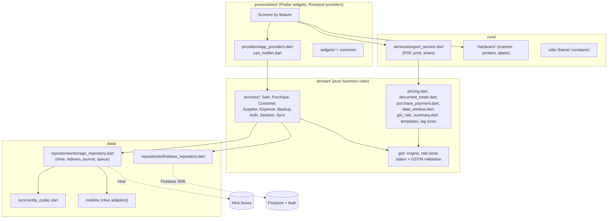
```mermaid
flowchart TB
    subgraph Presentation["presentation/  (Flutter widgets, Riverpod providers)"]
        SCR[Screens by feature]
        PRV[providers/app_providers.dart<br/>cart_notifier.dart]
        WID[widgets/ + common/]
    end
    subgraph Domain["domain/  (pure business rules)"]
        SVC[services/: Sale, Purchase, Customer,<br/>Supplier, Expense, Backup,<br/>Auth, Session, Sync]
        GST[gst/: engine, rate book,<br/>states + GSTIN validation]
        PRC[pricing.dart, document_totals.dart,<br/>purchase_payment.dart, date_window.dart,<br/>gst_rate_summary.dart, templates, tag sizes]
    end
    subgraph Data["data/"]
        REPO["repositories/storage_repository.dart<br/>(Hive, indexes, journal, queue)"]
        FBR[repositories/firebase_repository.dart]
        COD[sync/entity_codec.dart]
        MOD["models/ (Hive adapters)"]
    end
    subgraph Core["core/"]
        EXP["services/export_service.dart<br/>(PDF, print, share)"]
        HW["hardware/ (scanner, printers, labels)"]
        UTL[utils/ theme/ constants/]
    end
    SCR --> PRV --> SVC
    SCR --> EXP
    SVC --> REPO
    SVC --> GST
    PRC --> GST
    SVC --> FBR
    REPO --> MOD
    REPO --> COD
    EXP --> PRC
    SCR --> HW
    REPO -.->|Hive| HIVE[(Hive boxes)]
    FBR -.->|Firebase SDK| FS[(Firestore + Auth)]
```

**Dependency rule:** arrows point downward only. `domain/` imports `data/` types (models, repository) but **never** `presentation/`. The one historic inversion — `CartItem` living under `presentation/` while `SaleService` consumed it — was fixed by moving it to `domain/cart_item.dart` (re-exported from `cart_notifier.dart` for existing imports).

### 2.2 Runtime object graph

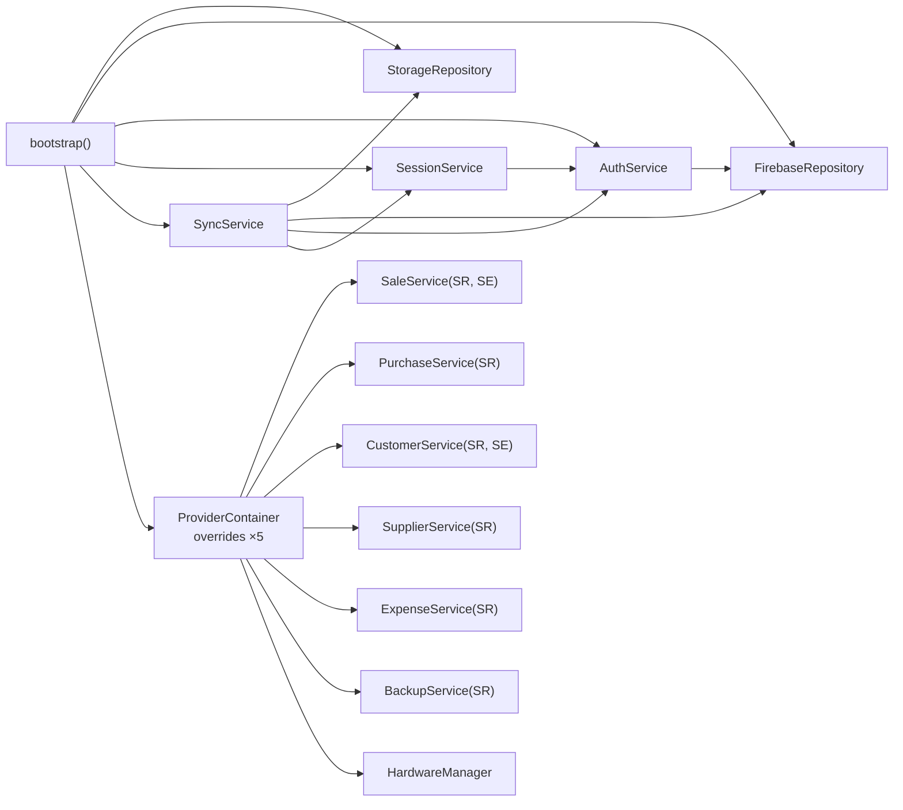
```mermaid
flowchart LR
    BS["bootstrap()"] --> SR[StorageRepository]
    BS --> FR[FirebaseRepository]
    BS --> AU[AuthService] --> FR
    BS --> SE[SessionService] --> AU
    BS --> SY[SyncService] --> SR & FR & AU & SE
    BS --> PC[ProviderContainer<br/>overrides ×5]
    PC --> SALE["SaleService(SR, SE)"]
    PC --> PUR["PurchaseService(SR)"]
    PC --> CUS["CustomerService(SR, SE)"]
    PC --> SUP["SupplierService(SR)"]
    PC --> EXPS["ExpenseService(SR)"]
    PC --> BAK["BackupService(SR)"]
    PC --> HWM[HardwareManager]
```

### 2.3 Why this layering (rationale)

* **Services own transactions, the repository owns storage.** Hive has no cross-box transaction, so multi-step business operations (checkout, goods receipt, merge) are *orchestrated* in services with explicit compensations, while the repository exposes small, individually-safe primitives (`performStockOut`, `addLedgerEntry`, …) plus *compensating* primitives (`deleteLedgerEntry`, `deleteLoyaltyTransaction`, `deleteSale`).
* **UI never computes money.** Screens call `SalePricing`/`SaleService.preview` and print stored snapshot fields. This is why invoice templates are "presentation only".
* **Providers are thin.** Because read providers are synchronous reads of in-memory caches, the UI needs no `FutureBuilder`/loading state for local data.
* **One composition root (`bootstrap`)** prevents entry points (app, tests, integration test) from building different object graphs.
* **Platform shims** (`platform_io*.dart`, `image_provider_*.dart`) use conditional exports (`dart.library.html`) so one codebase compiles for Web where `dart:io` does not exist.

### 2.4 Data-flow summary — "a sale, end to end"

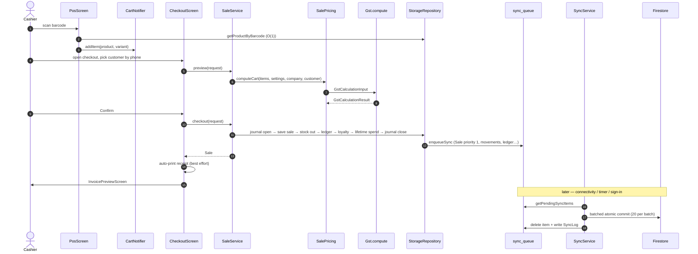
```mermaid
sequenceDiagram
    autonumber
    actor C as Cashier
    participant POS as PosScreen
    participant CART as CartNotifier
    participant CHK as CheckoutScreen
    participant SS as SaleService
    participant PR as SalePricing
    participant G as Gst.compute
    participant R as StorageRepository
    participant Q as sync_queue
    participant SY as SyncService
    participant FS as Firestore
    C->>POS: scan barcode
    POS->>R: getProductByBarcode (O(1))
    POS->>CART: addItem(product, variant)
    C->>CHK: open checkout, pick customer by phone
    CHK->>SS: preview(request)
    SS->>PR: computeCart(items, settings, company, customer)
    PR->>G: GstCalculationInput
    G-->>PR: GstCalculationResult
    C->>CHK: Confirm
    CHK->>SS: checkout(request)
    SS->>R: journal open → save sale → stock out → ledger → loyalty → lifetime spend → journal close
    R->>Q: enqueueSync (Sale priority 1, movements, ledger…)
    SS-->>CHK: Sale
    CHK->>CHK: auto-print receipt (best effort)
    CHK->>C: InvoicePreviewScreen
    Note over Q,FS: later — connectivity / timer / sign-in
    SY->>Q: getPendingSyncItems
    SY->>FS: batched atomic commit (20 per batch)
    SY->>Q: delete item + write SyncLog
```

---

## 3. Technology Stack and Why Each Piece Was Chosen

Versions are from `pubspec.yaml` (app version **1.0.1+2**, Dart SDK `^3.12.2`; CI pins **Flutter 3.47.1**).

### 3.1 Runtime dependencies

| Package | Version | Used for | Why this and not an alternative |
|---|---|---|---|
| **Flutter** (Material 3) | 3.47.1 | UI on 6 platforms | One codebase for till (Windows), phone/tablet (Android/iOS), web demo; same business logic everywhere. |
| **flutter_riverpod** | ^3.3.2 | State & DI | Compile-safe providers, `select` for surgical rebuilds (topic counters), easy overrides for tests (`ProviderContainer`/`UncontrolledProviderScope`), no `BuildContext` needed in services. |
| **hive_ce** + **hive_ce_flutter** | ^2.19.3 / ^2.3.4 | Local database | Pure Dart, runs on mobile/desktop/web, **synchronous reads** (the repository's indexes and caches rely on this), typed adapters with append-only field numbers for painless schema growth. *CE* = Community Edition, the maintained successor of the abandoned original `hive`. |
| **hive_ce_generator** + **build_runner** | ^1.11.2 / ^2.15.0 | Generates `*.g.dart` adapters and `hive_registrar.g.dart` | Adapters are checked in (`hive_registrar.g.dart` says "Check in to version control") and regenerated in CI (`dart run build_runner build --delete-conflicting-outputs`). |
| **firebase_core / firebase_auth / cloud_firestore** | ^4.12.1 / ^6.5.6 / ^6.7.1 | Account + cloud mirror | Zero server code to run; per-user document trees map 1:1 onto the security rule `request.auth.uid == userId`; Firestore's own offline cache is *not* relied on (Hive is the offline store), Firestore is used purely as a transport/store. |
| **connectivity_plus** | ^7.3.1 | Trigger sync when the network returns | Event stream of connectivity changes; the app treats any non-`none` result as "try now" and lets backoff handle captive portals. |
| **pdf** + **printing** | ^3.13.0 / ^5.15.0 | Invoice/receipt/report/label PDFs; preview, print, raster | A single document model for screen preview, A4, thermal roll, label roll; `Printing.directPrintPdf` sends to a named spooler printer without a dialog. |
| **share_plus** | ^13.1.0 | Native share sheet (WhatsApp, mail…) | Shops send bills over WhatsApp; the code writes a named file first so the customer sees `INV-…pdf`. |
| **mobile_scanner** | ^7.2.0 | Camera barcode scanning | Actively maintained ML-kit/AVFoundation based scanner; used on phones and tablets. |
| **google_mlkit_text_recognition** | ^0.15.1 | On-device OCR of price tags | Reads a printed tag to pre-fill a product; works offline (on-device model). Android/iOS only. |
| **image_picker** | ^1.2.2 | Logo, UPI QR image, OCR source | Standard camera/gallery picker. |
| **barcode_widget** | ^2.0.4 | Barcode rendering in on-screen tag preview | PDF barcodes use `pdf`'s own Code 128 widget. |
| **google_fonts** | ^8.1.0 | UI font *Outfit*, optional invoice fonts | See the note in §21 — runtime font fetching is a network dependency. |
| **intl** | ^0.20.3 | Number/date formatting | All formatting funnels through `Fmt`. |
| **uuid** | ^4.5.3 | Record ids (v4) | "Millisecond timestamps were previously used as keys, which silently overwrote records created in the same millisecond." |
| **path_provider** | ^2.1.6 | App-support/documents/external dirs | Database path, exports, backups. |

**Deliberately removed** (comment in `pubspec.yaml`): `crypto`, `local_auth` (left over from the retired PIN/RBAC and biometric designs — `local_auth` "declared biometric permissions on Android and iOS for a feature that did not exist"), `http`, `url_launcher` (never imported).

### 3.2 Dev dependencies and tooling

`flutter_test`, `integration_test`, **mocktail** (mocks), **flutter_lints** ^6 (`analysis_options.yaml` includes `package:flutter_lints/flutter.yaml`; excludes `build/`, `android/`, `ios/`, `web/`, `windows/`, `macos/`, `linux/`), **flutter_launcher_icons** (one logo → all platform icons; white ground, `remove_alpha_ios`), **msix** (Windows Store-style package: display name "Atomid Store"). Node tooling (`package.json`) exists *only* for Firestore rules tests: `@firebase/rules-unit-testing ^4.0.1`, `firebase ^11`, `firebase-tools ^14.24.0`.

### 3.3 Fonts and assets

`assets/fonts/`: **Roboto Regular/Bold** (default invoice font, bundled so documents never touch the network), **Noto Sans Tamil** and **Noto Sans Devanagari** (Regular; PDF fallback faces, SIL OFL licence in `Docs/licenses/NotoFonts-OFL.txt`). `assets/images/logo.png` (black atom with AD monogram on transparent).

### 3.4 Platform matrix (from `firebase.json`/`firebase_options.dart`)

| Platform | Local DB | Cloud sync | Hardware | Notes |
|---|---|---|---|---|
| Android | Hive (app-support dir) | ✔ | camera scan, OCR, share, optional USB/BT HID scanner | APK + AAB built in CI (debug-signed there) |
| Windows | Hive (`…\AppData\Local\atomid\db` if redirected) | ✔ | HID scanner, spooler receipt & label printers | CI Release build, Inno Setup installer / MSIX |
| Web | Hive over IndexedDB | ✔ | camera | no file export, no backup, no OCR; deployed to GitHub Pages `/ATOMID/` |
| iOS / macOS | Hive | configured in `firebase.json` | camera | camera/photo usage strings in `Info.plist` |
| Linux | Hive | Firebase not configured (`UnsupportedError` → device-only) | — | folder exists |

---

## 4. Repository Layout (every file)

```
atomid/
├─ pubspec.yaml · pubspec.lock · analysis_options.yaml · devtools_options.yaml
├─ firebase.json · firestore.rules · firestore.indexes.json
├─ package.json · package-lock.json            (Firestore rules tests only)
├─ setup.iss                                   (Inno Setup installer script)
├─ inspect_pdf.dart · test_pdf.dart            (ad-hoc debugging scripts, not part of the app)
├─ assets/ (fonts, images)
├─ android/ ios/ macos/ linux/ windows/ web/   (platform runners)
├─ docker/ (rules-tests.Dockerfile, rules-tests.compose.yml)
├─ tools/  (build_release.ps1, new_keystore.ps1)
├─ .github/workflows/ (ci.yml, deploy_web.yml)
├─ integration_test/app_startup_test.dart
├─ test/ (unit, widget, core, support, firestore-rules, migration[empty])
├─ Docs/   (existing human documentation — not used as a source for this document)
└─ lib/
```

### 4.1 `lib/` file inventory (hand-written; 20 generated `*.g.dart` adapters omitted)

| File | Lines | Responsibility |
|---|---|---|
| `main.dart` | 100 | error hooks, `AtomidBootstrap`, `AtomidApp` |
| `bootstrap.dart` | 130 | builds all services, Firebase init, storage init, sync start |
| `firebase_options.dart` | 93 | generated FlutterFire config (throws `UnsupportedError` on unsupported platforms) |
| `hive_registrar.g.dart` | gen | registers 23 adapters |
| **core/constants** `invoice_fonts.dart` | 12 | the six selectable invoice fonts |
| **core/hardware** `hardware_device.dart` | 58 | `HardwareDevice`, `DeviceStatus`, `ConnectionType`, `PrintJob` |
| `hardware_manager.dart` | 41 | registry + `connectAll` |
| `barcode_scanner_service.dart` | 49 | HID scanner device + stream |
| `receipt_printer_service.dart` | 89 | RETSOL RTP-81 spooler printing |
| `label_printer_service.dart` | 108 | TVS LP 46 DLITE device |
| `label_printer_adapter.dart` | 47 | adapter interface + Windows PDF adapter |
| `label_printer_profile.dart` | 97 | media/label geometry profiles |
| `label_layout_engine.dart` | 71 | validation + page geometry |
| `label_renderer.dart` | 176 | draws a label (Code 128) |
| `print_job_manager.dart` | 51 | duplicate-print guard |
| **core/services** `export_service.dart` | 2390 | every PDF, export, share |
| **core/theme** `brand.dart` / `theme_provider.dart` | 84 / 137 | logo widgets + status colours / Material 3 themes |
| **core/utils** `amount_in_words.dart` | 99 | Indian-system number to words |
| `app_error.dart` | 53 | `AppException`, `describeError` |
| `formatters.dart` | 66 | `Fmt` money/date/rounding |
| `ids.dart` | 23 | UUID + device short code |
| `responsive.dart` | 88 | breakpoints, padding, builder |
| `platform_io*.dart` ×3, `image_provider_*.dart` ×3 | — | conditional native/web shims |
| **data/models** (21 files) | see §6.5 | Hive models + `customer_stats.dart` (plain class), `hardware_config_model.dart` (map-backed) |
| **data/repositories** `storage_repository.dart` | 3556 | the local-database façade (§7) |
| `firebase_repository.dart` | 217 | Firestore/Auth wrapper, `SyncWrite`, paged fetch |
| **data/sync** `entity_codec.dart` | 550 | Firestore map → model decoders, routing tables |
| **domain** `cart_item.dart` | 30 | basket line |
| `pricing.dart` | 323 | `SalePricing`, `SaleTotals`, `TaxMode` |
| `document_totals.dart` | 111 | report aggregation |
| `gst_rate_summary.dart` | 209 | invoice GST-by-rate grouping |
| `date_window.dart` | 60 | half-open reporting windows |
| `purchase_payment.dart` | 133 | derived payment status/allocation |
| `invoice_template.dart` | 70 | 4 invoice designs |
| `price_tag_job.dart` / `price_tag_print_mode.dart` / `price_tag_size.dart` | 19 / 9 / 107 | tag printing descriptors |
| **domain/gst** `gst_engine.dart` | 540 | `Gst.compute` |
| `gst_models.dart` | 232 | input/output types |
| `gst_rate_resolver.dart` | 211 | rate book + resolver |
| `gst_states.dart` | 373 | states, UTGST, GSTIN validation |
| `gst_treatment.dart` | 64 | treatments |
| **domain/services** `sale_service.dart` | 412 | checkout |
| `purchase_service.dart` | 363 | purchase GST, receipt |
| `customer_service.dart` | 144 | CRM + merge |
| `supplier_service.dart` | 61 | suppliers |
| `expense_service.dart` | 63 | expenses + seed |
| `backup_service.dart` | 220 | backup/restore |
| `auth_service.dart` | 91 | Firebase Auth wrapper |
| `session_service.dart` | 147 | device id, watermark |
| `sync_service.dart` | 505 | outbox upload, pull, status |
| **presentation/providers** `app_providers.dart` | 493 | providers |
| `cart_notifier.dart` | 83 | basket |
| **presentation/widgets** (7 files) | — | shell, dialogs, tables, empty state, GSTIN fields |
| **presentation/common** `share_bottom_sheet.dart` | 314 | share/save/print sheet |
| **presentation/features** (see Part VIII) | ~18 k | 45 files in 20 feature folders |

Totals: ~34.6 k hand-written Dart lines in `lib/` (≈ 36.7 k including the 20 generated `*.g.dart` adapters); ~480 declared test cases in 62 Dart test files plus 1 JavaScript rules-test file.

### 4.2 The Hive "contract" — three places that must change together

When you add a synced field to a model you must touch **all three**, or the field silently stops syncing / restoring:

1. the model (`@HiveField(next-free-index)` — **never reuse a number**), then run `dart run build_runner build --delete-conflicting-outputs`;
2. `StorageRepository._encodeEntity` (what is uploaded/backed up);
3. `EntityCodec.<type>(json)` (what is decoded on pull/restore, with a default).

Tests that guard this: `sync_payload_test`, `settings_sync_roundtrip_test`, `backup_snapshot_test`, `serialization_fuzz_test`.

---

# PART II — STARTUP AND THE LOCAL DATABASE

## 5. Application Startup (`main.dart` → `bootstrap.dart`)

### 5.1 The entry point

`lib/main.dart` does five things, in this order:

1. `WidgetsFlutterBinding.ensureInitialized()` — required before any plugin (Hive path lookup, Firebase) is touched.
2. Installs `FlutterError.onError`, which prints the framework error (`FlutterError.presentError`) *and* writes it to `debugPrint` with the stack.
3. Installs `PlatformDispatcher.instance.onError`, which logs any uncaught async error and **returns `true`** — meaning "handled". This stops a stray unawaited future from killing the app on a till.
4. Calls `runApp(const AtomidBootstrap())`.
5. `AtomidBootstrap` (a `StatefulWidget`) owns a `Future<BootstrapResult>` created in `initState` by calling `bootstrap()`.

**Why startup is not inside the splash screen.** The source comment states the history: startup used to run inside the splash screen's `initState`. A failure there left the cashier stranded on the logo with a red exception string and no way forward. By moving it into a `FutureBuilder` above the app, three outcomes are now explicit:

| Future state | What is rendered |
|---|---|
| not done | `SplashScreen` |
| done, `result.canRunApp == false` | `StartupFailureScreen(error, onRetry)` — `_retry` calls `setState(() => _startup = bootstrap())` so the user can try again without killing the process |
| done, `canRunApp == true` | `UncontrolledProviderScope(container: result.container, child: AtomidApp(...))` |

`UncontrolledProviderScope` is used (instead of `ProviderScope`) because the Riverpod `ProviderContainer` is built **by hand** inside `bootstrap()` with services already constructed. This is the reason every long-lived service in the app can be a plain object created once.

### 5.2 `AtomidApp`

`AtomidApp` is a `ConsumerWidget` that watches `settingsProvider` and builds a `MaterialApp`:

* `theme: AppTheme.lightTheme`, `darkTheme: AppTheme.darkTheme`
* `themeMode` = dark when `settings.isDarkMode` else light (the default in `SettingsModel` is **dark**, `isDarkMode = true`).
* `debugShowCheckedModeBanner: false`
* `home: GlobalBarcodeListener(child: AppShell(startup: startup))` — the global listener wraps the whole shell so a USB/keyboard-wedge barcode scanner works on any screen (see §15.2).

### 5.3 `bootstrap()` step by step

`bootstrap()` returns a `BootstrapResult { container, storageReady, cloudReady, recoveredBoxes, fatalError, cloudMessage }`. `canRunApp` is simply `storageReady` — **local storage is the only hard requirement; cloud is optional by design.**

| # | Step | Failure behaviour | Why |
|---|---|---|---|
| 1 | Construct `StorageRepository`, `FirebaseRepository`, `AuthService(firebaseRepo)`, `SessionService(authService)` | n/a | One construction path. The comment records that `main` once built four services by hand while `app_providers` also had live constructors for two of them, so another entry point could silently get a different object graph. |
| 2 | `Firebase.initializeApp(options: DefaultFirebaseOptions.currentPlatform)` | `UnsupportedError` → `cloudMessage = 'Cloud sync is not configured for this platform…'`; any other error → `'Could not reach the cloud. Working on this device only.'`. **Never fatal**, `cloudReady` stays `false` | An offline-first till must open even when Firebase is unreachable/unconfigured. The unsupported-platform case is *caught*, not pre-checked, because a hand-written `isSupported` getter previously lived in the generated `firebase_options.dart` and was deleted by the next `flutterfire configure`. |
| 3 | `storageRepo.init()` then `sessionService.init()` | Any exception → returns `BootstrapResult(container: ProviderContainer(), storageReady:false, fatalError: error)` → `StartupFailureScreen` | Without a local DB there is nothing to run. |
| 4 | `storageRepo.deviceId = sessionService.deviceId` | — | Document numbers embed a 4-char device tag so two offline tills cannot both issue invoice `…-0001`. |
| 5 | Build `SyncService(storageRepo, firebaseRepo, authService, sessionService)` | — | — |
| 6 | Build `ProviderContainer(overrides: [...])` overriding `storageRepositoryProvider`, `firebaseRepositoryProvider`, `authServiceProvider`, `sessionServiceProvider`, `syncServiceProvider` with the already-built instances | — | Providers become thin accessors to the singletons. |
| 7 | `ExpenseService(storageRepo).seedDefaultCategories()` | — | New installs get 6 categories (see §14.6). Runs only when the category list is empty. |
| 8 | `if (cloudReady) syncService.start()` | — | Starts connectivity listener, auth listener, 2-minute fallback timer (see §8). |
| 9 | `container.read(hardwareManagerProvider).connectAll()` | — | Connects configured hardware devices (barcode scanner) — see §15. |
| 10 | Return `BootstrapResult(..., recoveredBoxes: storageRepo.recoveredBoxes, cloudMessage)` | — | `recoveredBoxes` is surfaced in the UI so data loss is never silent. |

### 5.4 Sequence diagram

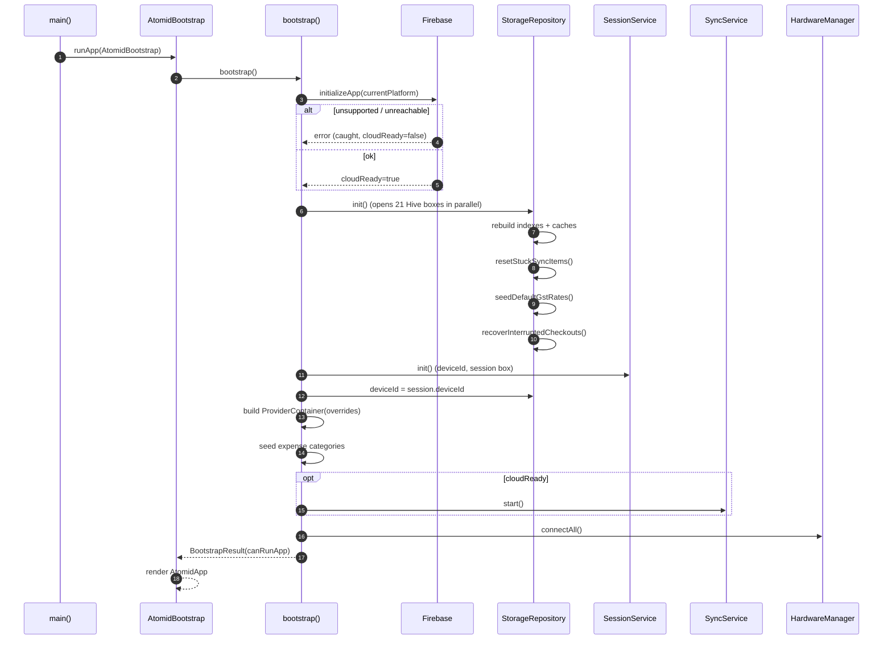
```mermaid
sequenceDiagram
    autonumber
    participant M as main()
    participant B as AtomidBootstrap
    participant BS as bootstrap()
    participant FB as Firebase
    participant SR as StorageRepository
    participant SS as SessionService
    participant SY as SyncService
    participant HW as HardwareManager
    M->>B: runApp(AtomidBootstrap)
    B->>BS: bootstrap()
    BS->>FB: initializeApp(currentPlatform)
    alt unsupported / unreachable
        FB-->>BS: error (caught, cloudReady=false)
    else ok
        FB-->>BS: cloudReady=true
    end
    BS->>SR: init() (opens 21 Hive boxes in parallel)
    SR->>SR: rebuild indexes + caches
    SR->>SR: resetStuckSyncItems()
    SR->>SR: seedDefaultGstRates()
    SR->>SR: recoverInterruptedCheckouts()
    BS->>SS: init() (deviceId, session box)
    BS->>SR: deviceId = session.deviceId
    BS->>BS: build ProviderContainer(overrides)
    BS->>BS: seed expense categories
    opt cloudReady
        BS->>SY: start()
    end
    BS->>HW: connectAll()
    BS-->>B: BootstrapResult(canRunApp)
    B-->>B: render AtomidApp
```

### 5.5 Error handling philosophy (from `app_error.dart`)

* `AppException(message)` — an error whose message is **safe and useful to show a user**. Domain code throws it for *expected* failures: insufficient stock, credit limit exceeded, duplicate code, GST cannot be computed.
* `describeError(error, {fallback})` — anything that is not an `AppException` or `FirebaseAuthException` collapses to a generic sentence, so internals never reach the screen.
* `FirebaseAuthException` codes are mapped to friendly sentences: `invalid-email`, `user-disabled`, `user-not-found`/`wrong-password`/`invalid-credential` (all deliberately the same text — "Email or password is incorrect." — so the UI does not reveal whether an email exists), `email-already-in-use`, `weak-password` (6 chars), `too-many-requests`, `network-request-failed` ("Your work is saved locally and will sync later"), `operation-not-allowed`, default.

---

## 6. The Local Database — Hive CE

### 6.1 What Hive is and why it was chosen

Hive CE (`hive_ce ^2.19.3`, `hive_ce_flutter ^2.3.4`) is a pure-Dart key-value store with typed adapters. It is the *system of record* for every business fact in Atomid. Reasons visible in the code:

* **Works on every target** — Android, iOS, Windows, macOS, Linux (file-backed) and **Web (IndexedDB)** with the same API; `StorageRepository.init` branches only on path selection (`kIsWeb → Hive.initFlutter()`).
* **Synchronous reads** after a box is open (`box.get`, `box.values`) — the whole repository is built on this: search, barcode lookup, dashboards, and the sync queue are synchronous in-memory reads, which is what makes the till feel instant and what lets screens run with zero network.
* **No native plugin / no SQL schema migration** — adapters are generated (`hive_ce_generator` + `build_runner` → `*.g.dart` and `hive_registrar.g.dart`). Adding a field means adding a new, never-reused `@HiveField(n)` index, so older rows decode with the constructor default. This is why the models have "Additive GST fields" comments — every GST column was added at the end of the field list.
* **Append-only log files** with **compaction** (see §6.4) — crash-tolerant.

### 6.2 Where the files live

`StorageRepository.init({String? storagePath})`:

1. `storagePath != null` → `Hive.init(storagePath)` (tests pass a temp folder so no `path_provider` plugin is needed).
2. `kIsWeb` → `Hive.initFlutter()` (IndexedDB).
3. Otherwise `PlatformIo.getApplicationSupportDirectoryPath()`, falling back to `getApplicationDocumentsDirectoryPath()`. Then:
   * if the path contains **`OneDrive`** (Windows folder redirection would put a live database inside a sync client that locks and conflicts files) and `PlatformIo.userProfile != null` → forced to `<USERPROFILE>\AppData\Local\atomid\db`;
   * otherwise `<support dir>\db`.
   * The directory is created recursively if missing.
4. `Hive.registerAdapters()` is guarded by the static `_adaptersRegistered` flag — adapters are per-isolate and registering twice throws, which would break a startup retry or a second store in a test.

### 6.3 The 21 boxes

Opened in parallel (all `Future`s started before any is awaited — the comment says sequential awaiting held the first frame "for seconds on a cold start").

| Box name (constant) | Hive type | Key | Contents | Synced? |
|---|---|---|---|---|
| `products` | `Product` | product id (UUID v4) | catalogue with embedded `ProductVariant` list | ✔ |
| `history` | `ActionHistory` | UUID | human-readable activity trail (bounded to 2000) | ✘ |
| `settings` | `SettingsModel` | `'app_settings'` | singleton billing/GST/UI settings | ✔ (`config/settings`) |
| `invoice_settings` | `InvoiceSettingsModel` | `'invoice_settings'` | singleton invoice look | ✔ (`config/invoice`) |
| `inventory_movements` | `InventoryMovement` | UUID | immutable stock in/out log | ✔ |
| `sales` | `Sale` | sale id | invoices with embedded `SaleItem` list | ✔ (priority 1) |
| `suppliers` | `Supplier` | id | vendors | ✔ |
| `purchases` | `Purchase` | id | POs with embedded `PurchaseItem` list | ✔ |
| `company` | `CompanyModel` | `'profile'` | singleton business profile | ✔ (`config/company`) |
| `customers` | `Customer` | id | CRM | ✔ |
| `customer_ledgers` | `CustomerLedger` | UUID | receivables ledger | ✔ |
| `supplier_ledgers` | `SupplierLedger` | UUID | payables ledger | ✔ |
| `loyalty_transactions` | `LoyaltyTransaction` | UUID | points earn/redeem rows | ✔ |
| `loyalty_settings` | `LoyaltySettingsModel` | `'loyalty_settings'` | singleton | ✔ (`config/loyalty`) |
| `sync_queue` | `SyncQueueItem` | UUID | the outbox | ✘ |
| `sync_logs` | `SyncLogModel` | UUID | per-record upload outcomes (bounded to 1000) | ✘ |
| `diagnostic_logs` | `DiagnosticLog` | `"<µs>-<seq>"` | local failure records (bounded to 500) | ✘ |
| `expenses` | `Expense` | UUID | shop expenses | ✔ |
| `expense_categories` | `ExpenseCategory` | id | categories | ✔ |
| `gst_rate_configs` | `GstRateConfig` | id (`gst_5`…) | the rate book | pull ✔ / push ⚠ see §21 |
| `checkout_journal` | `dynamic` (JSON strings) | sale id | in-flight checkout rows | ✘ (scratch) |

Plus two boxes opened elsewhere: `session` (by `SessionService`: `deviceId`, `lastPulledAt`, `pullSchemaVersion`) and `hardware_config` (by `HardwareConfigModel.load()`: `settings` map). Neither is a typed box.

### 6.4 Crash-safe opening (`_safeOpenBox`)

Every box is opened through a four-step escalation instead of destroying data on the first error:

1. `Hive.openBox(name, compactionStrategy: _shouldCompact)`.
2. On error: wait **250 ms** and retry once (most failures are a transient file lock — antivirus, OneDrive, a second instance).
3. Retry with `crashRecovery: true` — Hive salvages every frame up to the first corrupt one.
4. Last resort: record the name in `recoveredBoxes`, `Hive.deleteBoxFromDisk(name)` (swallowing errors — locked FS or Web), and open an empty box. The loss is **reported**, not hidden: `BootstrapResult.recoveredBoxes` is shown to the user.

**Compaction.** Hive appends; each overwrite leaves a dead frame. `_shouldCompact(deleted, total) = total > 60 && deleted > total * 0.5`. The `> 60` floor keeps small boxes from churning; the `> 50 %` ratio keeps a busy box (stock edits all day) from growing without bound and from slowing every open (dead frames are read and skipped at open).

### 6.5 Models — every field

> Field numbers (`@HiveField(n)`) are **permanent**. They are stored on disk. Never reuse or renumber one. New fields always take the next free number.

#### 6.5.1 `Product` (typeId 0) and `ProductVariant` (typeId 1)

One `Product` is **one colourway**; sizes are its `variants`. A shirt in three colours = three `Product` records sharing a `productCode`. `displayName` = `productName` or `productName - color`.

| # | Field | Type | Meaning |
|---|---|---|---|
| 0 | id | String | UUID |
| 1 | productName | String | |
| 2 | productCode | String | the *style* code — **deliberately shareable** across colourways |
| 3 | category | String | |
| 4 | brand | String | |
| 5 | color | String | |
| 6 | createdDate | DateTime | |
| 7 | updatedDate | DateTime | doubles as sync recency stamp |
| 8 | variants | List\<ProductVariant\> | sizes |
| 9 | version | int | default 1 |
| 10 | deviceId | String | writer |
| 11 | createdBy | String | |
| 12 | isDeleted | bool | soft-delete flag (note `deleteProduct` hard-deletes the Hive row) |
| 13 | lastSyncedAt | DateTime? | |
| 14 | isSynced | bool | |
| 15 | hsn | String | HSN/SAC code |
| 16 | uqc | String | unit quantity code, default `PCS` |
| 17 | gstTreatment | String | `TAXABLE`, `NIL_RATED`, `EXEMPT`, `NON_GST`, `UNCONFIGURED` (`ZERO_RATED` exists in `GstTreatment` but is not selectable) |
| 18 | gstRate | double? | `null` = unconfigured; constructor default is `0.0` |
| 19 | cessRate | double | |
| 20 | gstRateConfigId | String? | pins a rate-book entry (e.g. `gst_12`) |

`isGstConfigured` = treatment ≠ `UNCONFIGURED` AND (treatment ≠ `TAXABLE` OR `gstRate != null`).

`ProductVariant` fields: 0 `size`, 1 `price` (selling price), 2 `quantity` (on hand), 3 `barcode`, 4 `lastStockUpdated`, 5 `stockIn` (cumulative), 6 `stockOut` (cumulative), 7 `reorderLevel` (default **5**), 8 `sku`, 9 `costPrice`.

#### 6.5.2 `Sale` (typeId 6) and `SaleItem` (typeId 7)

A `Sale` is a **frozen legal document**. It copies the seller, the customer, the place of supply, the pricing mode and every tax head at the moment of sale, so editing the company profile or a product later can never change an old invoice.

| # | Field | Notes |
|---|---|---|
| 0 id · 1 invoiceNumber · 2 date · 3 customerId · 12 customerName | identity (`customerName` was added later, hence #12) |
| 4 items | `List<SaleItem>` |
| 5 subtotal · 6 discountPercent · 7 discountAmount · 8 taxAmount · 9 grandTotal | headline money |
| 10 paymentMethod (default `Cash`) · 11 notes | |
| 13 rewardDiscountAmount · 14 rewardPointsEarned | loyalty |
| 15 isSynced · 16 updatedAt · 17 version · 18 deviceId · 19 createdBy · 20 isDeleted · 21 lastSyncedAt | sync metadata |
| 22 sellerGstin · 23 sellerState · 24 sellerStateCode · 25 sellerLegalName · 26 sellerAddress | **seller snapshot** |
| 27 customerGstin · 28 customerState · 29 customerStateCode · 30 customerAddress · 31 customerPhone | **customer snapshot** |
| 32 placeOfSupply · 33 placeOfSupplyBasis | e.g. `Customer Billing State`, `Over-the-counter counter sale (Shop State Policy)` |
| 34 pricingMode | `inclusive` / `exclusive` |
| 35 taxableAmount · 36 cgstAmount · 37 sgstAmount · 38 utgstAmount · 39 igstAmount · 40 cessAmount | tax heads |
| 41 preRoundTotal · 42 roundOff | reproduces the round-off line |
| 43 documentType | `Tax Invoice` or `Bill of Supply` |
| 44 isInterState | |

Getters: `totalGst = cgst+sgst+utgst+igst`; `totalTax = totalGst + cess`.

`SaleItem`: 0 productId · 1 productName (snapshot of `displayName`) · 2 productCode · 3 variantBarcode · 4 variantSize · 5 price · 6 quantity · 7 total · 8 hsn · 9 uqc · 10 gstRate · 11 gstTreatment · 12 cessRate · 13 taxableValue · 14 discountAmount · 15 cgstAmount · 16 sgstAmount · 17 utgstAmount · 18 igstAmount · 19 cessAmount · 20 gstRateConfigId.

#### 6.5.3 `Purchase` (typeId 8) and `PurchaseItem` (typeId 9)

Mirrors `Sale` from the buyer's side. Header fields 0–21 (id, purchaseNumber, supplierId/Name, purchaseDate, items, subtotal, discount, tax, grandTotal, notes, createdDate, sync metadata, `status`, `paymentStatus`, `expectedDeliveryDate`), then additive GST: 22 supplierInvoiceNumber, 23 supplierInvoiceDate, 24 supplierGstin, 25 supplierState, 26 supplierStateCode, 27 supplierAddress, 28 **itcEligibility** (`REQUIRES_DETERMINATION` default / `ELIGIBLE` / `INELIGIBLE` / `BLOCKED`), 29–34 taxable + CGST/SGST/UTGST/IGST/Cess, 35 roundOff, 36 isInterState, 37–40 **recipient snapshot** (this shop: name, GSTIN, state, state code), 41 pricingMode (default `exclusive` — cost prices are usually ex-tax), 42 preRoundTotal.

`PurchaseItem`: 0 productId · 1 productName · 2 variantBarcode · 3 variantSize · 4 sku · 5 quantity · 6 costPrice · 7 sellingPrice · 8 lineTotal · 9 receivedQuantity · 10 hsn · 11 uqc · 12 gstRate · 13 gstTreatment · 14 cessRate · 15 taxableValue · 16 discountAmount · 17–21 CGST/SGST/UTGST/IGST/Cess · 22 gstRateConfigId.

Model comment lists statuses `Draft, Issued, Partially Received, Received, Cancelled`; `PurchaseStatus` in code defines only `Draft, Issued, Received, Cancelled` (see §21).

#### 6.5.4 `Customer` (typeId 15)

0 id · 1 code · 2 name · 3 mobile · 4 gstNumber · 5 address · 6 creditLimit · 7 creditDays · 8 openingBalance · 9 currentBalance · 10 status (`Active` / `Merged`) · 11 createdDate · 12 totalRewardPoints · 13 lifetimeSpend · 14 isSynced · 15 updatedAt · 16 version · 17 deviceId · 18 createdBy · 19 isDeleted · 20 lastSyncedAt · 21 email · 22 customerGroup (default `General`) · 23 notes · 24 tags · 25 attachments · 26 state · 27 stateCode · 28 city · 29 pincode.

`CustomerVisitStats` (a plain class, **not stored**): visits, totalSpend, firstVisit, lastVisit; `averageBasket`, `daysSinceLastVisit`; `standing` = *First visit* (0) / *Second visit* (1) / *Occasional* (<5) / *Regular* (<15) / *Loyal*; `nextVisitLabel` ordinal with 11/12/13 → "th". Derived from the sales index on demand "so it can never drift out of step with the invoices it summarises". Deliberately factual — "What to give away is the shop's call, not the app's."

#### 6.5.5 `Supplier` (typeId 5)

0 id · 1 supplierCode · 2 supplierName · 3 phone · 4 email · 5 address · 6 gstNumber · 7 contactPerson · 8 notes · 9 createdDate · 10 updatedDate · 11 isActive · 12 isSynced · 13 version · 14 deviceId · 15 createdBy · 16 isDeleted · 17 lastSyncedAt · 18 paymentTerms (default `Net 30`) · 19 currentBalance (what we owe) · 20 rating · 21 supplierCategory (default `General`) · 22 attachments · 23 state · 24 stateCode · 25 city · 26 pincode.

#### 6.5.6 Ledgers

* `CustomerLedger` (typeId 16): id, customerId, date, `transactionType` (`Sale`, `Payment`, `Opening Balance`, `Merge`), referenceId (invoice number / payment id), `debit` (increases what the customer owes), `credit` (decreases), `balance` (running balance **after** this row), notes.
* `SupplierLedger` (typeId 22): same shape with the **mirror sign convention** — `credit` increases what we owe the supplier (a received purchase), `debit` decreases it (a payment made). Types: `Purchase`, `Payment`, `Opening Balance`.

#### 6.5.7 Loyalty

* `LoyaltyTransaction` (typeId 20): id, customerId, saleId?, `transactionType` (`Earn`, `Redeem`, `Refund`, `Expire`, `ManualAdjustment`), `points` (signed — redeem rows are negative), `monetaryValue`, reference, remarks, createdDate, createdBy, isSynced, updatedAt, version, deviceId, isDeleted, lastSyncedAt.
* `LoyaltySettingsModel` (typeId 21): isLoyaltyEnabled (default **false**), spendAmountForPoint (100), pointsEarnedPerSpend (1), pointRedemptionValue (1), maxRedemptionPercentage (50), minBillAmountForRedemption (0), updatedAt.

#### 6.5.8 Inventory & history

* `InventoryMovement` (typeId 4): id, productId, productName, variantBarcode, variantSize, quantity, `type` (`Stock In` / `Stock Out`), reason, date, `movementReferenceId` (the sale id / PO id that caused it — what recovery searches by), `performedAt` (free text: who/where).
* `ActionHistory` (typeId 2): id, barcode (really "a reference": barcode, invoice number, customer code…), productName (really "subject"), action, date.

#### 6.5.9 Settings singletons

* `SettingsModel` (typeId 3): 0 isDarkMode(true) · 1 companyName('ATOMID STORE') · 2 currencySymbol('₹') · 3 pdfPageSize('A4') · 4 taxMode('inclusive') · 5 taxRate(0, **legacy**, must never be used as a product rate) · 10 updatedAt · 11 roundOffEnabled(true) · 12 hsnRequired(false) · 13 walkInPosPolicy('USE_SHOP_STATE') · 14 showGstBreakdown(true) · 15 showHsnSummary(true) · 16 defaultUqc('PCS') · 17 thermalReceiptSize('80mm') · 18 showTaxOnThermalReceipt(true) · 19 inclusiveTaxRounding('SHELF_PRICE') · 20 invoiceTemplate('THERMAL'). Has `copyWith`.
* `InvoiceSettingsModel` (typeId 50): 0 footerText · 1 showUpiQr · 2 upiId · 3 upiQrImagePath · 4 showCompanyLogo · 5 termsAndConditions · 6 fontName('Roboto') · 7 updatedAt · 8 showSignature(true; Rule 46(q) CGST Rules requires a supplier signature on a tax invoice unless digitally signed/e-invoiced).
* `CompanyModel` (typeId 10): 0 name · 1 logoPath · 2 ownerName · 3 gstNumber · 4 panNumber · 5 phone1 · 6 phone2 · 7 email · 8 website · 9 address · 10 city · 11 state · 12 country · 13 pincode · 14 invoicePrefix('INV') · 15 barcodePrefix('BR') · 16 currency('₹') · 17 financialYear · 18 updatedAt · 19 stateCode · 20 gstRegistrationStatus(`Registered`/`Unregistered`/`Composition`) · 21 tradeName. `isGstRegistered` = status is `Registered` **and** GSTIN non-empty.
* `GstRateConfig` (typeId 70): id, rateName, rate, cessRate, effectiveFrom, effectiveTo?, description, isDeleted, updatedAt, isSynced; `isEffectiveOn(date)`.

#### 6.5.10 Operational logs

* `SyncQueueItem` (typeId 30): id, entityType, entityId, action (`CREATE`/`UPDATE`/`DELETE`), status (`PENDING`/`SYNCING`/`FAILED`/`DEAD`), payload? (unused in practice — the payload is rebuilt at send time), retryCount, createdAt, lastAttempt?, priority (default 10, lower = earlier; sales use 1).
* `SyncLogModel` (typeId 40): id, entityType, entityId, operation, deviceId, startedAt, completedAt, durationMs, status (`SUCCESS`/`FAILED`), retryCount, error?.
* `DiagnosticLog` (typeId 41): id, occurredAt, severity (`WARNING`/`ERROR` — **string, not enum index**, so adding a value cannot renumber rows), area (`Checkout`, `Receiving`, `Storage`, `Startup`, `Backup`), reference, message, detail?. Device-local; never synced.
* `Expense` (typeId 26) and `ExpenseCategory` (typeId 25): see §14.6.
* `HardwareConfigModel`: *not* a Hive type; a plain map stored under key `settings` in the untyped `hardware_config` box — `receiptPrinterName?`, `labelPrinterName?`, `scannerEnabled`(true), `labelProfileId`('50x35').

### 6.6 Entity-relationship diagram

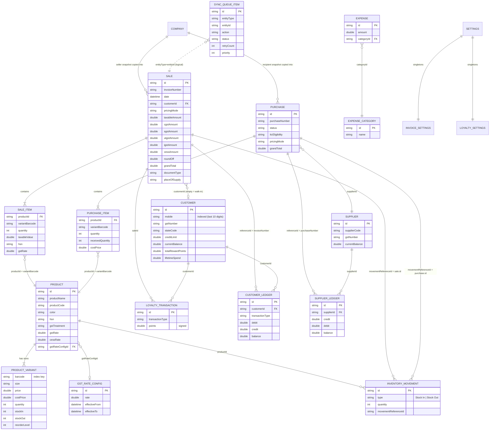
```mermaid
erDiagram
    COMPANY ||--o{ SALE : "seller snapshot copied into"
    COMPANY ||--o{ PURCHASE : "recipient snapshot copied into"
    PRODUCT ||--|{ PRODUCT_VARIANT : "has sizes"
    PRODUCT }o--o| GST_RATE_CONFIG : "gstRateConfigId"
    PRODUCT ||--o{ INVENTORY_MOVEMENT : "productId"
    SALE ||--|{ SALE_ITEM : contains
    SALE_ITEM }o--|| PRODUCT : "productId + variantBarcode"
    SALE }o--o| CUSTOMER : "customerId (empty = walk-in)"
    SALE ||--o{ INVENTORY_MOVEMENT : "movementReferenceId = sale.id"
    SALE ||--o{ LOYALTY_TRANSACTION : "saleId"
    SALE ||--o{ CUSTOMER_LEDGER : "referenceId = invoiceNumber"
    CUSTOMER ||--o{ CUSTOMER_LEDGER : customerId
    CUSTOMER ||--o{ LOYALTY_TRANSACTION : customerId
    PURCHASE ||--|{ PURCHASE_ITEM : contains
    PURCHASE_ITEM }o--|| PRODUCT : "productId + variantBarcode"
    PURCHASE }o--|| SUPPLIER : supplierId
    PURCHASE ||--o{ INVENTORY_MOVEMENT : "movementReferenceId = purchase.id"
    PURCHASE ||--o{ SUPPLIER_LEDGER : "referenceId = purchaseNumber"
    SUPPLIER ||--o{ SUPPLIER_LEDGER : supplierId
    EXPENSE }o--|| EXPENSE_CATEGORY : categoryId
    SYNC_QUEUE_ITEM }o..|| SALE : "entityType+entityId (logical)"
    SETTINGS ||--|| INVOICE_SETTINGS : "singletons"
    SETTINGS ||--|| LOYALTY_SETTINGS : "singletons"

    PRODUCT {
        string id PK
        string productName
        string productCode
        string color
        string hsn
        string gstTreatment
        double gstRate
        double cessRate
        string gstRateConfigId FK
    }
    PRODUCT_VARIANT {
        string barcode "index key"
        string size
        double price
        double costPrice
        int quantity
        int stockIn
        int stockOut
        int reorderLevel
    }
    SALE {
        string id PK
        string invoiceNumber
        datetime date
        string customerId FK
        string pricingMode
        double taxableAmount
        double cgstAmount
        double sgstAmount
        double utgstAmount
        double igstAmount
        double cessAmount
        double roundOff
        double grandTotal
        string documentType
        string placeOfSupply
    }
    SALE_ITEM {
        string productId FK
        string variantBarcode
        int quantity
        double taxableValue
        string hsn
        double gstRate
    }
    CUSTOMER {
        string id PK
        string mobile "indexed (last 10 digits)"
        string gstNumber
        string stateCode
        double creditLimit
        double currentBalance
        double totalRewardPoints
        double lifetimeSpend
    }
    CUSTOMER_LEDGER {
        string id PK
        string customerId FK
        string transactionType
        double debit
        double credit
        double balance
    }
    SUPPLIER {
        string id PK
        string supplierCode
        string gstNumber
        double currentBalance
    }
    SUPPLIER_LEDGER {
        string id PK
        string supplierId FK
        double credit
        double debit
        double balance
    }
    PURCHASE {
        string id PK
        string purchaseNumber
        string status
        string itcEligibility
        string pricingMode
        double grandTotal
    }
    PURCHASE_ITEM {
        string productId FK
        string variantBarcode
        int quantity
        int receivedQuantity
        double costPrice
    }
    INVENTORY_MOVEMENT {
        string id PK
        string type "Stock In | Stock Out"
        int quantity
        string movementReferenceId
    }
    LOYALTY_TRANSACTION {
        string id PK
        string transactionType
        double points "signed"
    }
    EXPENSE {
        string id PK
        double amount
        string categoryId FK
    }
    EXPENSE_CATEGORY {
        string id PK
        string name
    }
    GST_RATE_CONFIG {
        string id PK
        double rate
        datetime effectiveFrom
        datetime effectiveTo
    }
    SYNC_QUEUE_ITEM {
        string id PK
        string entityType
        string entityId
        string action
        string status
        int retryCount
        int priority
    }
```

> There are **no foreign-key constraints** — Hive is a key-value store. Referential integrity is enforced in `StorageRepository` / services and *checked* by `auditDerivedState()` (§7.4).

### 6.7 Physical storage map

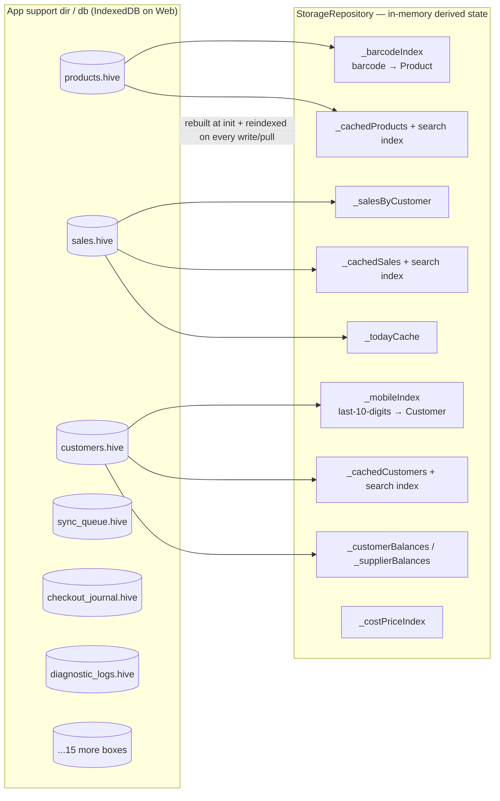
```mermaid
flowchart LR
    subgraph Disk["App support dir / db  (IndexedDB on Web)"]
        P[(products.hive)]
        S[(sales.hive)]
        C[(customers.hive)]
        Q[(sync_queue.hive)]
        J[(checkout_journal.hive)]
        D[(diagnostic_logs.hive)]
        X[(...15 more boxes)]
    end
    subgraph Memory["StorageRepository — in-memory derived state"]
        BI[_barcodeIndex<br/>barcode → Product]
        MI[_mobileIndex<br/>last-10-digits → Customer]
        SC[_salesByCustomer]
        CB[_customerBalances / _supplierBalances]
        PC[_cachedProducts + search index]
        SLC[_cachedSales + search index]
        CC[_cachedCustomers + search index]
        TT[_todayCache]
        CP[_costPriceIndex]
    end
    P --> BI & PC
    C --> MI & CC & CB
    S --> SC & SLC & TT
    Memory -. "rebuilt at init + reindexed on every write/pull" .- Disk
```

---

# PART III — THE STORAGE REPOSITORY (the heart of the data layer)

## 7. `StorageRepository` (`lib/data/repositories/storage_repository.dart`, 3,556 lines)

### 7.1 Role

`StorageRepository` is the **only** object that touches Hive boxes. UI code never opens a box; services never open a box. Everything — CRUD, search, indexes, numbering, ledgers, the sync outbox, backup snapshots, crash recovery — goes through it. It is therefore both a repository and the place where cross-box invariants are maintained.

Why one big class rather than one repository per entity? Because the invariants span boxes: a sale touches `sales`, `products`, `inventory_movements`, `history`, `customer_ledgers`, `customers`, `loyalty_transactions`, `sync_queue` and `checkout_journal`; the derived indexes are keyed across them. Keeping them together means a single `_notify` / `_reindex` discipline and a single place to audit.

### 7.2 Derived in-memory state (indexes and caches)

Hive gives O(1) `get(key)` but only O(n) scans for everything else. A till scanning 20,000 products on each keystroke would stutter, so the repository maintains these structures:

| Structure | Key → Value | Used for | Maintained by |
|---|---|---|---|
| `_barcodeIndex` | barcode → `Product` | **scan-to-product in O(1)**; also exact-match shortcut in `searchProducts` | `_indexProductBarcodes`, `_releaseBarcodes` |
| `_indexedBarcodes` | productId → barcodes it currently owns | lets a re-barcoded/removed variant drop its **old** key even though the previous variant list is gone (Hive returns the same mutated instance) | same |
| `_mobileIndex` | normalised 10-digit mobile → `Customer` | **phone lookup at the till** | `_indexCustomerMobile` |
| `_indexedMobile` | customerId → current key | same reason as `_indexedBarcodes` | same |
| `_salesByCustomer` | customerId → `List<Sale>` | visit counts / stats without rescanning `sales` | `_indexSaleForCustomer`, `_unindexSale` |
| `_indexedSaleCustomer` | saleId → customerId | a re-assigned or voided sale leaves its old list | same |
| `_customerBalances`, `_supplierBalances` | id → running balance | append a ledger row with **one** write instead of rewriting history | `_rebuildLedgerBalances`, ledger add/recalc |
| `_cachedProducts` + `_productSearchIndex` | sorted list; id → lowercase haystack of *name, code, category, brand, color, all barcodes* | product list + search | `_rebuildProductCache` |
| `_cachedSales` + `_saleSearchIndex` | non-deleted sales newest-first; haystack *invoiceNumber + customerName* | sales history | `_rebuildSaleCache` |
| `_cachedCustomers` + `_customerSearchIndex` | non-deleted customers; haystack *name, mobile, email, group* | customer list | `_rebuildCustomerCache` |
| `_todayCache` (`_TodayTotals`) | today's sales, revenue, units | dashboard in one pass | invalidated on every `DataTopic.sales` notify; also self-invalidates when the calendar day rolls (`isFor(now)`) so a till left open past midnight never shows yesterday as today |
| `_costPriceIndex` | barcode → latest purchase cost | inventory valuation | dropped whenever any `Purchase` changes |

`normaliseMobile(input)`: strip every non-digit, and if more than 10 digits keep the **last 10** — so `+91 98765 43210`, `098765 43210` and `9876543210` resolve to the same person. `getCustomerByMobile` refuses keys shorter than 10 digits.

### 7.3 One way to reindex: `_reindex(entityType, entityId)`

The source documents a real bug class here: there are two families of write — **local** (`saveX`) and **remote** (`applyRemote`) — and they used to maintain indexes by hand, separately, so they drifted. `applyRemote` wrote the record and left `_mobileIndex` and `_salesByCustomer` untouched, so after a cloud pull the shop saw a full customer list but a phone lookup that found nobody until the next restart.

`_reindex` is now the single path used by both: `Product` → (re)index/unindex barcodes + rebuild product cache; `Customer` → index mobile, mirror `currentBalance` into the cache, rebuild customer cache; `Sale` → file/unfile under customer + rebuild sale cache; `Supplier` → mirror balance; `Purchase` → drop `_costPriceIndex`. After a bulk pull or restore, `reconcileAfterPull()` rebuilds *everything* as a safety net and re-notifies **all** topics.

### 7.4 Self-audit: `auditDerivedState()`

Returns one human line per discrepancy; empty = coherent. It checks:

1. every variant barcode is indexed, points at the right product, and no index entry is orphaned;
2. mobile index ⇄ non-deleted customers;
3. sales-by-customer sets equal the non-deleted sales in the box;
4. cached balances equal the record balances, and each customer's `openingBalance + Σ(debit − credit)` equals `currentBalance`;
5. supplier cached balance equals record;
6. loyalty: a customer whose transactions sum **negative** is reported (not clamped away — the source explains that clamping made the check pass on exactly the corruption it exists to catch), and `totalRewardPoints` must equal `max(0, Σ points)`.

It is called by the test suite (`data_invariants_test.dart`, `remote_index_consistency_test.dart`). The source comment says it is "safe to call from the System Console", but **no screen currently calls it** — wiring it into the System Console is an open improvement (see §21). *Why it exists:* "the expensive bugs in this repository have all been the same shape: a box says one thing and something derived from it says another, with no symptom until a cashier types a phone number and gets nothing."

### 7.5 Reactivity: `DataTopic` and `changes` stream

`DataTopic` constants: `products, inventory, sales, customers, suppliers, purchases, expenses, settings, history, loyalty, sync, diagnostics` (`DataTopic.all`).

`StorageRepository.changes` is a broadcast `Stream<String>`. Riverpod read-providers watch a topic instead of each screen remembering to invalidate (the previous design, where a missed invalidation "silently showed stale numbers"). `enqueueSync` is "the single place that tells the UI something changed": it notifies every topic from `_topicsFor(entityType)`:

| Entity | Topics notified |
|---|---|
| Product | products, inventory |
| InventoryMovement | inventory, history |
| Sale | sales, inventory, products |
| Customer | customers |
| LoyaltyTransaction | loyalty, customers |
| Supplier | suppliers |
| Purchase | purchases, inventory, suppliers |
| Expense / ExpenseCategory | expenses |
| LoyaltySettingsModel | loyalty, settings |
| everything else | settings |

plus `DataTopic.sync` always. `_notify(sales)` also clears `_todayCache`.

### 7.6 Products and stock

* `saveProduct` stamps `updatedDate = now` on **every** local write. Stock-in/out mutate the same instance in place; without the stamp the timestamp froze at creation and a stale local copy would always outrank a genuine remote update.
* `saveProductWithStockAudit(product, performedBy='Manual edit', reason='Manual stock adjustment')` is how the product **edit form** saves. The form rebuilds each variant from text fields, so a naive save overwrote `quantity/stockIn/stockOut` with no audit. The method (a) remembers the *requested* quantity per existing barcode, (b) restores the **stored** quantity and cumulative counters onto the incoming variants, (c) saves (stock unchanged), then (d) applies each difference via `performStockIn`/`performStockOut` — which write the movement, counters and sync item. New barcodes keep their typed quantity as opening stock.
* `performStockIn/Out({productId, variantBarcode, quantity, reason, movementReferenceId, performedAt})`: reject `quantity <= 0`; look up product and variant (typed `AppException`s: *"That product no longer exists."*, *"That variant no longer exists on the product."*); **stock-out refuses to go below zero** (*"Not enough stock for X (size). Available: n, requested: m."*); mutate `quantity` and cumulative `stockIn`/`stockOut`; set `lastStockUpdated`; `saveProduct`; write an `InventoryMovement` (`Ids.generate()` id — never a timestamp, which "silently overwrote records created in the same millisecond"); enqueue it as `CREATE`; write an `ActionHistory` line with its **own** id.
* Low stock = `0 < quantity <= reorderLevel`; out of stock = `quantity <= 0`; `getTotalStockUnits()` sums all variant quantities.
* `productsWithCode(code)` / `productWithCodeAndColour(code, colour)`: sharing a code is **normal** (colourways). Only *same code + same colour* is a true duplicate; the form uses these to inform, not block, the user.
* `searchProducts`: empty → all; **exact barcode match first** (O(1)); else substring match against the prebuilt haystack.
* `deleteProduct` removes the row and enqueues a `DELETE`.

### 7.7 Document numbering

```
INV-20260810-A3F1-0001
│    │        │    └─ per-prefix counter, zero-padded to 4
│    │        └────── device tag = last 4 alnum chars of deviceId, upper-cased (Ids.shortCode)
│    └─────────────── yyyyMMdd
└──────────────────── company.invoicePrefix (trimmed, upper-cased; default INV)
```

Purchases use `PUR-yyyyMMdd-<tag>-NNNN`. `_nextCounter(prefix, existing)` scans existing numbers that start with the *same full prefix* and takes `max + 1`. **Why:** two tills billing offline would both issue `0001` for the day; embedding a per-install tag makes numbers globally unique without any network coordination. The counter restarts daily per device (the date is in the prefix). The device tag is also written into backups (`deviceTag`).

### 7.8 The checkout journal — crash recovery for a non-transactional store

A checkout writes to ~5 boxes; Hive has no cross-box transaction. `SaleService` already unwinds a *thrown* failure with an in-memory list of compensations, but that list dies with the process. Pull the plug between deducting stock for item 2 and item 3 and the sale is committed, the shelf is wrong, nothing notices.

Solution (write-ahead journal):

1. `openCheckoutJournal(saleId, invoiceNumber, customerId, previousLifetimeSpend, previousUpdatedAt)` writes a small JSON row into `checkout_journal` and **`flush()`es it to disk** *before the first box is touched*.
2. `closeCheckoutJournal(saleId)` deletes it (and flushes) on success **or** after an in-memory unwind.
3. At the next `init()`, `recoverInterruptedCheckouts()` iterates the journal. For each row `_unwindInterruptedCheckout` is run:
   1. **Restore stock** — driven by `InventoryMovement`s whose `movementReferenceId == saleId` and `type == 'Stock Out'` (a movement exists only for stock actually deducted → reverses exactly what happened). Each is reversed with `performStockIn(... 'Recovered interrupted sale (INV…)')`, then the original movement is deleted → **running recovery twice is a no-op**. If the product has since been deleted, a `DiagnosticLog(ERROR, Startup)` says "Check this count by hand" and recovery continues.
   2. **Remove customer ledger rows** whose `referenceId == invoiceNumber`, and **loyalty rows** whose `saleId == saleId`.
   3. **Restore `lifetimeSpend`** and `updatedAt` from the journal — "the one figure that cannot be recomputed from what is left behind, which is why it is journalled".
   4. `deleteSale(saleId)`, then write an `ActionHistory` "Interrupted sale reversed".
4. A row that cannot be unwound stays in the journal and is retried on the next launch (with a diagnostic). Corrupt/non-string rows are discarded.

The journal deliberately stores almost nothing: recovery *discovers* the work by asking which records point at the sale. The source comment gives the reason: a step-by-step log would be wrong the moment a crash fell between doing a step and recording it.

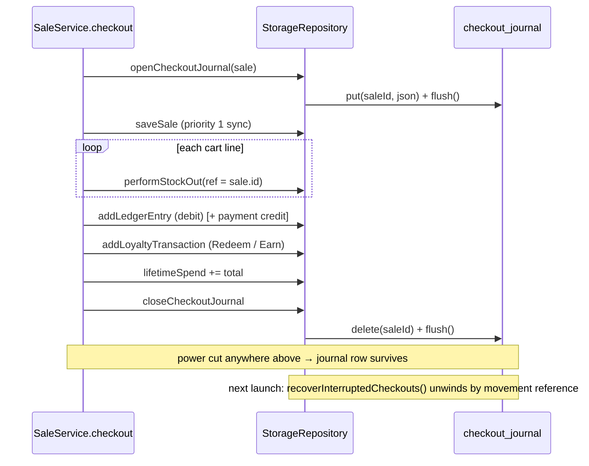
```mermaid
sequenceDiagram
    participant S as SaleService.checkout
    participant R as StorageRepository
    participant J as checkout_journal
    S->>R: openCheckoutJournal(sale)
    R->>J: put(saleId, json) + flush()
    S->>R: saveSale (priority 1 sync)
    loop each cart line
        S->>R: performStockOut(ref = sale.id)
    end
    S->>R: addLedgerEntry (debit) [+ payment credit]
    S->>R: addLoyaltyTransaction (Redeem / Earn)
    S->>R: lifetimeSpend += total
    S->>R: closeCheckoutJournal
    R->>J: delete(saleId) + flush()
    Note over S,J: power cut anywhere above → journal row survives
    Note over R,J: next launch: recoverInterruptedCheckouts() unwinds by movement reference
```

### 7.9 Ledgers

**Customer ledger.** `addLedgerEntry(customerId, date, transactionType, referenceId, debit, credit, notes)`:
`newBalance = round2(previousBalance + debit − credit)` where `previousBalance` comes from the in-memory `_customerBalances` (falls back to `customer.currentBalance`). The row stores `balance = newBalance`; the customer's `currentBalance` is updated and the customer saved. Returns the new entry id so a caller running a multi-step transaction can hand it to `deleteLedgerEntry` to compensate. *Carry-forward balances* mean one write per transaction regardless of ledger length.

`deleteLedgerEntry` → delete the row, then `recalculateCustomerLedger` (a middle deletion invalidates all later balances, so only a full recalculation is correct): start at `openingBalance`, walk entries chronologically, rewrite each `balance`, enqueue each as `UPDATE`.

`reassignCustomerLedger(from, to)` (customer merge): fold the source's `openingBalance` in as one traceable `Merge` ledger row (`MERGE-<toId>`), zero it, repoint every entry's `customerId`, then recalculate **both** customers. (The source documents that hand-adding `currentBalance` was tried and dropped because it left ledger rows under an id nobody queries again.)

**Supplier ledger.** Mirror image: `newBalance = previous + credit − debit` ("what we owe"); `recalculateSupplierLedger` starts from **zero** (a supplier has no `openingBalance` field — its opening figure is itself a ledger row of type `Opening Balance`); `deleteSupplierLedgerEntry` exists so a failed purchase receipt can reverse its credit.

`purchasePaymentAllocation()` builds, per supplier, how much of each purchase number has been paid (see §13.5).

### 7.10 Loyalty points

`addLoyaltyTransaction` writes the row, enqueues it, then `_recomputeRewardPoints(customerId)`: **re-derive** `totalRewardPoints = max(0, Σ transaction.points)` and save the customer. Points are *derived, never incremented*. That is also why a customer merge **moves the loyalty rows** (`reassignLoyaltyTransactions`) instead of adding the totals: an added number would survive only until the next recompute from rows that never heard of it. `deleteLoyaltyTransaction` is the compensation primitive for failed checkouts.

### 7.11 Inventory valuation

`calculateInventoryValue()` returns `{costValue, retailValue, potentialProfit}`. Per variant: `retail += price × qty`; `cost += (latest purchase cost for that barcode ?? selling price) × qty`. "Latest cost" comes from `_costPriceIndex`, built by sorting purchases ascending by `purchaseDate` and letting later ones overwrite earlier — rebuilt only when a purchase changes. (Note: variants with no purchase history are valued at their selling price — i.e. zero margin — which is a documented simplification.)

### 7.12 Dates and reporting windows

* `getSalesByDateRange(start, end)` / `getPurchasesByDateRange` use a **half-open** window `[startOfDay(start), startOfDay(end)+1 day)`. The previous `isAfter(start−1d) && isBefore(end+1d)` "quietly pulled in a whole extra day at each end"; these figures are reconciled against the till, "so being a day out is worse than being approximate".
* All business dates are **local** time; sync timestamps are a separate concern (see §8.4).
* `DateWindow.forTimeframe('Today' | 'This Week' | 'This Month', now)` (`lib/domain/date_window.dart`) — Monday-start week built from *today's midnight* (not `now`, or Monday-morning records would be missed); every window ends at *tomorrow's* midnight so future-dated records never count; "This Month" is month-to-date; any other label → `null` = everything. `DateWindow.contains` is half-open.

### 7.13 Bounded logs

| Log | Cap | Trim rule |
|---|---|---|
| `history` | 2000 | delete oldest keys beyond cap on each save |
| `sync_logs` | 1000 | same |
| `diagnostic_logs` | 500 | same |

`recordDiagnostic` **swallows its own errors**: every caller is already inside a `catch`, and a logger that threw would replace the original failure with a less useful one — "the logger destroying the evidence it was called to preserve". Diagnostic ids are `"<microsecondsSinceEpoch>-<seq>"` so two failures in the same tick cannot overwrite each other.

### 7.14 Backup snapshot primitives

`exportSnapshot()` builds `{entityType: [json…]}` using **the same `getEntityJson` that sync uses** — "a backup written by different code than the one sync uses would drift from it silently — and a backup that quietly omits a field is worse than no backup". Each record carries `_localId` (needed because a singleton's payload id `settings` is not its box key `app_settings`). `importSnapshot()` is **additive by id**, in dependency order (`EntityCodec.pullOrder`), writing straight into boxes via `_writeRestored` (deliberately *not* `applyRemote`, whose "unsent local change wins / skip older" rules are right for a peer and wrong for an operator restoring a file), then enqueues each restored record as `UPDATE` and runs `reconcileAfterPull()`.

---

# PART IV — OFFLINE-FIRST, CLOUD SYNC, AUTH AND SECURITY

## 8. Offline-First and Sync

### 8.1 The principle

Atomid is **offline-first, not offline-tolerant**. Every screen reads and writes the local Hive database. The cloud (Firestore) is a *mirror and a transport between devices*, never the source of truth for the till. A sale is complete the instant it is written locally; uploading it is a background concern that may happen seconds or days later.

Consequences visible in the code:

* No screen awaits a network call to render or to save.
* Signing out or having no Firebase only changes `SyncPhase` to `offline` — "Signing out affects cloud sync only — every screen keeps working offline, by design."
* All work is captured in a persisted **outbox** (`sync_queue` box), so nothing is lost by being offline or by the app being killed.

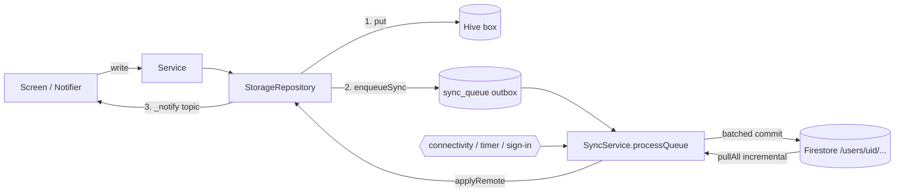
```mermaid
flowchart LR
    UI[Screen / Notifier] -->|write| SVC[Service]
    SVC --> REPO[StorageRepository]
    REPO -->|1. put| BOX[(Hive box)]
    REPO -->|2. enqueueSync| Q[(sync_queue outbox)]
    REPO -->|3. _notify topic| UI
    Q --> SYNC[SyncService.processQueue]
    NET{{connectivity / timer / sign-in}} --> SYNC
    SYNC -->|batched commit| FS[(Firestore /users/uid/...)]
    FS -->|pullAll incremental| SYNC
    SYNC -->|applyRemote| REPO
```

### 8.2 The outbox: `enqueueSync`

Every meaningful mutation calls `enqueueSync(entityType, entityId, action, priority=10)`:

1. **Whitelist guard.** Only types in `syncableEntities` (16 types: `Product, Customer, Sale, Supplier, Purchase, Expense, ExpenseCategory, InventoryMovement, LoyaltyTransaction, CustomerLedger, SupplierLedger, GstRateConfig, SettingsModel, CompanyModel, InvoiceSettingsModel, LoyaltySettingsModel`) may be queued. Anything else would produce an item "that can never be sent and never be removed". An `assert` fires in debug; release silently returns.
2. **Notify UI** topics for the entity (see §7.5) and `DataTopic.sync`.
3. **Coalesce.** If a `PENDING` or `FAILED` item already exists for the same `(entityType, entityId)`, it is **reused**, not duplicated: status → `PENDING`, `createdAt = now`; and `action` becomes `DELETE` if the new action is `DELETE` ("a delete always wins over a pending create/update"). Result: twenty rapid edits to one product produce **one** upload.
4. Otherwise a new `SyncQueueItem` (UUID, `retryCount: 0`, `priority`) is stored.

Priorities: **sales = 1** (the highest-value record uploads first); everything else = 10. `getPendingSyncItems()` returns `PENDING`+`FAILED` items sorted by `priority` then `createdAt`.

Note the queue stores **no payload** — only `(type, id, action)`. The JSON is rebuilt from the *current* box row at send time (`getEntityJson`). That means the cloud always receives the latest state of a record, and a record deleted locally before upload simply disappears from the queue.

### 8.3 Queue item lifecycle

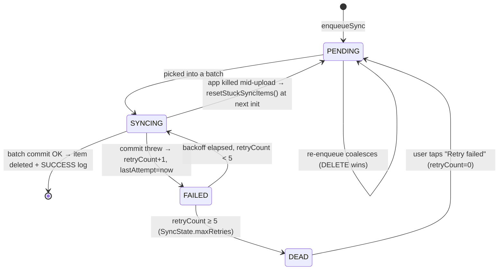
```mermaid
stateDiagram-v2
    [*] --> PENDING: enqueueSync
    PENDING --> SYNCING: picked into a batch
    SYNCING --> [*]: batch commit OK → item deleted + SUCCESS log
    SYNCING --> FAILED: commit threw → retryCount+1, lastAttempt=now
    FAILED --> SYNCING: backoff elapsed, retryCount < 5
    FAILED --> DEAD: retryCount ≥ 5 (SyncState.maxRetries)
    DEAD --> PENDING: user taps "Retry failed" (retryCount=0)
    SYNCING --> PENDING: app killed mid-upload → resetStuckSyncItems() at next init
    PENDING --> PENDING: re-enqueue coalesces (DELETE wins)
```

`SyncState`: `pending`, `syncing`, `failed`, `dead` (terminal, "kept for reporting, never retried"), `maxRetries = 5`.

### 8.4 Upload: `SyncService.processQueue()`

Triggers (all in `SyncService.start()`):

| Trigger | Mechanism |
|---|---|
| Connectivity regained | `Connectivity().onConnectivityChanged` → if any result ≠ `none` → `processQueue()`; if none → emit `offline` "No connection — changes are queued on this device." |
| Sign-in / auth change | `authStateChanges` → user null → emit `offline`; non-null → `pullAll()` **then** `processQueue()` |
| Periodic fallback | `Timer.periodic(2 minutes)` |
| App start | if already signed in → `_refreshCounts()` + `processQueue()` |
| Manual | `retryFailed()` and System Console actions |

Algorithm:

1. `uid = session.cloudUid`. If `_isSyncing` → return (single-flight). If `uid == null` → emit `offline` "Sign in to back this device up to the cloud." and return; work simply waits.
2. `pending = getPendingSyncItems()`; empty → `idle`.
3. Emit `syncing`. Walk pending in **slices of 20** (`_batchSize = 20`).
4. For each item in a slice:
   * skip if `retryCount >= 5`;
   * skip if **backing off**: `waited(seconds since lastAttempt) < 2^retryCount × 30`. `retryCount` is already incremented when the item is re-examined, so the wait is **60 s after the 1st failure, 2 min after the 2nd, 4 min after the 3rd, 8 min after the 4th**; the 5th failure makes the item `DEAD` (no further wait). In practice retries happen on the next trigger after the wait (connectivity event, sign-in, or the 2-minute timer) (`_isBackingOff`);
   * `collection = EntityCodec.collectionFor(type)`, `docId = _documentIdFor(item)`;
   * `DELETE` → `SyncWrite.delete`;
   * else `getEntityJson`; **null** (record vanished) → delete the queue item; otherwise `SyncWrite.put`.
5. Mark the slice's queued items `SYNCING`, then `firebaseRepo.commitBatch(uid, writes, sourceDevice)` — **one atomic Firestore `WriteBatch`**: puts use `SetOptions(merge: true)` and are stamped with `syncedAt = FieldValue.serverTimestamp()` and `sourceDevice = deviceId`.
6. Success → `_recordOutcome(success:true)`: delete each queue item and write a `SyncLogModel(SUCCESS, durationMs)`. Failure → each item `FAILED`, `retryCount+1`, `lastAttempt=now` (→ `DEAD` at 5), `SyncLogModel(FAILED, error)`. If the error text contains `permission-denied` the status becomes `failed` with *"The cloud refused this write. Your work is safe on this device — try signing in again."*
7. After all slices: remaining pending = 0 → `idle` (or `failed` if dead items exist) + `lastSuccess = now`; else `_refreshCounts()` (→ `retrying` if pending, `failed` if dead).
8. `finally { _isSyncing = false }`.

Document ids: normally the entity id. **Config singletons share one collection `config`** with fixed doc ids: `SettingsModel→settings`, `CompanyModel→company`, `InvoiceSettingsModel→invoice`, `LoyaltySettingsModel→loyalty`. Locally they are keyed `app_settings`, `profile`, `invoice_settings`, `loyalty_settings` — `_localIdFor` maps back on pull.

**Why batches are atomic but retries are per item:** a failing batch marks all its items failed together (one bad document fails the whole `WriteBatch`), and each then backs off independently; a poison document therefore cannot starve others forever — it eventually goes `DEAD` and stops being retried, while subsequent batches proceed.

### 8.5 Uniform `updatedAt` — the invisible-document trap

`getEntityJson` guarantees **every payload carries a non-null `updatedAt`** (`json['updatedAt'] ??= _syncTimestampFor(...)`). The source explains why: Firestore's `where('updatedAt', isGreaterThan: …)` does not just rank a document lacking the field lower — it **omits it entirely**. Eleven of fifteen collections lacked the field, so an incremental pull would "come back empty and report success". `_syncTimestampFor` picks the truest stamp per type (product `updatedDate`, customer `updatedAt ?? createdDate`, expense `createdDate`, movement `date`, ledgers `date`, config models `updatedAt`, etc.) in **local time** so it is comparable with the stamps `_encodeEntity` already wrote (mixing UTC `Z` strings with offset strings "would quietly select the wrong rows").

### 8.6 Download: `pullAll({since, full})`

Purpose (from the source): "previously absent entirely, which meant a second device or a reinstall started empty and stayed empty."

1. Single-flight (`_isPulling`), requires `uid`.
2. **`startedAt = now` is captured BEFORE the first fetch** — a record written while the pull is in flight would otherwise fall between "the last fetch" and the watermark and never be requested again. Re-fetching a few records is free (`applyRemote` is idempotent); missing one is permanent.
3. `watermark = full ? null : (since ?? session.lastPulledAt)`. `null` ⇒ full pull ("Fetching your data…"); else "Checking for changes…".
4. For each `entityType` in **`EntityCodec.pullOrder`** (dependency order): settings → company → invoice settings → loyalty settings → expense categories → GST rate configs → products → customers → suppliers → purchases → sales → expenses → movements → loyalty tx → customer ledgers → supplier ledgers:
   * `alwaysFullPull` types (`SettingsModel, CompanyModel, InvoiceSettingsModel, LoyaltySettingsModel, ExpenseCategory, GstRateConfig`) ignore the watermark (tiny collections; some have no honest timestamp).
   * `fetchCollectionPages(uid, collection, since, onPage)` pages **300** docs at a time. Full pull orders by `documentId` (every doc has one; ordering by `updatedAt` would skip records written before the field existed). Incremental pull `where('updatedAt' > since.iso).orderBy('updatedAt')`. A short page ends the loop (saves an empty round trip). `onPage` applies records as they arrive, so peak memory is one page.
   * Each document → `applyRemote(type, localId, doc)`; counts `applied`.
   * A throw for one type is recorded in `failures` (and `deniedCount` if permission-denied) and the pull **continues** with the other types.
5. `reconcileAfterPull()` rebuilds all derived indexes and re-notifies every topic.
6. **Watermark advance rule:** `setLastPulledAt(startedAt)` **only if `failures.isEmpty`** — "advancing the watermark past a partial pull would mean the records in the failed collection are never requested again". Otherwise status `failed` with either *"This account cannot read this store in the cloud. Check that the security rules are deployed…"* (denied) or *"Could not fetch N of 16 record types."*

`SessionService.lastPulledAt` returns `null` (= do a full pull) when: the stored `pullSchemaVersion` ≠ the code's `pullSchemaVersion` (currently **1**; bumped whenever previously uploaded documents become untrustworthy for incremental pull), the value is unparseable, or it is **in the future** (would skip every record between now and then). `clearLastPulledAt()` forces the next pull to be full (System Console "Re-fetch store data").

### 8.7 Conflict resolution: `applyRemote`

```
applyRemote(type, id, raw):
  json = raw + {'id': id}                      # id is pinned to the key → indexes can't disagree with box keys
  if sync_queue has any item (not DEAD) for (type,id):  return false   # unsent local edit ALWAYS wins
  remote = max(updatedAt, updatedDate, createdDate in json)
  local  = _localUpdatedAt(type,id)
  if remote and local both known and remote <= local:    return false   # last-write-wins on timestamp
  decode with EntityCodec → box.put → _reindex → _notify(topic(s))
  return true
```

Policy summary — **last-write-wins on `updatedAt`, with "pending local change beats remote"**. Config singletons were previously compared with `null` (which skipped the comparison and let whichever pull arrived last win); `_localUpdatedAt` now returns their real `updatedAt`, so two tills changing the tax rate resolve on which edit was more recent.

Honest limits (a new team must know): whole-record replace, not field-level merge; clocks are device clocks; a `DEAD` queue item stops protecting its record (so a pull can overwrite an edit that never uploaded). Because money documents are *append-style* (sales, ledger rows, movements have unique UUIDs and are rarely edited), real conflicts are rare in practice.

### 8.8 Decoding defensively: `EntityCodec`

`EntityCodec` (`lib/data/sync/entity_codec.dart`) turns Firestore maps back into models. Helpers never throw on bad data: `_str` (fallback), `_dbl` (rejects NaN/Infinity), `_int` (rejects non-finite and values beyond int64 range), `_bool`, `_date` (falls back to epoch 0 or given default), `_strList`, `_list`. Decoded rows are marked `isSynced: true` and `lastSyncedAt: now`. Notable defaults: product `category → 'General'`, `uqc → 'PCS'`, `gstTreatment → 'TAXABLE'`, `reorderLevel → 5`. Fuzz tests (`serialization_fuzz_test.dart`, `snapshot_chaos_test.dart`) feed it hostile JSON.

`collectionFor`: `Customer→customers, Sale→sales, Product→products, Supplier→suppliers, Purchase→purchases, Expense→expenses, ExpenseCategory→expenseCategories, InventoryMovement→inventoryMovements, LoyaltyTransaction→loyaltyTransactions, CustomerLedger→customerLedgers, SupplierLedger→supplierLedgers, GstRateConfig→gstRateConfigs`, four config types → `config`.

### 8.9 Failure and recovery matrix

| Failure | Detection | Automatic response | Operator action |
|---|---|---|---|
| No internet | connectivity stream / commit throws | items stay `PENDING`/`FAILED`; status `offline`/`retrying`; app fully usable | none |
| Process killed mid-upload | item left `SYNCING` | `resetStuckSyncItems()` at `init()` → `PENDING` | none |
| Transient Firestore error | batch `commit()` throws | `FAILED`, `retryCount+1`, backoff 60 s, 2, 4, 8 min | none |
| Poison document / permanent error | `retryCount ≥ 5` | → `DEAD`, banner shows count, sync status `failed` | "Retry failed" (`retryFailed()`), or inspect System Console |
| Permission denied (rules/account) | error string contains `permission-denied` | status `failed` + clear message; pull records `deniedCount` | sign in again / deploy rules |
| Record deleted before upload | `getEntityJson == null` | queue item removed | none |
| Partial pull | per-type try/catch | watermark **not** advanced → next pull re-requests | none |
| Untrustworthy watermark | schema mismatch / future / unparseable | full pull | none |
| Box corrupt | `_safeOpenBox` steps | retry → crash recovery → rebuild; `recoveredBoxes` shown | restore from backup; "Re-fetch store data" |
| Crash during checkout | journal row at startup | `recoverInterruptedCheckouts()` unwinds | review diagnostics/history |
| Index drift | `auditDerivedState()` | (detect only) | `reconcileAfterPull` via re-fetch / restart |
| Cloud mirrors a mistake | n/a | — | **Backup/Restore** (§14.8) is a point-in-time copy, deliberately separate |

### 8.10 Observability

* `SyncStatus { phase, pending, dead, lastSuccess, message }` is broadcast on `SyncService.statusStream`; `isHealthy = phase != failed && dead == 0`. Phases: `offline`, `idle`, `syncing`, `retrying`, `failed`.
* `SyncLogModel` rows (capped 1000) record each item's operation, duration and error; `getSyncLogs(limit, failuresOnly)` feeds the System Console.
* UI: `sync_status_bar.dart`, `sync_status_widget.dart` (see Part VIII).

---

## 9. Authentication, Sessions and Security

### 9.1 `AuthService`

Email + password via Firebase Auth, **gating cloud sync only**.

* `signIn`, `signUp`, `resetPassword`, `signOut`, `authStateChanges`, `currentUser`, `uid`, `isSignedIn`, `isAvailable` (Firebase initialised).
* `signUp` creates the account then **sends a verification email**. Failure to send is swallowed (logged) — "a mail problem, not a sign-up problem". Verification is **not enforced** before syncing: "locking a shop out of its own till because a confirmation email was slow would be the worse failure." `isEmailVerified`, `resendVerificationEmail()` exist for a non-blocking prompt.
* Every method calls `_requireAvailable()` → `AppException('Cloud sync is not available on this platform. Your data is still saved on this device.')`.

### 9.2 `SessionService`

Per-install state in the untyped `session` box:

| Key | Meaning |
|---|---|
| `deviceId` | `dev_<epochMs>_<8 hex of Random.secure()>`, generated once and persisted |
| `lastPulledAt` | ISO timestamp of the last fully successful pull's *start* |
| `pullSchemaVersion` | invalidates old watermarks |

Also: `cloudUid` (= `AuthService.uid`; null means "nowhere to write"), `deviceLabel` (Web browser / Android device / iPhone or iPad / Windows PC / Mac / Linux PC), `sessionChanges` stream (fires on auth changes), `logout()`. The session box has its own open-with-recovery (open → crashRecovery → delete & recreate). The file's header comment explains the simplification: it once carried a store id, cloud role and active operator; with one user, only the device tag matters.

### 9.3 Security model — what exists and what deliberately does not

**Exists**
* **Cloud isolation** — all synced data lives under `/users/{uid}/…`; the rule is one ownership condition; verified by an automated emulator suite.
* **Email/password** auth with friendly error mapping (no user-enumeration in sign-in errors).
* **Secret hygiene** — `.gitignore` excludes `android/key.properties`, `*.jks`, `*.keystore`, `node_modules/`, `/dist/`.
* Typed `AppException`s so internals do not leak to the UI.

**Deliberately absent** (an earlier version had them; removed; the code no longer contains them): app lock/PIN/biometrics, roles/permissions/staff login, encryption at rest (Hive boxes are plain; on Windows `%USERPROFILE%\AppData\Local\atomid\db`). `local_auth`, `crypto`, `http`, `url_launcher` were removed from `pubspec.yaml`; `local_auth` in particular "declared biometric permissions on Android and iOS for a feature that did not exist".

Implication: this is appropriate for a till one owner-operator physically controls. If the device is shared with staff, protect it with the OS account lock.

### 9.4 Firestore rules (`firestore.rules`) — line by line

```
rules_version = '2';
service cloud.firestore {
  match /databases/{database}/documents {
    match /users/{userId}/{document=**} {
      allow read, write: if request.auth != null && request.auth.uid == userId;
    }
    match /{document=**} {
      allow read, write: if false;
    }
  }
}
```

* `{document=**}` recursive wildcard — the account owns **every** nested path; no per-collection rules. The older per-collection rules distinguished *who* was acting (staff vs owner); with a single user there is no second party.
* `request.auth.uid == userId` — the only condition; identity comes from the verified token, never from document contents (a test proves a forged `uid` *field* grants nothing).
* The catch-all `if false` denies everything else, including the retired `/stores/{storeId}/…` tree.
* `firestore.indexes.json` is empty: queries use a single-field `orderBy` (`updatedAt` or `documentId`), which Firestore indexes automatically.

**Rules test suite** (`test/firestore-rules/rules.test.js`, Node `--test` + `@firebase/rules-unit-testing`, run by `npm run test:rules` through `firebase emulators:exec --only firestore`): own subtree read/write/list/nested/top-level user doc; other accounts cannot read/write/delete/list/nest; unauthenticated cannot read/write; catch-all denies non-`/users` paths and top-level user listing; forged `uid` field and uid-prefix collisions get nothing; sanity: the rules file under test is the one the app deploys. Also runnable in Docker (`docker/rules-tests.*`).

### 9.5 Cloud data layout

```
/users/{uid}
   ├─ customers/{id}             ├─ inventoryMovements/{id}
   ├─ sales/{id}                 ├─ loyaltyTransactions/{id}
   ├─ products/{id}              ├─ customerLedgers/{id}
   ├─ suppliers/{id}             ├─ supplierLedgers/{id}
   ├─ purchases/{id}             ├─ gstRateConfigs/{id}
   ├─ expenses/{id}              └─ config/{settings|company|invoice|loyalty}
   └─ expenseCategories/{id}
every doc also carries:  syncedAt (server timestamp), sourceDevice (deviceId), updatedAt (ISO string)
```

Firebase project (from `firebase.json`): `atomid-erp`; FlutterFire configured for android, ios, macos, web, windows. Emulator: Firestore on port 8080, UI disabled.

---

# PART V — GST AND PRICING

## 10. The GST Engine (`lib/domain/gst/`)

### 10.1 Files and responsibilities

| File | Responsibility |
|---|---|
| `gst_engine.dart` | `Gst.compute(GstCalculationInput) → GstCalculationResult`. **The single authority for all tax arithmetic.** `Gst` is `const Gst._()` — it cannot be instantiated. |
| `gst_models.dart` | `GstLineInput`, `GstLineResult`, `GstCalculationInput`, `GstCalculationResult` (immutable value types). |
| `gst_treatment.dart` | `GstTreatment` constants and helpers. |
| `gst_rate_resolver.dart` | The date-aware **rate book** (`GstRateEntry`, `GstRateResolver.defaultRates`) and `resolve(...)`. |
| `gst_states.dart` | Master of 37 states/UTs with 2-digit codes, UTGST classification, state-name aliases, **GSTIN validation**, party-state resolution. |
| `lib/domain/pricing.dart` | `SalePricing.computeCart` — builds the engine input from cart + settings + company + customer + loyalty. |
| `lib/domain/document_totals.dart` | Report-level aggregation of the stored snapshots (never recomputes tax). |
| `lib/domain/gst_rate_summary.dart` | Invoice "GST summary by rate" grouping (presentation only). |

> **One authority, by design.** Checkout, thermal receipts, invoice PDFs, purchases and GST reports all derive from `Gst.compute`. The purchase service "used to carry its own copy of the arithmetic, which had drifted from the engine in ways that all understated tax". It now delegates.

### 10.2 Statutory treatments (`GstTreatment`)

| Constant | Meaning | Tax? |
|---|---|---|
| `TAXABLE` | regular supply at the configured rate | yes |
| `NIL_RATED` | 0% tariff rate (Schedule I) | no |
| `EXEMPT` | exempt under s.11 CGST Act | no |
| `NON_GST` | outside GST (s.9(2): alcohol, petroleum) | no |
| `ZERO_RATED` | exports/SEZ (s.16 IGST Act) — exists in the resolver; not offered in the product UI (`selectable = [taxable, nilRated, exempt, nonGst]`) | no |
| `UNCONFIGURED` | product has not been set up | **billing blocked** |

**Cardinal rule: UNCONFIGURED is never 0%.** A missing tax setup must stop the sale, not silently under-tax it. `attractsTax(t) == (t == TAXABLE)`.

### 10.3 The rate book

`GstRateResolver.defaultRates` (effective **01-Jul-2017**, GST inception): `gst_0` (0%), `gst_0_25` (0.25% precious stones), `gst_3` (3% gold/silver), `gst_5`, `gst_12`, `gst_18`, `gst_28`. They are seeded into the `gst_rate_configs` box when it is empty (`seedDefaultGstRates`) and are editable in *Advanced Settings* (Part VIII). Each entry has `effectiveFrom`/`effectiveTo`, so a future rate change (say 12% → 18% from some date) is a **new entry with an effective date**, not a code change, and old invoices keep their frozen rate.

`GstRateResolver.resolve({gstTreatment, configuredRate, cessRate, rateConfigId, transactionDate, customRateBook})`:

1. `UNCONFIGURED` → **unresolved** "Product tax treatment is unconfigured."
2. `NIL_RATED | EXEMPT | NON_GST | ZERO_RATED` → resolved rate 0, cess 0.
3. `TAXABLE` with `configuredRate == null` → unresolved "Taxable product has no GST rate configured."
4. If `rateConfigId` given: must exist in the book (else unresolved "…not found in rate book") and be effective on the transaction date (else unresolved "…not effective on transaction date"). Resolved: its rate; cess = entry's cess if > 0 else the product's.
5. Else match by percentage (±0.001). No book match: if date < inception → unresolved; else accept the product's custom rate as-is. Match(es) exist but none effective on the date → unresolved "No GST rate configuration for X% covers transaction date".
6. Else resolved with `configId` of the effective match.

Returned `GstRateResolution.resolved(rate, cessRate, gstTreatment, configId?)` or `.unresolved(error)`.

### 10.4 State master and GSTIN validation (`gst_states.dart`)

* 37 `GstState(code, name, isUnionTerritoryWithoutLegislature)`. UTs **without** legislature levy **UTGST** instead of SGST: Andaman & Nicobar (35), Chandigarh (04), Dadra & Nagar Haveli and Daman & Diu (26), Ladakh (38), Lakshadweep (31), Other Territory (97). Delhi (07), Puducherry (34) and J&K (01) have legislatures → SGST.
* `findByCode` pads to 2 digits; `findByName` normalises (lower-case, strip non-alphanumerics) and has aliases: `ap/andhra→37`, `tn/tamilnadu→33`, `ka→29`, `kl→32`, `mh→27`, `ts/tg→36`, `dl/nctdelhi→07`, `pondicherry→34`, `orissa→21`, `uttaranchal→05`, `dnh/daman/diu/dnhdd→26`.
* `validateGstin(gstin, {expectedStateCode})`:
  1. empty → `GstinStatus.empty`;
  2. length ≠ 15 → `invalidFormat` ("must be exactly 15 characters");
  3. regex `^[0-9]{2}[A-Z]{5}[0-9]{4}[A-Z]{1}[1-9A-Z]{1}Z[0-9A-Z]{1}$` else `invalidFormat`;
  4. first two digits must be a known state → else `invalidStateCode`;
  5. if `expectedStateCode` given and ≠ prefix → `stateMismatch`;
  6. else `valid` with `stateCode`, `stateName`, and **`pan`** = characters 3–12.
  (Structure only — there is **no checksum (15th character) verification** and no online GSTN lookup.)
* `resolvePartyState({label, stateCode, stateName, gstin})` — shared by sale and purchase paths. **A typed state always wins; the GSTIN is consulted only when no state is recorded, and a GSTIN that disagrees with a recorded state blocks** (never "pick a side"). Nothing else about a party (address, city, pincode, phone) is ever used to infer state. Returns `PartyStateResolution{state, basis, error, derivedFromGstin}` — never both state and error.

### 10.5 Inputs and outputs

`GstCalculationInput`: `transactionDate`, seller (`sellerState`, `sellerStateCode`, `sellerGstin`), customer (`customerState`, `customerStateCode`, `customerGstin`), `destinationStateCode`, `pricingMode` (`inclusive`/`exclusive`), `walkInPosPolicy`, `isWalkIn`, `requestedDiscountPercent`, `manualDiscountAmount`, `rewardDiscountAmount`, `roundOffEnabled`, `inclusiveTaxRounding` (`SHELF_PRICE` | `TAX_RATE`), `lines: List<GstLineInput>`.

`GstLineInput`: product identity, `unitPrice`, `quantity`, `hsn`, `uqc`, `gstTreatment`, `gstRate?`, `cessRate`, `gstRateConfigId?`, `lineDiscount` (per-line discount; **sales never set it; purchases do**).

`GstCalculationResult`: `isValid`, `errors`, `lines[]` (each with `lineGross, discountAllocated, taxableValue, cgst/sgst/utgst/igst rate+amount, cessAmount, totalTax, lineTotal`), totals (`subtotal, discountAmount, rewardDiscount, manualDiscount, appliedDiscountPercent, taxableAmount, cgstAmount, sgstAmount, utgstAmount, igstAmount, cessAmount, totalGst, totalTax, preRoundTotal, roundOff, payableAmount`), and `pricingMode, isInterState, isUtgst, placeOfSupplyCode/State/Basis`. An invalid result carries `errors` and `payableAmount: 0`.

### 10.6 The algorithm, step by step

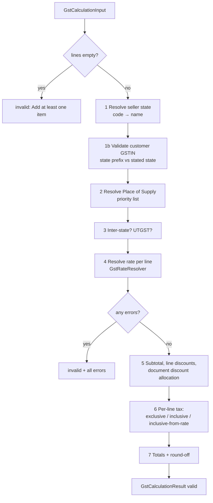
```mermaid
flowchart TD
    A[GstCalculationInput] --> B{lines empty?}
    B -- yes --> X[invalid: Add at least one item]
    B -- no --> C[1 Resolve seller state<br/>code → name]
    C --> D[1b Validate customer GSTIN<br/>state prefix vs stated state]
    D --> E[2 Resolve Place of Supply<br/>priority list]
    E --> F[3 Inter-state? UTGST?]
    F --> G[4 Resolve rate per line<br/>GstRateResolver]
    G --> H{any errors?}
    H -- yes --> X2[invalid + all errors]
    H -- no --> I[5 Subtotal, line discounts,<br/>document discount allocation]
    I --> J[6 Per-line tax:<br/>exclusive / inclusive / inclusive-from-rate]
    J --> K[7 Totals + round-off]
    K --> L[GstCalculationResult valid]
```

**Step 1 — Seller state.** `findByCode(sellerStateCode) ?? findByName(sellerState)`. If null → error: either *"Configure your shop state before billing. Settings > Business Details."* (both empty) or *"Shop state is not configured or unknown (…)"*. **There is no default state** — a missing state "used to become Tamil Nadu / 33, so a shop anywhere else that had not finished setup billed CGST + SGST against a state it had never chosen — and the invoice looked entirely normal."

**Step 1b — Customer GSTIN.** The first 2 digits of a GSTIN *are* the registration's state code, so reading them is reading the number, not guessing. `statedCustomerCode` = customer's stored code, or the code resolved from the stored state name. Validate with that as `expectedStateCode`:
* `valid` → remember `gstinStateCode`;
* `stateMismatch` → **error** "Customer GSTIN and customer state do not agree… Correct the customer record before billing." (never silently pick a side);
* `invalidFormat | invalidStateCode` → `customerGstinMalformed = true` (only matters if state cannot otherwise be found).

**Step 2 — Place of Supply (POS), in priority order** (first hit wins; the *basis* string is stored on the invoice for audit):

| Priority | Source | Basis string |
|---|---|---|
| 1 | explicit `destinationStateCode` (delivery address) | `Destination / Delivery Address` |
| 2 | `customerStateCode` | `Customer Billing State` |
| 3 | `customerState` (name) | `Customer Billing State` |
| 4 | state prefix of a **valid** customer GSTIN | `Customer GSTIN State Prefix` |
| 5 | walk-in policy `USE_SHOP_STATE` (or `ASK_ONLY_WHEN_REQUIRED`) → shop state | `Over-the-counter counter sale (Shop State Policy)` |
| 5′ | policy `REQUIRE_STATE` → error "Place of Supply state is required by shop policy. Select customer state." | — |
| 5″ | policy `ASK_AT_CHECKOUT` → error "Place of Supply must be confirmed at checkout." | — |
| 5‴ | unknown policy → shop state | `Over-the-counter counter sale` |
| 6 | not walk-in & malformed GSTIN → error naming the GSTIN; not walk-in otherwise → "Place of Supply is required for this transaction." | — |

**Step 3 — Intra vs inter-state.** `isInterState = seller.code != pos.code` (both known). `isUtgst = !isInterState && seller is a UT without legislature`. Therefore:

* Inter-state → **IGST** (100% of the rate).
* Intra-state → **CGST + SGST** (each half the rate) — or **CGST + UTGST** if the seller is such a UT.

**Step 4 — Per-line rate resolution** via `GstRateResolver` (§10.3). Errors are prefixed with `"<product> (<size>): …"`. **All** errors are collected; if any exist the whole calculation is invalid (nothing partial is returned).

**Step 5 — Subtotal, discounts.**

* `lineGross[i] = round2(unitPrice × quantity)`; `subtotal = round2(Σ lineGross)`.
* Per-line discounts `lineDiscounts[i] = round2(clamp(lineDiscount, 0, lineGross))` — taken off *before* the document discount and **never redistributed** to other lines.
* **Document discount**: reward (loyalty) discount is applied first. `headroomAfterReward = subtotal − reward`.
  * If `requestedDiscountPercent > 0`: percent clamped 0–100; `requested = round2(subtotal × percent/100)`; `manual = clamp(requested, 0, max(headroom,0))`; if clipped the *applied percent is recomputed* from the clipped amount.
  * Else if `manualDiscountAmount > 0`: `manual = clamp(amount, 0, headroom)`, percent derived.
* `totalDiscountToAllocate = clamp(reward + manual, 0, subtotal)`.
* **Proportional allocation**: `share[i] = round2(total × lineGross[i] / subtotal)`. Residual rounding difference (`total − Σ shares`, if > 0.0001) is added to the **largest line** — so allocated discounts always sum exactly to the discount.

**Step 6 — Per-line tax.** `discount = round2(lineDiscount + allocated)`; `netGross = max(0, lineGross − discount)`; `totalRate = rate + cess`.

| Case | Formula |
|---|---|
| Non-taxable treatment, or `totalRate ≤ 0` | `taxable = netGross`, `lineTotal = netGross`, no tax |
| **Exclusive** | `taxable = netGross`; `gst = round2(taxable × rate/100)`; `cess = round2(taxable × cess/100)`; split below; `lineTotal = taxable + all taxes` |
| **Inclusive, `SHELF_PRICE`** (default) | `taxable = round2(netGross / (1 + totalRate/100))`; `totalTax = round2(netGross − taxable)` — **the marked price is authoritative; tax is the remainder**. If cess > 0: `gst = round2(totalTax × rate/totalRate)`, `cess = totalTax − gst`. `lineTotal = netGross` exactly |
| **Inclusive, `TAX_RATE`** | `taxable` as above, but `gst = round2(taxable × rate/100)`, `cess = round2(taxable × cess/100)`; `lineTotal = taxable + taxes` (can be 1 paisa above the shelf price). Chosen by the shop in Settings; neither reading is confirmed as the legally required one |

**Splitting GST.** Inter-state: `igst = gst` (rate full). Intra-state: `cgst = round2(gst/2)`; the **other half = gst − cgst** (so the two halves always sum to the exact total even when `gst` is an odd number of paise) → `sgst`, or `utgst` when `isUtgst`. CGST/SGST *rates* reported per line are `rate/2`.

**Step 7 — Totals and round-off.** Running totals are `round2`-accumulated per head. `totalGst = cgst+sgst+utgst+igst`; `totalTax = totalGst + cess`. If `roundOffEnabled`: `payable = round2(preRound.roundToDouble())` (nearest rupee, half away from zero) and `roundOff = payable − preRound`; else `payable = preRound`, `roundOff = 0`. `payable` is floored at 0. `discountAmount` in the result = allocated document discount + line discounts.

### 10.7 Worked examples

**A. Intra-state, inclusive, one item, 18% GST.** Shop in Tamil Nadu (33), walk-in, `USE_SHOP_STATE`. Price ₹118.00 × 1.

* `taxable = 118 / 1.18 = 100.00`; `totalTax = 18.00`; `cgst = 9.00`; `sgst = 9.00`; `lineTotal = 118.00`; `preRound = 118.00`; `roundOff = 0`; payable **₹118.00**. POS basis: *Over-the-counter counter sale (Shop State Policy)*.

**B. Same, exclusive.** Price ₹100.00: `taxable 100`, `gst 18` → `cgst 9 / sgst 9`; total **₹118.00**.

**C. Inter-state.** Customer GSTIN `29ABCDE1234F1Z5` (Karnataka, 29), shop in 33: priority 4 sets POS = Karnataka (*Customer GSTIN State Prefix*), `isInterState = true` → `igst 18.00`, no CGST/SGST.

**D. Discount allocation.** Lines ₹600 and ₹400 (subtotal 1000), 10% discount: manual = 100.00; shares 60.00 / 40.00; taxable values are computed on `540` and `360` (inclusive: each ÷ 1.18, etc.).

**E. Odd-paisa split.** When a line's GST is an odd number of paise (say ₹0.51), `cgst = round2(0.51 / 2)` is computed first and `sgst` is defined as **`0.51 − cgst`** — never `round2(0.51 / 2)` a second time. The two halves therefore always sum to exactly the line's GST, even when the halves differ by one paisa (the tests in `gst_engine_test.dart` and `pricing_fuzz_test.dart` exercise this reconciliation).

**F. Round-off.** `preRound = 117.50` → payable 118.00, `roundOff = +0.50`; `preRound = 117.49` → payable 117.00, `roundOff = −0.49`.

**G. Blocked sale.** A product with `gstTreatment = UNCONFIGURED`, or `TAXABLE` and `gstRate == null` ⇒ `errors = ["Cotton Shirt - Blue (M): Product tax treatment is unconfigured."]` ⇒ `SaleService.checkout` throws `AppException("Cannot complete billing:\n• …")` and **nothing is written**.

### 10.8 Rounding helpers (`Fmt`)

* `Fmt.round2(v) = (v × 100).roundToDouble() / 100` — half away from zero; keeps float error out of ledgers.
* `Fmt.floor2(v)` — truncate to 2 decimals **with a snap**: some two-decimal values scale to just below an integer (the source cites `8.33 × 100`; in Dart that product is exactly `833.0`, but e.g. `0.29 × 100 = 28.999999999999996`), and flooring such a value "loses a whole paisa — the opposite error, silently", so a value within 1e-9 of an integer paisa is snapped first. Used for redemption **ceilings** where rounding up would hand back more than the customer holds.
* `Fmt.money/moneyCompact/amount/count/points/date/dateTime/compactDate` — all UI numbers/dates go through here. Negative money reads `-₹45.50`. Date formats: `dd MMM yyyy`, `dd MMM yyyy · hh:mm a`, `yyyy-MM-dd`.

### 10.9 Amount in words (`AmountInWords.rupees`)

Indian numbering (Crore / Lakh / Thousand / Hundred), e.g. `4838.00 → "Four Thousand Eight Hundred Thirty-Eight Rupees Only"`; paise appended as "and Forty Paise"; `Minus` prefix for negatives; `1 → "One Rupee"`. An `1e-9` epsilon guards exact `.005` halves from IEEE truncation. Display only — "the figure printed alongside is always the authority".

### 10.10 Reports from stored snapshots

`DocumentTotals` sums stored fields — **never recomputes tax**: sales revenue/taxable/CGST/SGST/UTGST/IGST/cess/total-GST/units/average basket; purchase cost/taxable/CGST/SGST(+UTGST)/IGST/GST/units. Also `invoiceIsConsistent(sale, taxIsExclusive)` — checks `(subtotal − discount − reward) [+ tax if exclusive] + roundOff ≈ grandTotal` within half a paisa, and `discountPercentReproduces`.

`GstRateSummary.fromSale(sale)` groups a sale's line snapshots by GST rate for the invoice "GST summary", with SGST/UTGST label chosen from what was recorded (`utgstAmount > 0 ? 'UTGST' : 'SGST'`) and reconciles per-column drift onto the largest-taxable group (abandons reconciliation if any drift exceeds ₹1 — legacy sales without full snapshots print as-is rather than inventing figures). Empty summary → template falls back to legacy totals.

---

## 11. Pricing and Loyalty Arithmetic (`pricing.dart`)

### 11.1 `SalePricing.computeCart`

Builds the engine input from live objects and returns a `SaleTotals`:

1. `subtotal = round2(Σ variant.price × quantity)`.
2. `rewardDiscount` = `maxRedeemableValue(...)` if the cashier chose to redeem, else 0.
3. For each cart line, **the product's own `gstTreatment` / `gstRate` / `cessRate` / `gstRateConfigId` / `hsn` / `uqc`** (falling back to `settings.defaultUqc`). **`settings.taxRate` is never used.** The source documents why: using the legacy shop-wide rate broke "UNCONFIGURED is not 0%" in both directions — an explicit 0% product inherited the shop's 18%, and a product with no rate was silently billed at the shop rate instead of stopping the sale. A `null` rate is passed through untouched so the resolver raises its error.
4. Seller = `company` exactly as configured (no default state). Customer fields from the `Customer`. `isWalkIn = customer == null || (customer.gstNumber.isEmpty && customer.state.isEmpty)`.
5. `Gst.compute`; then `pointsRedeemed = floor2(reward / pointRedemptionValue)`; `pointsEarned` on the **payable** amount.

`SaleTotals` exposes subtotal, discountPercent, manualDiscount, rewardDiscount, taxAmount (GST + cess), grandTotal, pointsRedeemed, pointsEarned, all tax heads, roundOff, isInterState, isUtgst, placeOfSupply, and the raw `gstResult`. `totalDiscount = manual + reward`.

`SalePricing.compute(...)` is a legacy single-line helper (hard-codes Tamil Nadu/33 and `settings.taxRate`); the live path is `computeCart`. `maxDiscountPercent = 100`.

### 11.2 Loyalty rules

* `maxRedeemableValue(loyalty, availablePoints, subtotal)`: 0 if loyalty disabled, no points, `subtotal < minBillAmountForRedemption`, or `pointRedemptionValue ≤ 0`. Otherwise `min(points × pointRedemptionValue, subtotal × maxRedemptionPercentage%)`, then **`floor2`**.
* `pointsEarned(loyalty, payableAmount)`: 0 if disabled / `spendAmountForPoint ≤ 0` / payable ≤ 0; else `floor(payable / spendAmountForPoint) × pointsEarnedPerSpend`. Earned on **what the customer actually paid** (after discount, tax and round-off).

Example with defaults (₹100 → 1 point, 1 pt = ₹1, max 50%): bill ₹1,250 payable → `floor(12.5) = 12` points. Customer holds 80 points, bill subtotal ₹120: `min(80, 120×50% = 60) = ₹60` redeemable → 60 points redeemed.

### 11.3 Cart state (`CartNotifier`) — see §17.2.

---

# PART VI — BUSINESS SERVICES (the `domain/services` layer)

## 12. `SaleService` — the checkout transaction

### 12.1 Request and result

`CheckoutRequest { items: List<CartItem>, customer?, paymentMethod, notes, discountPercent, destinationStateCode?, redeemPoints, createdBy='POS' }`; `isCredit = paymentMethod.toLowerCase() == 'credit'`. `CartItem { product, variant, quantity }` lives in `domain/` (not `presentation/`) because the service takes it as input — "a domain service reaching up into the presentation layer for a type is the one layering inversion this project had".

`SaleService.preview(request, {date})` prices a cart without committing (used live by the POS/checkout screens). The customer is **re-read from storage** (`_currentCustomer`) so a stale object held by a screen cannot supply an old balance or points figure.

### 12.2 `checkout()` — in order

1. **Empty cart** → `AppException('Add at least one item before checking out.')`.
2. **`_assertStockAvailable`**: aggregates requested quantity *per barcode* (the same variant on two cart lines counts once, cumulatively), then for each line re-reads the product (deleted → "…is no longer in your catalogue"), finds the variant (missing → "…is no longer available"), and checks `variant.quantity >= total wanted` ("Only N left of X (size) — the basket has M.").
3. **Price** with `preview(request, date: now)`. If `gstResult` is invalid → `AppException("Cannot complete billing:\n• …")` with every GST error.
4. **`_assertCreditAllowed`** (credit sales only): a customer is mandatory ("Select a customer before taking a sale on credit."); if `creditLimit > 0` and `currentBalance + grandTotal > creditLimit` → "This would take NAME to ₹X, over their ₹Y credit limit." (`creditLimit <= 0` = unlimited).
5. **Build `SaleItem`s** from the engine's `GstLineResult`s (falling back to product fields), snapshotting `productName = displayName` (colour included), HSN, UQC, rate, treatment, cess, taxable value, discount, all tax heads, rate-config id.
6. **Document type**: `Tax Invoice` if `company.isGstRegistered || totals.taxAmount > 0`, else `Bill of Supply`.
7. **Build the `Sale`**: new UUID, `invoiceNumber = repo.getNextInvoiceNumber()`, `deviceId`, `createdBy`, `updatedAt: now`, **seller snapshot**, **customer snapshot**, place of supply + basis, pricing mode, taxable amount, every tax head, preRoundTotal, roundOff, documentType, isInterState. Walk-in → `customerName 'Walk-In Customer'`, empty customerId.
8. **Open the checkout journal** (stores previous `lifetimeSpend`/`updatedAt` of the customer).
9. **Commit** inside `try`, recording a compensating action in `undo` after each step:
   1. `saveSale` → undo `deleteSale`
   2. per line `performStockOut(reason 'Sale (INV…)', movementReferenceId: sale.id)` → undo `performStockIn('Reversal of failed sale')`
   3. if a customer is attached:
      * `_recordLedger`: a **debit** row `Sale` (`referenceId = invoiceNumber`, amount = grandTotal); and, if **not** credit, an immediately-settling **credit** row `Payment` (`'Paid by <method>'`). So a cash sale nets the customer to zero; a credit sale leaves the debit as outstanding.
      * `_recordLoyalty`: a `Redeem` row (`points = −pointsRedeemed`, `monetaryValue = rewardDiscount`) if any reward was used, and an `Earn` row (`points = pointsEarned`) if > 0.
      * `_updateLifetimeSpend`: `lifetimeSpend = round2(old + grandTotal)`, `updatedAt = now`.
10. `closeCheckoutJournal` and return the `Sale`.
11. **On any exception**: `debugPrint`, write `DiagnosticLog(WARNING, Checkout, "Checkout failed and was reversed.")`, `_unwind(undo)` — runs the compensations **in reverse order**, each in its own try/catch; a failing reversal step writes `DiagnosticLog(ERROR, Checkout, "A step of the checkout reversal failed. Stock or the customer ledger may not match this invoice.")` and the unwind **continues** with the remaining steps. Then `closeCheckoutJournal` and `rethrow`.

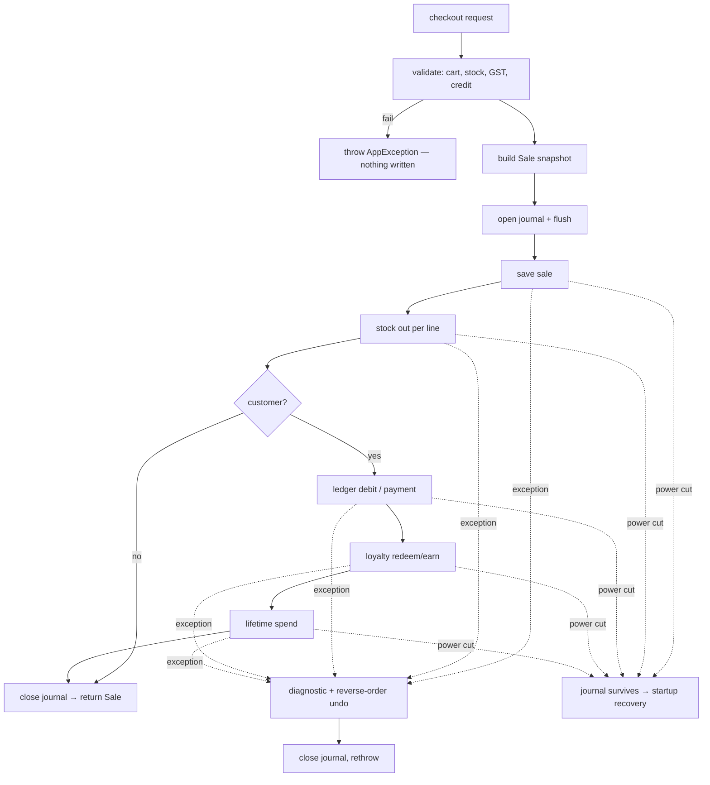
```mermaid
flowchart TD
    A[checkout request] --> B[validate: cart, stock, GST, credit]
    B -->|fail| X[throw AppException — nothing written]
    B --> C[build Sale snapshot]
    C --> D[open journal + flush]
    D --> E[save sale]
    E --> F[stock out per line]
    F --> G{customer?}
    G -- yes --> H[ledger debit / payment]
    H --> I[loyalty redeem/earn]
    I --> J[lifetime spend]
    G -- no --> K
    J --> K[close journal → return Sale]
    E & F & H & I & J -. exception .-> U[diagnostic + reverse-order undo] --> R[close journal, rethrow]
    E & F & H & I & J -. power cut .-> P[journal survives → startup recovery]
```

**Two layers of protection, on purpose.** The in-memory `undo` list handles *thrown* errors with exact compensations. The journal handles *process death*, where the list no longer exists. Neither alone covers both cases.

### 12.3 Things a new developer must not break

* The sale's tax figures come **only** from `Gst.compute` via `SalePricing`; the service never does arithmetic of its own on tax.
* `Sale.total` per line uses the engine's `lineTotal` (so inclusive-mode lines equal shelf price × qty less discount).
* Everything that references the sale uses the **invoice number** (ledger) or the **sale id** (movements, loyalty). Crash recovery depends on both.

---

## 13. `PurchaseService` — procurement, goods receipt and input tax

### 13.1 Lifecycle

`PurchaseStatus`: `Draft → Issued → Received` (or `Cancelled`). `isSettled(received)`.

| Method | Rule |
|---|---|
| `savePurchase(purchase, {isNew, previousStatus})` | requires ≥ 1 item; always **recomputes GST**; detects *transition into Received* (`status == received && priorStatus != received`); on transition temporarily restores the prior status, runs `_assertReceivable`, saves, then `_receive`; writes an `ActionHistory` line ("PO created/updated · status · amount") |
| `markAsIssued` | only from `Draft` |
| `markAsReceived` | not if already received, not if cancelled |
| `cancel` | not if received ("Record a return instead.") |

`_assertReceivable`: every line's product and variant must still exist (else "remove it from the order before receiving") and `quantity > 0`.

### 13.2 `_receive` — stock + supplier credit with rollback

For each item: `performStockIn(reason 'PO Received (PUR-…)', movementReferenceId: purchase.id, performedAt 'Purchase from <supplier>')`, set `receivedQuantity = quantity`, record undo = `performStockOut('Reversal of failed PO receipt')`. If the purchase has a supplier: `addSupplierLedgerEntry(Purchase, referenceId: purchaseNumber, credit: grandTotal)` with undo `deleteSupplierLedgerEntry`. Then status `Received` and save. On failure: `DiagnosticLog(WARNING, Receiving)`, reverse-order undo (each reversal failure → `ERROR` diagnostic), reset every `receivedQuantity` to 0, restore prior status (default `Issued`), save, rethrow.

### 13.3 Purchase GST — the buyer's view of the same engine

`tryComputePurchaseGst(purchase)` returns a reason string or null; `computePurchaseGst` throws it as `AppException`. (The live form preview calls the non-throwing form because "an exception there is an error screen rather than a message".)

* **Recipient = this shop**: `GstStates.resolvePartyState(label 'Shop', company state/code/GSTIN)`; unresolved → *"… Set it in Settings > Business Details."*
* **Supplier state**: the **order's own** copy (`purchase.supplierStateCode/State/Gstin`) wins over the supplier master, so correcting one order never rewrites another; GSTIN is read only if no state is recorded; disagreement blocks.
* Engine call with roles **inverted**: the *supplier is the seller*; place of supply and `destinationStateCode` = **this shop's state**; `isWalkIn: false`; `pricingMode = purchase.pricingMode` (default exclusive); each line carries `lineDiscount = item.discountAmount` (supplier invoices discount individual lines).
* Results are written back onto each `PurchaseItem` and the header (taxable, CGST/SGST/UTGST/IGST/Cess, `tax = totalTax`, roundOff, preRoundTotal, `grandTotal = payable`), `isInterState`, and the **recipient snapshot** (frozen "exactly as a Sale freezes its seller" — a purchase "used to re-read `getCompany()` on every recompute, so renaming the business or correcting its state silently rewrote the tax heads on orders booked months earlier").
* **ITC**: `itcEligibility` defaults to `REQUIRES_DETERMINATION` and is stored with the purchase (`ELIGIBLE`/`INELIGIBLE`/`BLOCKED` selectable). The app records it; it does **not** file or reconcile GSTR-2B (see §21).

### 13.4 Payment status is derived, not stored (`PurchasePayment`)

`Purchase.paymentStatus` exists on the model but nothing ever wrote it except the `'Unpaid'` default — "every order a shop had ever received showed as unpaid forever". It is now **derived from the supplier ledger**:

* `paidAgainst(purchaseNumber, ledger)` = Σ `debit` where `referenceId == purchaseNumber`.
* `status(grandTotal, paidSoFar)` → `Paid` if total ≤ ₹0.005, `Unpaid` if paid ≤ 0.005, `Paid` if paid + 0.005 ≥ total, else `Partial`.
* `allocate(orders, ledger, isReceived)`: payments **filed against an order number** settle that order; payments **to the account** (no order reference — which is *every* payment before the per-order action existed) form a pool allocated **oldest received order first** (open-item settlement). Only **received** orders participate (an unreceived order has not credited the supplier).
* `outstanding(total, paid)` never negative; an overpayment shows as settled (the excess lives on the supplier balance).
* `StorageRepository.purchasePaymentAllocation()` runs this per supplier in one pass for list screens.

---

## 14. Other Domain Services

### 14.1 `CustomerService`

* Pass-throughs: `getAllCustomers`, `searchCustomers`, `getCustomersByGroup`, `getCustomerById`, `findByMobile` (till primary lookup), `statsFor` (visit stats).
* **`registerByMobile(mobile, {name})`** — registers a walk-in from a phone number alone: normalises to last-10 digits (< 10 → *"Enter a 10-digit mobile number."*); returns the **existing** customer if the number is already known; else creates `Customer(code 'C-' + last 6 digits, name = given or 'Customer <digits>', mobile)` with the device id. Rationale: "a cashier at a queue will not type more than that".
* `isDuplicate(mobile, email, {excludeId})` — exact-match on non-empty mobile/email.
* `saveCustomer` — stamps `deviceId` if empty and `updatedAt = now`.
* **`mergeCustomers(primaryId, secondaryId)`**:
  1. `primary.lifetimeSpend += secondary.lifetimeSpend` (a *running* figure nothing recomputes, so adding is the only way); union the `tags`; save.
  2. `reassignCustomerLedger` (moves ledger rows, folds opening balance in, recalculates both balances).
  2b. `reassignLoyaltyTransactions` (moves rows; points are derived so they follow).
  3. Re-read the secondary (steps 2/2b changed and saved it), then **soft-delete**: `isDeleted = true`, `status = 'Merged'`, note appended "[System] Merged into <code> on <ISO>".
  4. `ActionHistory('Customer Merge', 'Merged A (code) into B (code)')`.

### 14.2 `SupplierService`

`isDuplicate(code)` (empty → false), `saveSupplier(supplier, {isNew, openingBalance})` — saves, logs "Supplier Created/Updated", and for a new supplier with `openingBalance > 0` writes a supplier-ledger `Opening Balance` credit ("We owe them money from start"; referenceId `OPENING-<ms tail>`). `deleteSupplier` logs "Supplier Deleted" then **soft-deletes** (so the deletion syncs and historical purchases keep the name).

### 14.3 `ExpenseService`

CRUD pass-through to the repository plus `seedDefaultCategories()` — only when no category exists: `cat_rent Rent (home)`, `cat_utilities Utilities (electric_bolt)`, `cat_salary Salary (people)`, `cat_maintenance Maintenance (build)`, `cat_marketing Marketing (campaign)`, `cat_other Other (receipt)`. Fixed ids make the seed identical on every device so two devices seeding offline merge instead of duplicating.

### 14.4 `BackupService` (point-in-time copy, deliberately separate from sync)

**Why backup exists even though sync exists:** "Cloud sync is a live mirror, not a backup: it faithfully replicates a mistake. Deleting a year of sales replicates the deletion."

* File: plain **pretty-printed JSON** (`formatVersion: 1`, `takenAt`, `deviceTag`, `recordCount`, `data{entityType:[records]}`) — "a backup nobody can read without this exact app version is a hostage, not a safeguard".
* `createBackup()` — not on Web (no file system). Export snapshot → UTF-8 → write to `<name>.<uuid>.part` with `flush` then **rename** into place (atomic: a crash leaves the previous backup, never a truncated file that looks like one) → prune to the newest **10** (housekeeping failure never fails the backup).
* Location: `<base>/Atomid Store/Backups/atomid-<timestamp>.json`, where base = Android **external storage** (app-private documents are deleted on uninstall — "a backup that dies with the app it protects is not a backup"), otherwise the documents directory.
* `restoreBackup(path)` — file exists? readable JSON? `formatVersion` must be an int ≤ the app's (else "written by a newer version…"); `data` must be a map; then `importSnapshot` (additive by id; nothing local is deleted for being absent from the backup, "so restoring an older backup cannot destroy work done since it was taken").
* `listBackups()` newest-first with file size (record count is not read, to avoid parsing every file).

### 14.5 Diagnostics service surface (in the repository)

`recordDiagnostic`, `getDiagnostics({limit=200, severity})`, `clearDiagnostics`. Areas: `Checkout`, `Receiving`, `Storage`, `Startup`, `Backup`. The Health banner/System Console reads them (Part VIII).

### 14.6 Expenses data (model recap)

`Expense`: id, title, categoryId, categoryName (denormalised snapshot so renaming/deleting a category does not blank old rows), amount, date, notes, `receiptImagePath?`, createdDate, createdBy, isSynced. `ExpenseCategory`: id, name, iconName (a string key mapped to a Material icon in the UI). Expenses sync with `createdDate` as their recency stamp; categories are always fully pulled.

---

# PART VII — HARDWARE, PRINTING AND DOCUMENTS

## 15. Hardware Layer (`lib/core/hardware/`)

### 15.1 Design

Hardware is modelled as **devices** behind one abstract class, so a screen asks "is the label printer ready?" without knowing whether it is a USB scanner, a Windows spooler queue or (later) a raw TSPL socket.

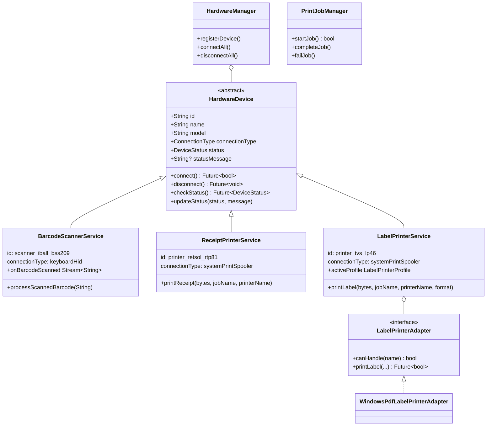
```mermaid
classDiagram
    class HardwareDevice {
      <<abstract>>
      +String id
      +String name
      +String model
      +ConnectionType connectionType
      +DeviceStatus status
      +String? statusMessage
      +connect() Future~bool~
      +disconnect() Future~void~
      +checkStatus() Future~DeviceStatus~
      +updateStatus(status, message)
    }
    class BarcodeScannerService {
      id: scanner_iball_bss209
      connectionType: keyboardHid
      +onBarcodeScanned Stream~String~
      +processScannedBarcode(String)
    }
    class ReceiptPrinterService {
      id: printer_retsol_rtp81
      connectionType: systemPrintSpooler
      +printReceipt(bytes, jobName, printerName)
    }
    class LabelPrinterService {
      id: printer_tvs_lp46
      connectionType: systemPrintSpooler
      +activeProfile LabelPrinterProfile
      +printLabel(bytes, jobName, printerName, format)
    }
    class HardwareManager {
      +registerDevice()
      +connectAll()
      +disconnectAll()
    }
    class PrintJobManager {
      +startJob() bool
      +completeJob()
      +failJob()
    }
    class LabelPrinterAdapter {
      <<interface>>
      +canHandle(name) bool
      +printLabel(...) Future~bool~
    }
    class WindowsPdfLabelPrinterAdapter
    HardwareDevice <|-- BarcodeScannerService
    HardwareDevice <|-- ReceiptPrinterService
    HardwareDevice <|-- LabelPrinterService
    HardwareManager o-- HardwareDevice
    LabelPrinterService o-- LabelPrinterAdapter
    LabelPrinterAdapter <|.. WindowsPdfLabelPrinterAdapter
```

`DeviceStatus`: `connected, disconnected, connecting, error, unknown`. `ConnectionType`: `usb, bluetooth, network, serial, systemPrintSpooler, keyboardHid` (only `keyboardHid` and `systemPrintSpooler` are implemented). `updateStatus(newStatus, [message])` always **overwrites** the message "to allow clearing errors on success".

`hardwareManagerProvider` (Riverpod) constructs a `HardwareManager` and registers the three device services. `connectAll()` runs once at startup (§5.3 step 9) and sequentially `await`s each `connect()`.

### 15.2 Barcode scanner — keyboard-wedge (HID)

Hardware named in the code: **iBall BSS209**. A keyboard-wedge scanner types the barcode as keystrokes followed by Enter; the OS handles USB/Bluetooth, so `connect()` merely marks the device `connected`.

`GlobalBarcodeListener` (wraps the whole app in `main.dart`) is a `KeyboardListener` with autofocus:

1. On each `KeyDownEvent`, if the gap since the previous key is **> 50 ms** (`_barcodeMaxCharIntervalMs`) the buffer is cleared — humans type slower than scanners (~< 30 ms per character).
2. `Enter` with a non-empty buffer → `BarcodeScannerService.processScannedBarcode(buffer)`; any other key with a character is appended (max 256 chars).
3. `processScannedBarcode` ignores input unless the device is `connected`, trims, and broadcasts on `onBarcodeScanned`.

Consumers: `PosScreen` subscribes in `initState` (post-frame) and calls `_processSearch(barcode)`, so scanning works while the POS is open without focusing the search box. Phone/tablet cameras use `mobile_scanner` instead (`PosScreen` camera toggle, `BarcodeScannerScreen`).

> Known gap: the **"Keyboard HID Barcode Scanner"** switch on the Hardware settings screen persists `scannerEnabled`, but nothing reads it (§21).

### 15.3 Receipt printer

Hardware named: **RETSOL RTP-81** (80 mm thermal). `checkStatus()` loads `HardwareConfigModel`; no name configured → `disconnected` ("No printer configured in settings."); name present but absent from `Printing.listPrinters()` → `error` ("…ensure the driver for RETSOL RTP-81 is installed on this laptop."); else `connected`.

`printReceipt(pdfBytes, jobName, {printerName})`: resolves the named `Printer` (missing → `false` with an error status), then `Printing.directPrintPdf` to the spooler. It **never throws into the sale flow**: "Does NOT block offline sales if it fails." On checkout, `CheckoutScreen._dispatchAutoPrint` runs *after* the sale is committed and the cart cleared, fire-and-forget.

### 15.4 Print job de-duplication (`PrintJobManager`)

`startJob(jobId, transactionId, docType, printerId)` returns **false** if a job with that id exists and is not `FAILED` — so a double-tap or a re-entry cannot print two receipts for one sale. Job ids: `receipt_<saleId>`, `label_<…>`, `BULK_PRINT`. A failed job may be retried (attempt counter carried over). Memory is bounded to the **50 most recent** jobs (oldest evicted). `completeJob`, `failJob(jobId, error)` (increments `attempts`).

### 15.5 Label printer — TVS LP 46 DLITE

Hardware named: **TVS Electronics LP 46 DLITE** (thermal label printer reached through the OS driver/spooler). Pieces:

| Piece | Role |
|---|---|
| `LabelPrinterProfile` | Physical media description: media/label width & height (mm), `columns`, horizontal/vertical gap, margins, `LabelPageModel` (`singleLabel`, `multiColumnMedia`, `continuousRoll`) |
| `LabelLayoutEngine` | Validates a profile and answers geometry questions |
| `LabelRenderer` | Draws one label as `pdf` widgets |
| `LabelPrinterAdapter` / `WindowsPdfLabelPrinterAdapter` | Sends a rendered PDF to the named Windows printer (`Printing.directPrintPdf`, `usePrinterSettings: true`); missing printer → exception "…is offline or missing." |
| `LabelPrinterService` | Device wrapper: holds `activeProfile`, picks an adapter, tracks status |

**Predefined profiles**

| id | Name | Media (mm) | Label (mm) | Columns | Gap | Margins | Model |
|---|---|---|---|---|---|---|---|
| `50x35` (default) | 50x35 mm | 50 × 35 | 50 × 35 | 1 | 0 | 0 | singleLabel — driver gets one logical 50×35 page; the printer's gap sensor handles spacing |
| `50x35_2up` | 50x35 mm (2 Across) | 104 × 35 | 50 × 35 | 2 | 2 mm h-gap | L/R 1 mm | multiColumnMedia — app places two labels per page |
| `50x50` | 50x50 mm | 50 × 50 | 50 × 50 | 1 | 0 | 0 | singleLabel |

**`LabelLayoutEngine` validation (throws `Exception` otherwise):** label ≥ **20 × 15 mm** ("minimum to safely render a barcode"); media dimensions > 0; columns ≥ 1; `leftMargin + columns×labelWidth + (columns−1)×gap + rightMargin ≤ mediaWidth`. Geometry: `pdfPageFormat` (single label → label size; otherwise full media width), `labelsPerPage` (1 or `columns`), `calculateTotalPages(n) = ceil(n / perPage)` (0 for n ≤ 0), `getColumnOffset(i) = leftMargin + (labelWidth + gap) × i` (mm).

**`LabelRenderer.buildLabelContent(PriceTagLine)`** — one label:
* safe margin 2.5 mm; vertical budget **40 % name+size / 35 % barcode / 25 % price**; 0.5 mm spacing.
* Name (bold 9 pt, max 2 lines) with `Size: X` (8 pt); fallback `"Unnamed Product"`.
* **Code 128** barcode, graphic without text, then human-readable text (6 pt, shrink-to-fit) — the barcode value has non-ASCII characters replaced with `?` ("Code128 accepts ASCII 0–127 … so the widget never throws"); empty barcode → `00000`.
* Price `Fmt.money(price, currencySymbol)` bold 12 pt, shrink-to-fit.

**Status flow**: `checkStatus()` first loads the saved profile (so a 2-across preview works even before a printer is picked), then verifies the configured printer exists. `printLabel(...)` finds an adapter, sends, and sets status to `connected` ("Ready: …") or `error` ("Print job rejected by spooler" / "Driver error: …"). Only the Windows spooler adapter exists ("Later this can be expanded to TSPL/EPL raw sockets").

### 15.6 Persisted configuration

`HardwareConfigModel` (untyped box `hardware_config`, key `settings`): `receiptPrinterName?`, `labelPrinterName?`, `scannerEnabled` (true), `labelProfileId` ('50x35'). **Per terminal — never synced** ("Terminal Hardware Setup … for this specific terminal"): printers differ per machine.

`HardwareSettingsScreen` loads printers via `Printing.listPrinters()` and lets the user choose: scanner switch, receipt printer ("None (Use OS Dialog)" allowed), label printer, label profile (3 options). Each change is saved immediately. `HardwareDiagnosticsScreen` lists every registered device with model / status / connection type and a refresh button that calls `checkStatus()`.

### 15.7 Price-tag sizing for A4 sheets (`PriceTagSize`)

Tags are sized by how many fit on the sheet so the grid divides the page exactly:

| Size | Grid (cols × rows) | Per sheet | Approx tag | Notes |
|---|---|---|---|---|
| Small | 5 × 10 | 50 | 42 × 30 mm | logo inline beside the name |
| Medium (default) | 4 × 6 | 24 | 52 × 49 mm | |
| Large | 3 × 4 | 12 | 70 × 74 mm | display/promo |

Typography is specified **per size** rather than scaled "because a barcode that has been shrunk by a multiplier stops scanning long before it stops looking reasonable on screen". `PriceTagPrintMode`: `a4Sheet` (OS print dialog) or `lp46Direct` (1 page = 1 physical label, direct to spooler).

---

## 16. Documents: PDF, Invoices, Reports (`core/services/export_service.dart`, 2,390 lines)

`ExportService` is a static utility that builds every printable/shareable document with the `pdf` package and delivers it through `printing` and `share_plus`.

### 16.1 Resource loading and fonts

* `_ensureResourcesLoaded()` (idempotent): bundled **Roboto Regular/Bold**, the **fallback fonts** (Noto Sans Tamil, Noto Sans Devanagari — Regular only), and the **logo** (`assets/images/logo.png`).
* **Why fallback fonts:** Roboto and every Google font offered in settings carry no Tamil/Devanagari glyphs, so a shop name/address/footer typed in those scripts printed as nothing ("Unable to find a font to draw"). The fallback list is walked for any rune the main face lacks; Latin text never touches it. To add a script: drop a Noto face in `assets/fonts/` and add it to `_fallbackFontAssets`. (Noto licence: `Docs/licenses/NotoFonts-OFL.txt`.)
* **Italic is mapped to the regular face** because an unset italic falls back to built-in Helvetica-Oblique which has no Unicode (₹ and Indic scripts would render as blanks); the only italic text is the shopkeeper-written footer.
* **A `SynchronousFuture` deadlock** is documented in the source: `rootBundle.load(...).catchError` never completes on a `SynchronousFuture`, which once deadlocked every document; the code uses `try/catch` instead.
* `_getTheme(fontName)`: **Roboto never touches the network** (an offline-first app must not fetch its own default font). Other names (`Open Sans`, `Lato`, `Montserrat`, `Oswald`, `Merriweather`) use `PdfGoogleFonts`, **cached per name on success**; a fetch failure (routine offline) falls back to bundled Roboto **for that document only and is not cached**, so later invoices retry once connectivity returns; an unknown name → bundled Roboto.

### 16.2 Invoice templates (presentation only)

`InvoiceTemplate` enum (persisted as `id` in `SettingsModel.invoiceTemplate`; unknown id → `thermal` fallback so a newer build's id never crashes the till):

| id | Label | Layout |
|---|---|---|
| `THERMAL` (default) | Thermal Receipt | 58/80 mm till roll |
| `A4_PROFESSIONAL` | A4 Professional | A4 tax invoice, GST summary, amount in words |
| `A4_DETAILED_GST` | A4 Detailed GST | adds HSN and per-line CGST/SGST columns |
| `SIMPLE_RETAIL` | Simple Retail | plain bill: item, qty, rate, amount, GST totals |

**Invariant:** a template **never recomputes** anything. All render the same stored `Sale` snapshot, so the choice cannot change what a customer was charged. `ExportService.generateInvoiceForTemplate(sale, settings, company, invoiceSettings, {template, pageFormat})` is the single entry point: thermal → `generateThermalReceiptPdf`, otherwise `generateInvoicePdf`.

### 16.3 A4 invoice contents (`generateInvoicePdf`)

Header: logo (if `showCompanyLogo`), seller legal name (from the **sale snapshot**, falling back to the live company), trade name, address, state + code, **GSTIN**, phone; right side: document title (`Tax Invoice` / `Bill of Supply` from `sale.documentType`), invoice number, date, and **Place of Supply** when inter-state. "Billed To" block (name, address, state, phone, customer GSTIN). Item table (columns per template; HSN is always printed — a dash means the product still needs one). Summary: gross subtotal, discount (% and amount), reward discount, taxable value, IGST *or* CGST + (UTGST *or* SGST) (rate shown as `@ x%` when a single rate applies), total GST, cess, round-off, **Total Payable**. **Amount in words** (Rule 46) rendered from the same grand total. **GST summary by rate** (when `settings.showGstBreakdown`; for Simple Retail only if multiple rates). Footer: UPI QR (only if `showUpiQr` **and** payment method is UPI and an image is set), "For <seller> / Authorized Signatory" block (`showSignature`), italic footer text. Terms & conditions. Page: `settings.pdfPageSize` (`A4`/`Letter`) unless the print dialog's format is usable (`_sheetOrFallback` rejects infinite/zero formats such as a receipt roll, which would make `MultiPage` assert).

### 16.4 Thermal receipt

Printable width is set explicitly (80 mm paper → **72 mm** printable; 58 mm → **48 mm**) "to prevent the driver from clipping the right edge". Compact header (logo, name, GSTIN), bill number + date on one line, two-line items (name/qty/amount, then HSN + rate detail), totals, optional tax summary (`showTaxOnThermalReceipt`; each rate listed when several), round-off, total, UPI QR, T&C, one-line signature. The postal address and a separate "TAX INVOICE" banner were removed because they "cost four lines of roll on every sale".

### 16.5 Reports and tags

| Method | Output |
|---|---|
| `generateSalesReportPdf` | Date / Invoice / Customer / Items / Total with totals from `DocumentTotals` |
| `generateInventoryReportPdf` | Product / Code / Size / Barcode / Qty / Price |
| `generateInventoryValuationReportPdf` | Product / Size / Qty / Price / Value |
| `generatePurchaseReportPdf` | Date / Purchase # / Supplier / Items / Total |
| `generateSupplierReportPdf` | Code / Name / Phone / GST / Status / Total Purchases |
| `generateSingleTagPdf` | one tag (default 200×300 pt page, or custom mm) |
| `generateBulkSheetPdf` | A4/Letter grid of tags, flowing continuously across products so a sheet is filled before another starts ("printing five products used to cost five part-empty sheets") |
| `generateBulkLabelRollPdf` | one label per page (or per row for multi-column media) for the LP46 |

Barcode on A4 tags: Code 128 with drawn text.

### 16.6 Export, files and sharing

* `safeFileName(value)` — replaces `< > : " / \ | ? *` and control chars with `-`, collapses whitespace, strips leading/trailing dots/spaces (Windows silently strips them), prefixes Windows reserved names (`CON`, `PRN`, `AUX`, `NUL`, `COM1-9`, `LPT1-9`) with `_`, falls back to `atomid-export`, and caps at **120** chars. Needed because free text such as sizes `1/2 kg` or `12"` would otherwise break a path. Windows rules are applied on all platforms so names are identical everywhere.
* `exportPdf` / `exportPdfBytes` → `<Documents>/Atomid Store/PDF/<name>.pdf` (Android: external storage dir); `exportPng` → `…/Images/<name>.png` (first page only, 300 dpi; throws `AppException('There was nothing to export.')` if raster yields nothing).
* `shareFile(context, file, text)` → `SharePlus.instance.share`, with a share-popover anchor rect for iPad/tablet; if the user dismisses → snack bar "Share cancelled. File saved to …"; if the plugin fails on desktop → snack bar with **Show in Folder** (Windows `explorer.exe /select,`) or **Copy Path**.
* `ShareBottomSheet` (`presentation/common`): Share (writes to cache + native share sheet — avoids `Printing.sharePdf`, which opens a PDF viewer on many Android devices), Save PDF, Print.
* **Web:** file export is unsupported (`UnsupportedError`); backups are disabled.

---

# PART VIII — THE PRESENTATION LAYER: EVERY MODULE AND SCREEN

## 17. UI Architecture

### 17.1 Composition and state (Riverpod 3)

`lib/presentation/providers/app_providers.dart` is the **composition root view** of the app:

* **Injected singletons** (throw `UnimplementedError` if not overridden — "a second construction path would give tests and entry points a different object graph"): `storageRepositoryProvider`, `firebaseRepositoryProvider`, `authServiceProvider`, `sessionServiceProvider`, `syncServiceProvider`. `bootstrap()` overrides all five.
* **Derived services**: `backupServiceProvider`, `saleServiceProvider`, `supplierServiceProvider`, `purchaseServiceProvider`, `expenseServiceProvider`, `customerServiceProvider` — cheap objects rebuilt from the repository.
* **Change tracking**: `DataVersionNotifier` holds `Map<topic, int>`; it subscribes to `StorageRepository.changes` and bumps the counter for the announced topic. Every read provider calls `_watch(ref, topic)` which `select`s **only that topic's counter** — so a provider rebuilds *only* when its own area changes.
* **Read providers** (all synchronous, backed by the repository's caches): settings/invoice/company/loyalty settings, `currencySymbolProvider` (a `select` on the symbol so unrelated settings changes do not rebuild widgets that only need it), products, filtered products (with `searchQueryProvider`), low/out-of-stock lists, total stock units, movements, inventory valuation, sales / today's sales / revenue / items sold, suppliers (+ search & category filter notifiers), supplier ledger family, purchases (+ search & status filter), `purchasePaymentsProvider` (watches **suppliers and purchases** because payments are supplier-ledger rows), today's purchases, expenses & categories, customers (+ search & group filter), customer ledger and loyalty-transaction families, history.
* **Sync/health providers**: `authStateProvider` (a `StreamProvider<User?>`), `isSignedInProvider`, `syncStatusProvider` (`SyncStatusNotifier` listening to `SyncService.statusStream`; previously "a string that nothing ever wrote, so the cloud icon showed a green 'Synced' no matter how deep or broken the queue was"), pending/dead queue items, sync log, sync-failure log, diagnostic log, `unresolvedDiagnosticsProvider` (ERROR-severity only — what the Health tab badges).

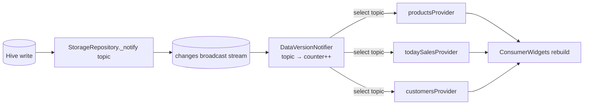
```mermaid
flowchart LR
    W[(Hive write)] --> R[StorageRepository._notify topic]
    R --> S[(changes broadcast stream)]
    S --> V[DataVersionNotifier<br/>topic → counter++]
    V -->|select topic| P1[productsProvider]
    V -->|select topic| P2[todaySalesProvider]
    V -->|select topic| P3[customersProvider]
    P1 & P2 & P3 --> UI[ConsumerWidgets rebuild]
```

> **Rule:** never read the repository directly in `build` without watching the matching topic via a provider, or the screen will show stale numbers. Some older code paths still call `ref.invalidate(...)` (e.g. customer form/payment dialog) — harmless but redundant.

### 17.2 `CartNotifier` (basket)

State = `List<CartItem>` (immutable list replaced on each change):

* `addItem(product, variant)` → `false` if `variant.quantity <= 0`; merges into an existing line **by variant barcode**; refuses to exceed on-hand stock (so the UI can toast *why* nothing happened rather than ignore the tap).
* `updateQuantity(barcode, n)` (`n <= 0` removes; `n > stock` → `false`), `removeItem`, `clearCart`, `subtotal` (round2), `totalItems`, `validateStock()` (names the first line that now exceeds stock — stock can move underneath a basket left open).
* `CartItem` is re-exported from `domain/cart_item.dart`; `CartItem.total = round2(price × qty)` and `displayName = "<productDisplayName> (<size>)"`.

### 17.3 Navigation shell (`AppShell`)

* 9 destinations: **Home, Products, Stock, Purchases, Suppliers, Customers, Reports, System, Settings**.
* Breakpoints (`ResponsiveBreakpoints`): mobile < 600, tablet 600–1023, desktop ≥ 1024 px.
  * **Mobile**: bottom `NavigationBar` with 5 primary tabs (Home, Products, Stock, Reports, System) + **More** (bottom sheet listing Purchases, Suppliers, Customers, Settings).
  * **Tablet**: `NavigationRail` (labels).  **Desktop**: extended rail with brand title (minimum extended width 230).
* **`IndexedStack` with lazy build**: a destination's widget is only constructed once visited (tracked by *label*, not index) — "handing it every destination meant the first frame after startup constructed all eight at once — every list, dashboard and report querying storage before the user had looked at any of them". Visited screens stay alive, so scroll position/search text/filters survive tab switches.
* A `SyncStatusBar` sits under the body on every screen.
* **Startup notices** (first frame): if `recoveredBoxes` is non-empty → a red 10-second snack bar naming the reset boxes ("Sign in and fetch from the cloud to restore it"); else if `cloudMessage` exists → snack bar.
* Responsive helpers: `ResponsiveHelper`, `ResponsivePadding` (32/24/16 px), `ResponsiveBuilder`, `AdaptiveDialog` (full-screen dialog on mobile, `AlertDialog` ≤ 800 px wide on larger screens), `ResponsiveDataTable` (card list on mobile, scrollable `DataTable` on wider; handles its own scrolling unless `nested`), `EmptyState` (icon + title + message + optional action), `BrandTitle`/`BrandMark`, `GstinStateFields` (shared GSTIN + state selector), `StatusColors` context extension (`warningColor`, `dangerColor`, `successColor`, `mutedColor`; theme-aware to satisfy WCAG AA — `Colors.orange` on white measured ~2.4:1 vs the required 4.5:1).

### 17.4 Theme

`AppTheme` (Material 3): brand gold `#D4AF37` seed; dark background `#121212` / surface `#1E1E1E`, light background `#F5F5F7` / surface white; Google Fonts **Outfit** for text; cards elevation 4 radius 16; buttons radius 12; filled inputs radius 12 with a 2 px gold focus border. `settings.isDarkMode` (default **true**) chooses the mode. Because the logo is black line art, it is always drawn on a white rounded ground (`BrandMark`).

---

## 18. Module-by-Module Reference

> Each module lists **what it is for, the screens, what a user can do, the rules enforced, the data touched, and why it is built that way.**

### 18.1 Home / Dashboard — `features/dashboard/dashboard_screen.dart`

* **Purpose:** the owner's at-a-glance page.
* **Empty store** (no products and no sales today) → `EmptyState` "Welcome to <store>… Everything works offline and syncs when you connect." with an "Add stock" action.
* **Today** grid: Revenue, Invoices, Items sold, Average sale — from the cached `_TodayTotals`.
* **Needs attention**: out-of-stock and low-stock cards with variant chips that open Stock-In. Out-of-stock lines are shown **deliberately** — the source notes they "used to vanish from the dashboard entirely" because the low-stock query required `quantity > 0`.
* **Quick actions** (only items not already in the nav): **New sale** (primary), Sales history, Stock in, Scan, Price tags, Expenses, Activity (history).
* **Your store**: product count, stock at retail, stock at cost, potential margin (retail − cost; green/red).
* App bar: `BrandTitle` + `SyncStatusWidget`.

### 18.2 Billing & POS — `features/billing/`

**`PosScreen`** ("Billing & POS")
* **Inputs:** one search field ("Scan barcode, type style code or product name…", autofocus); camera scan toggle (`mobile_scanner`, `DetectionSpeed.noDuplicates`, closes after one read); keyboard-wedge scanner stream (§15.2).
* **Resolution logic (`_processSearch`)**: exact barcode via the O(1) index → add that variant straight to the basket; else `searchProducts`; 0 matches → toast "Nothing matches"; 1 match → variant picker; several matches sharing **one product code** (one style in several colours) → a **single colour-and-size picker** ("asking 'which product?' and then 'which size?' makes the cashier answer the same question twice"); otherwise a product picker → variant picker.
* **Stock guard:** out-of-stock variants cannot be added ("…is out of stock."); adding beyond on-hand stock → "Only N in stock — all of them are already in the basket." Success toast 1.2 s, error 3 s.
* **Layout:** mobile = search + cart pane + floating "N · ₹total" checkout button; tablet = catalogue grid (flex 5) | cart (flex 4); desktop = catalogue grid (flex 6) | 440 px cart. Clear-basket action in the app bar.
* Totals shown live via `SalePricing.computeCart` (no customer yet → walk-in policy applies).

**`CheckoutScreen`**
1. **Customer** (optional): `CustomerLookupField` — identify by **10-digit phone** (O(1) lookup); letters fall back to name search; unknown number → inline "Name (optional)" + **Add and attach to this sale** (`CustomerService.registerByMobile`). Once matched, a card shows *"This is their 12th visit"*, purchases, spent here, average bill, points, standing — facts for the cashier to decide a discount ("What to give away is the shop's call, not the app's").
2. Selecting a customer sets `_destinationStateCode` from the customer's state (so Place of Supply follows the customer) and shows GSTIN validity (*"B2B GSTIN format valid"* / *"incomplete"*).
3. **Loyalty** (only if enabled and a customer is attached): `RewardDiscountWidget` offers redeeming points up to `maxRedeemableValue`.
4. **Discount**: presets 0/5/10/15/20 % + free entry (two decimals); helper text shows the resulting amount; clamped by the engine (never above subtotal less reward).
5. **Payment method**: **Cash, UPI, Card** (UI-offered list). *(`SaleService` also supports `Credit`, but the checkout UI does not offer it — see §21.)*
6. **Notes**.
7. **Summary card** (live `SaleService.preview`): subtotal, discount, reward, taxable, CGST/SGST (or IGST), cess, round-off, **Payable Amount**; Place of Supply is shown only when inter-state. GST errors are shown in a red banner and **block** confirming.
8. **Confirm** → `SaleService.checkout` (see §12). While processing: "Recording sale and freezing tax snapshot…". Success: cart cleared, **silent auto-print** (§15.3) to the configured receipt printer if any, then navigate to `InvoicePreviewScreen`, clearing the stack back to the shell. Failure: red snack bar with `describeError(error, fallback: 'The sale could not be completed. Nothing was charged.')`.

**`InvoicePreviewScreen`** — `PdfPreview` of the sale in the **shop-wide** template (deliberately not selectable here "the counter should print the same document on every bill"); thermal uses the roll format. Actions: Share (ShareBottomSheet with filename = invoice number and a message with the amount — "otherwise the customer receives `document.pdf`"), Print (`Printing.layoutPdf`, job name uses the template), Download PDF.

**`SalesHistoryScreen`** — all non-deleted sales newest first; search by invoice number or customer; per-row share (re-renders the invoice in the current template).

### 18.3 Products — `features/products/`

**`ProductListScreen`**: search ("Search product or barcode…", via `filteredProductsProvider`); master-detail on wide screens ("Select a product to view details."), cards on phones; per-variant "Price Tag" button; Edit; Delete (confirmation, writes an `ActionHistory` "Deleted", calls `deleteProduct`); **Read a price tag** (OCR) and **Add product** actions.

**`ProductFormScreen`** (1,080 lines) — create/edit:
* Fields: Product Name*, Product Code / Style #, Category (default `Dresses` for new products, `General` if blank on save), Brand, Colour, **GST Tax Treatment*** (Taxable / Nil rated / Exempt / Non-GST), **GST Rate %*** chosen from the rate book (or a **custom %**), Cess %, HSN (mandatory if `settings.hsnRequired`), **UQC** unit.
* New-product default rate: the shop's legacy `taxRate` if > 0, else **5 %** (taxable).
* **Variants:** size chips `S, M, L, XL, XXL` + **Add Custom Size**; each selected size has: Selling Price (MRP)*, Cost Price, Available Stock Qty*, Low-stock alert level (default 5), Barcode* (auto-generated 12-char uppercase from a UUID; regenerate button), SKU (auto-generate `<3-letter store code>-<CODE>[-<COLOUR>]-<SIZE>`), cumulative stock-in/out counters.
* **Validation on save:** form valid; ≥ 1 size selected; **no duplicate barcodes within the product** (snack bar), plus a repository-level check against other products; the **shared-code check** (`_confirmSharedCode`): sharing a code is allowed, but it asks if a code is shared with **no colour** to tell records apart, or if **code + colour already exists** ("Already stocked?" — Go back / Save anyway).
* **Save path:** new → `saveProduct`; edit → **`saveProductWithStockAudit`** (stock edits become audited movements, §7.6). Writes an `ActionHistory` ("Created/Updated Product"). Rate stored as 0 when treatment is not taxable.

**`OcrScannerScreen`** (price-tag reader, Android/iOS only — not Web): pick Camera/Gallery (`image_picker`), run Google ML Kit text recognition, parse lines with regexes — price `(₹|Rs\.?)\s*(\d+)`, code `^[A-Z0-9]{6,12}$` (excluding lines containing "MRP"), size ∈ {S,M,L,XL,XXL} — show the extracted values and raw text, then **Review & Create Product** pre-fills `ProductFormScreen` (code, price, size). A failure shows "Unable to read tag. Please try again with a clearer image."

**`BarcodeScannerScreen`** (camera): on a detected code stops the camera, resolves via the barcode index, logs an `ActionHistory` "Barcode Scanned" (own UUID), and opens `PriceTagScreen` for that variant; unknown → "Product Not Found" dialog with *Scan Again*. The code defends against a stale index with a guarded variant lookup (an unguarded `firstWhere` "turns 'should' into a StateError that crashes the scanner mid-shift").

### 18.4 Inventory — `features/inventory/`

* **`InventoryDashboardScreen`** ("Inventory"): totals, low-stock and out-of-stock lists with **Stock In** shortcuts, links to **Stock Out** and **Inventory Movements**, PDF export of the inventory report.
* **`StockInScreen`**: choose product → variant (or pre-selected), quantity > 0, reason ∈ **Purchase, Return, Adjustment, Manual Entry** → `StorageRepository.performStockIn`.
* **`StockOutScreen`**: reason ∈ **Sale, Damage, Return, Adjustment**; quantity limited to on-hand ("Max: n") → `performStockOut`.
* **`InventoryMovementScreen`**: chronological movement log with search over product / barcode / reason (`Stock In` / `Stock Out`, reason, barcode, reference).
* All stock changes produce an immutable `InventoryMovement`, update the cumulative counters and enqueue sync.

### 18.5 Customers — `features/customers/`

* **List**: search by name/mobile/code/tags, group filter **All / General / VIP / Wholesale**; Export/Import icons are **placeholders** (they only show a snack bar "Exporting Customers…" / "Import Customers…").
* **Form**: name*, mobile*, GSTIN + **state** (`GstinStateFields` — structural GSTIN validation, "Format valid… Not verified with the GST portal."), billing address, email, group, tags, internal notes, **credit limit**, **credit days**, **opening balance**, status (**Active/Inactive**). Duplicate detection on mobile or email. New customer code `CUST-<ms tail>`. *Known defect:* a non-zero **opening balance is double counted** on creation (§21).
* **Details**: contact card, credit limit, reward points, lifetime spend, outstanding balance; **Record Payment** (amount, mode Cash/UPI/Card, notes → ledger *credit* of type `Payment`); **Merge Customer** (soft-deletes the selected secondary into the current customer, §14.1); tabs **Financial Ledger** (newest first) and **Loyalty Rewards**.

### 18.6 Suppliers — `features/suppliers/`

* **List**: search; category filter **All / General / Electronics / Hardware / Services**; Export/Import placeholders; edit, delete (soft); "Inactive" chip.
* **Form**: name*, code* (unique), category, contact person, phone, email, address, GSTIN + state (`GstinStateFields`), notes, **payment terms** (Advance / Due on Receipt / Net 15 / Net 30 / Net 60), **opening balance (owed to supplier)** → supplier-ledger `Opening Balance` credit.
* **Details**: info, purchase list, ledger ("Amount payable" / "Payment made"), **Record Payment** (amount, reference ID e.g. cheque #, notes). The payment dialog is its own stateful widget — the source documents a "controller disposed while the route was still animating out" error screen that this structure fixes. A payment with **no reference** gets `PAY-<ms tail>` and settles the account as a whole (oldest-order-first allocation); a reference equal to a purchase number settles that order.

### 18.7 Purchases — `features/purchases/`

* **List**: search (number, supplier, item names), status filter, **payment badge** from the derived allocation.
* **Form** (1,016 lines): supplier*, supplier invoice number/date, **supplier GSTIN & state** (default = shop's state, only once the shop has one), lifecycle status, expected delivery, notes, **line items** (product → size variant, qty, cost, GST % ∈ 0/5/12/18/28, HSN, per-line discount, cess). A **live preview** recomputes GST on each keystroke via `tryComputePurchaseGst` (shows the reason if it cannot). An **ITC banner** states `REQUIRES_DETERMINATION` (the form always saves that value; there is no control to change it). Save → number `PUR-…` → `PurchaseService.savePurchase`.
* **Details**: header, items with per-line tax, totals, payment status, and a **state-driven action button**: *Send to supplier* (Draft→Issued), *Receive into stock* (Issued→Received, moves stock & credits supplier), *Record payment* (Received only — files a ledger debit under the purchase number); print/share via the purchase report PDF.

### 18.8 Expenses — `features/expenses/`

* **List**: period filter (**Today / This Week / This Month / All Time** via `DateWindow`), totals, swipe-to-delete with confirmation, add. Seeds default categories if none exist (also done at bootstrap).
* **Form**: amount*, title/description*, category* (6 seeded), date, notes. Id = UUID.

### 18.9 Reports & GST — `features/reports/reports_dashboard_screen.dart`

Timeframe chips **Today / This Week / This Month / All Time**; PDF export of the sales/GST report; three tabs:

1. **Overview** — Total Revenue, Total GST Collected, items sold ("Dresses Sold" label), invoices issued, **Top Selling Garments**.
2. **Sales & GST** — Gross turnover, net taxable turnover, CGST, SGST, UTGST (if any), IGST, Cess, **Total Output GST**; **rate-wise table** (rate, taxable, CGST, SGST/UTGST, IGST, total tax).
3. **HSN Summary** — per HSN: UQC, total qty, total value, taxable value, CGST, SGST, IGST, Cess (the structure of GSTR-1 table 12).

All sums come from `DocumentTotals` over **stored snapshots** (never recomputed). There is **no GSTR-1/3B filing export** (§21).

### 18.10 Price tags & labels — `features/price_tag/`

* **`PriceTagScreen`**: preview one tag; "Show Quantity"; **Save Image** (PNG), **Export PDF**, **Share**, **Print** (to the configured label printer through `PrintJobManager`, else the OS print dialog).
* **`BulkGeneratorScreen`** (923 lines; the working tree has uncommitted edits adding a **Multiple products** mode): "Print for" = *This product / Multiple products / All products*; **Print Destination** = *A4 Sheet Printer* or *LP46 Label Printer*; A4 → tag size Small/Medium/Large; LP46 → shows the active label profile (size, media, columns, gap). Per-variant quantity fields with **Fill from stock** and **Clear**, product filter, live `PdfPreview` pinned to the sheet that will print (LP46 mode disables the generic print button to force the controlled dispatch). Checks printer configured, de-duplicates through `PrintJobManager`.

### 18.11 Settings — `features/settings/`

| Screen | What it controls |
|---|---|
| **Settings** (hub) | Store name, currency symbol, **round-off**, **mandatory HSN**, **print GST summary table**, **thermal width (58/80 mm)**, **show tax on thermal**, dark mode, PDF page size (A4/Letter), links to every sub-screen, account (sign in/out), backup |
| **Advanced** ("Advanced Admin Setup") | **Tax mode** (inclusive/exclusive), **walk-in place-of-supply policy** (Use shop state / Require state / Ask at checkout), **tax-inclusive rounding** (SHELF_PRICE vs TAX_RATE), **default UQC** (PCS/NOS/SET/MTR/KGS), **GST rate book manager** (add/edit/delete presets with cess and notes) |
| **Business Details** (company profile) | name, trade name, logo (image picker), owner, **GSTIN + registration status** (Registered/Unregistered/Composition), PAN, phones, email, website, address, city, **State / UT (required before billing)**, country (default India), pincode, **invoice prefix**, financial year; unsaved-changes guard (`PopScope` "Discard changes?"). Currency & barcode prefix are carried over from other settings |
| **Invoice Template** | pick one of 4 designs by looking at rendered samples (three rates & HSN on every line so the rate summary shows); full-size preview |
| **Invoice Layout & UPI QR** | show logo, **show signature block**, invoice **font** (Roboto, Open Sans, Lato, Montserrat, Oswald, Merriweather), footer text, terms & conditions, **UPI QR** toggle, UPI ID, QR image |
| **Reward Points** | enable loyalty, spend-per-point, points earned, redemption value, max redemption %, minimum bill; live preview card of a sample bill |
| **Hardware Terminal Setup / Diagnostics** | §15.6 |
| **Backup & Restore** | **Back up now**; list of backups with copy-path / send-a-copy / **Restore** (confirmation); Web shows an unsupported message |
| **Account (Auth)** | `AuthScreen` — Sign in / Create account (segmented), email + password (≥ 6 on sign-up only — "an existing account may predate this rule and must still be able to sign in"), **Forgot your password?**, **Continue on this device only**; after success runs `processQueue()` ("Work captured before the account existed belongs to it") |

### 18.12 System console — `features/system/system_console_screen.dart`

"System administration, separate from business administration … can be handed to a technician who has no business access at all." Tabs:

* **Health** — status card; rows: waiting to upload, **given up (dead letter)**, recent failures, device tag, cloud account, last successful sync, **boxes rebuilt after damage**; badge/card for unresolved ERROR diagnostics; actions **Retry failed items**, **Push queued changes now**, **Re-fetch from cloud** (`pullAll(full: true)`), **Clear sync log**.
* **Sync log** — recent per-record outcomes (`CREATE Sale`, duration, status, retry count, error).
* **Diagnostics** — local failures (WARNING/ERROR) with area, reference (invoice/PO number), message, collapsible detail; **Clear diagnostics**.

### 18.13 Sync UI — `features/sync/`

* **`SyncStatusWidget`** (app-bar cloud icon): real phase colour/icon, badge with dead-or-pending count; tap → bottom sheet "Cloud sync" with Waiting/Failed metrics and actions **Sync now**, **Fetch from cloud** (incremental pull; toast "Already up to date." or "Updated N records…"), **Retry failed** (only if dead items exist), **Upload everything** (`enqueueAllExistingDataForSync`), **Sign out**; signed-out tap goes straight to `AuthScreen`.
* **`SyncStatusBar`** (bottom strip): hidden when idle/offline with nothing pending; otherwise shows the message ("N items waiting to sync", "N items failed to sync") with an expandable logs panel (pending items + recent logs).

### 18.14 Activity history — `features/history/history_screen.dart`

Searchable "Action History" (barcode/reference & product/subject), responsive table, **Clear history** (confirmed). It is a convenience trail (capped at 2,000), **not** a ledger.

### 18.15 Splash and startup failure — `features/splash/splash_screen.dart`

`SplashScreen` (animated brand mark, "Opening your store…") and `StartupFailureScreen` (storage icon, the error, **Try again**) — each builds its own `MaterialApp` because they render *above* the real app.

---

# PART IX — QUALITY, DELIVERY AND OPERATIONS

## 19. Testing

### 19.1 Philosophy

The test suite deliberately **uses the real `StorageRepository` on a throw-away Hive directory** rather than mocking it, because "the repository owns the behaviour that actually breaks — ledger balances, document numbering, the sync queue, stock movement". Only the cloud is faked.

### 19.2 Support code (`test/support/`)

| File | Purpose |
|---|---|
| `test_store.dart` | `TestStore.open({repository, configureShop})` — temp dir, `repo.init(storagePath)`, device id `dev_test_abcd`; `configureShop: true` seeds a Tamil Nadu (33) GST-registered company (opt-in because seeding queues a sync record that sync tests count; and because GST refuses to guess a shop state, a fresh store *cannot bill*). Fixtures: `addProduct`, `addCustomer`, `addSupplier`, etc. `close()` closes Hive and deletes the directory. A subclass of the repository can be passed to **fail on demand** mid-transaction. |
| `fake_firebase_repository.dart` | Subclasses the real repository ("if a Firestore type ever leaks back into the sync engine, this stops compiling"). Records `committedBatches`, serves `remoteDocuments`, `failingCollections`, `nextCommitError`, tracks `sinceByCollection` (to prove incremental vs full pulls and that config collections are exempt). |
| `screen_harness.dart` | Renders real screens through the real provider graph at a **13-width matrix**: phone 320/360/375/390/414, phablet 480, tablet 600/768/834, desktop 1024/1280/1440/1920; `renderAt` returns any layout (overflow) error. |

### 19.3 What is covered (≈ 480 declared cases)

| Area | Test files (examples) | What they prove |
|---|---|---|
| **GST engine** | `gst_engine_test` (states, UTGST, GSTIN structure, inclusive/exclusive, 0.25/3/18/28 %, inter-state IGST, Chandigarh CGST+UTGST, exempt/nil/non-GST, UNCONFIGURED error, cess, proportional discount, **odd-paisa CGST/SGST may differ by one paisa**, SHELF_PRICE vs TAX_RATE), `gst_place_of_supply_test`, `gst_product_rate_test`, `gst_sale_pricing_test`, `gst_shop_setup_test`, `gst_service_snapshot_test`, `gst_document_totals_test`, `gst_purchase_test` (23 cases) | tax math and "block, never guess" |
| **Pricing/loyalty** | `pricing_test`, `pricing_fuzz_test`, `document_totals_test`, `cart_notifier_test` | reward/earn rules, rounding invariants under random input |
| **Checkout & rollback** | `sale_service_test`, `sale_rollback_test` (incl. *credit sale that fails leaves no balance*, *debit leg reversed when payment leg fails*), `checkout_crash_recovery_test` (6 cases: completed checkout leaves nothing to recover; thrown checkout leaves nothing; interrupted checkout fully reversed; customer restored exactly; recovery safe to repeat; recovery runs at startup) | transactional integrity |
| **Purchases** | `purchase_service_test`, `purchase_receive_rollback_test`, `purchase_payment_test` (16), `purchase_model_test` | receipt rollback, derived payment status |
| **Storage/indexes** | `storage_repository_test` (20), `data_invariants_test` (12 — after sales, credit, rollback, merge, merge with points, product edits/deletes, cloud arrival; "customer balance always equals its ledger"; "loyalty points always equal transactions"; stock out→in round trip), `remote_index_consistency_test` (14 — pulled customers/products are indexed immediately), `product_stock_audit_test`, `product_code_sharing_test`, `customer_lookup_test`, `customer_merge_ledger_test`, `customer_service_test`, `today_totals_test`, `date_window_test`, `date_range_boundaries_test` | derived state and boundary correctness |
| **Sync** | `sync_service_test` (15 — account-scoped collection, queue emptied on success, failure counted & logged, backoff window respected, nothing uploaded signed-out, large pull paged, unsent local work never overwritten), `sync_watermark_test` (11), `sync_payload_test` (13), `settings_sync_roundtrip_test` | push/pull/watermark/conflict |
| **Resilience** | `serialization_fuzz_test`, `snapshot_chaos_test` (hostile JSON into codecs/restore), `backup_snapshot_test`, `diagnostic_log_test` | never crash on bad data |
| **Scale** | `scale_benchmark_test` (3) — prints timings, e.g. a repeated cached read ≈ 2 ms; pulling+reconciling 1,000 customers ≈ 0.66 s | indexes/caches stay fast |
| **Documents** | `export_service_test` (44 — fonts, file names, invoice/thermal/report PDFs), `invoice_template_test`, `invoice_settings_model_test`, `formatters_test` | print correctness |
| **Hardware** | `core/hardware_test` (print-job de-dup, scanner emits when connected / ignores when disconnected), `lp46_pagination_test`, `price_tag_size_test` | |
| **UI** | `widget/responsive_layout_test`, `narrow_screen_overflow_test` (overflow at 13 widths; interactions such as the bulk generator), `accessibility_test`, `accessibility_guidelines_test` (Android 48 dp and iOS 44 pt tap targets, labelled tap targets, WCAG AA contrast in light), `invoice_settings_screen_test` | layout, a11y |
| **E2E** | `integration_test/app_startup_test.dart` | real app boots from cold to a navigation surface (60 × 500 ms pumps because the splash progress bar animates forever and `pumpAndSettle` would time out) |
| **Cloud rules** | `test/firestore-rules/rules.test.js` | see §9.4 |
| **Utility/legacy** | `verify_data_test.dart`, `share_windows_test.dart` | ad-hoc checks (the share test and verify test are local diagnostics rather than regression tests) |

`test/migration/` exists and is **empty**.

### 19.4 Observed result of a full local run (during this audit)

`flutter test` → **882 passed, 1 failed** in ≈ 75 s (the count exceeds ~480 because several tests are parameterised across the viewport matrix). The failing case is **`narrow_screen_overflow_test.dart` › "Bulk price tag generator expanding a product group does not throw"**: `find.text('All products')` found no widget. The working tree contains **uncommitted changes to `bulk_generator_screen.dart`** (a new *Multiple products* mode) that add a third segment to the "Print for" selector; the failure coincides with that WIP and was not investigated further.

### 19.5 How to run

```bash
flutter pub get
dart run build_runner build --delete-conflicting-outputs   # regenerate Hive adapters
dart format --output=none --set-exit-if-changed lib test    # CI formatting gate
flutter analyze --fatal-infos                               # CI lint gate (infos are fatal)
flutter test --coverage                                     # → coverage/lcov.info
npm ci && npm run test:rules                                # Firestore rules (needs Node 22 + JDK 21)
docker compose -f docker/rules-tests.compose.yml run --rm --build rules-tests   # same, containerised
flutter test integration_test                               # on a device/desktop
```

---

## 20. CI/CD, Build and Release

### 20.1 GitHub Actions — `.github/workflows/ci.yml`

Triggers: push and PR to `main`. `FLUTTER_VERSION: 3.47.1` (pinned "so the toolchain cannot change under the build").

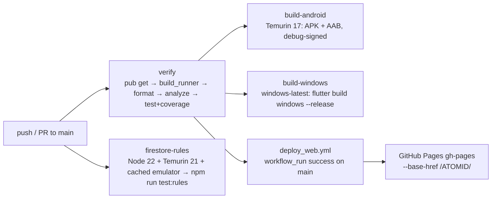
```mermaid
flowchart LR
    P[push / PR to main] --> V[verify<br/>pub get → build_runner → format → analyze → test+coverage]
    P --> R[firestore-rules<br/>Node 22 + Temurin 21 + cached emulator → npm run test:rules]
    V --> A[build-android<br/>Temurin 17: APK + AAB, debug-signed]
    V --> W[build-windows<br/>windows-latest: flutter build windows --release]
    V --> D[deploy_web.yml<br/>workflow_run success on main]
    D --> GH[GitHub Pages gh-pages<br/>--base-href /ATOMID/]
```

* **verify**: checkout → Flutter action (cache on) → `flutter pub get` → generate adapters → `dart format --set-exit-if-changed lib test` → `flutter analyze --fatal-infos` → `flutter test --coverage` → upload `coverage/lcov.info` (always).
* **firestore-rules**: separate job because the emulator is a JVM process. JDK pinned (21 — "firebase-tools 15 drops support for anything below it"; note `package.json` actually pins `firebase-tools ^14.24.0`), emulator jar (~60 MB) cached.
* **build-android** (needs *verify*): proves the release build *packages* — "a plugin that will not compile for the target, a missing native dependency, a Gradle toolchain change". No keystore on CI → debug-signed on purpose; builds APK and AAB (different code path; Play accepts only AAB); uploads artifacts.
* **build-windows** (needs *verify*): runs on `windows-latest` which has symlink support (a local machine needs Developer Mode) → authoritative Windows build; uploads the Release folder.
* **deploy_web.yml**: after a successful CI on `main` (or manual dispatch): build web release with `--base-href "/ATOMID/"` (must equal the repo name with slashes) and publish `build/web` to the `gh-pages` branch via `peaceiris/actions-gh-pages@v4` using `GITHUB_TOKEN` (`contents: write`).

### 20.2 Android

* `applicationId`/`namespace` **`com.atomid.store`** — permanent ("changing it after publishing creates a separate listing"). Java/Kotlin target 17. Google services plugin. `minSdk/targetSdk/versionCode/versionName` come from Flutter.
* **Signing:** `android/key.properties` (git-ignored) supplies `keyAlias/keyPassword/storeFile/storePassword`; absent → release falls back to the **debug key** and Gradle prints a boxed warning (Play will reject it). `tools/new_keystore.ps1` creates the upload keystore outside the repo (default `%USERPROFILE%\atomid-upload.jks`, alias `upload`, 10,000 days; password passed via environment variable not command line) and writes `key.properties`. The keystore "is the only thing that proves an update comes from you … there is no recovery path if it is lost."
* `proguard-rules.pro`: `-dontwarn` for ML Kit Chinese/Devanagari/Japanese/Korean text modules (only Latin recognition is bundled).
* `gradle.properties`: `-Xmx4G`, `MaxMetaspaceSize=1G`, daemon off, `useAndroidX`; a recent commit reduced heap "to prevent OOM in CI".
* `AndroidManifest.xml` permissions declared **explicitly** (so "the app's permission surface does not change when a dependency does"): `INTERNET`, `ACCESS_NETWORK_STATE`, `CAMERA` (+ camera feature not required).
* iOS `Info.plist`: camera ("scan barcodes and OCR price tags") and photo-library usage strings.

### 20.3 Windows

* Release build `flutter build windows --release` → `build\windows\x64\runner\Release`.
* **Inno Setup** (`setup.iss`): `AppId {1B5371F5-…}` (permanent, so upgrades replace in place), `AppVersion` default 1.0.1 (kept in step with `pubspec.yaml` by hand; override `/DAppVersion=`), installs to `{autopf}\Atomid Store` (64-bit), `CloseApplications=yes` / `RestartApplications=yes` ("the shop is likely to have the till open when it updates"), data lives in the user's app-data folder so upgrades never touch it. It **ships the VC++ runtime DLLs app-locally** (`MSVCP140`, `VCRUNTIME140`, `VCRUNTIME140_1`) because Flutter does not copy them and a PC without the redistributable would show "VCRUNTIME140.dll was not found". `CrtDir` default is **one developer machine's path** — override with `/DCrtDir=…`.
* **MSIX** via the `msix` package (`msix_config`: display name "Atomid Store", identity `atomid.store.app`, publisher `CN=Atomid`, version `1.0.0.0`).

### 20.4 `tools/build_release.ps1`

One command builds everything into `dist/` (git-ignored) under versioned names with SHA-256: parameters `-Target all|mobile|desktop`, `-Aab`, `-SplitAbi`, `-Installer`, `-Msix`, `-Portable`, `-Clean`, `-SkipCodegen`, `-IsccPath`. Mobile first (so a fast Android failure stops before the slow Windows build); steps are timed with a pass/fail summary; `Find-Iscc` locates Inno Setup via PATH, the uninstall registry key, then common roots.

### 20.5 Web

`web/index.html` (title "Atomid — Retail & POS"), `manifest.json` (standalone, portrait, maskable icons). Hive uses IndexedDB. Web **cannot** export/share files, back up, or run OCR.

### 20.6 Versioning and branching facts

App version `1.0.1+2`. 45 commits from 2026-07-25 to 2026-09-12 on `main`. Working tree at the time of this audit: `M lib/presentation/features/price_tag/bulk_generator_screen.dart`, `?? Docs/IMPLEMENTATION_GUIDE.md`.

---

## 21. Audit Findings — Defects, Gaps and Design Risks

Everything below was found by reading the source (§ references point to the explanatory sections). Items marked **✔ reproduced** were confirmed by running code during the audit; the others are **by code reading** and should be reproduced before fixing. Severity is the auditor's judgement.

### 21.1 Defects

| # | Sev | Finding | Evidence | Suggested fix |
|---|---|---|---|---|
| D1 | **High** | **A new customer's opening balance is double counted.** `CustomerFormScreen._saveCustomer` creates the customer with `currentBalance = openingBalance`, saves it, then calls `addLedgerEntry(... debit: openingBalance)`, which starts from the already-set `currentBalance`. **✔ reproduced:** a customer created with opening ₹500 ends with `currentBalance = 1000.0`, and `auditDerivedState()` reports nothing (because `recalculateCustomerLedger` starts from `openingBalance` and adds the same entry, so the doubled figure is *self-consistent*). | `customer_form_screen.dart:~121–150`, `storage_repository.dart: addLedgerEntry` | Create the customer with `currentBalance: 0` and let the ledger entry produce the balance (or skip the ledger row and keep the field). Add a test around the form flow. |
| D2 | Med | **Credit sales are unreachable from the UI.** `SaleService` implements `Credit` (credit-limit check, debit-only ledger) but `CheckoutScreen._paymentMethods = ['Cash','UPI','Card']`. Customer `creditLimit`/`creditDays` therefore never constrain anything, and receivables only come from opening balances; "Record Payment" can only reduce them. | `checkout_screen.dart` (no `credit` string), `sale_service.dart isCredit` | Offer `Credit` when a customer is attached; print the true payment status. |
| D3 | Med | **Invoice prints "Payment Status: PAID" unconditionally** (A4) — the source comment says "a bill is settled before it can be printed", which stops being true the moment D2 is fixed (and is already untrue for any record with `paymentMethod == 'Credit'` created by tests/imports). | `export_service.dart` ~1200 | Derive from `paymentMethod`/ledger. |
| D4 | Low | `scannerEnabled` (Hardware settings switch) is persisted but **never read**; the scanner listener always runs. | `grep scannerEnabled` → only the settings screen and model | Read the config in `BarcodeScannerService.connect`/listener. |
| D5 | Low | `auditDerivedState()` is documented as callable from the System Console but **is not wired to any screen**. | `grep` → tests only | Add a "Run data check" button to the Health tab. |
| D6 | Low | **"Upload everything" omits `CustomerLedger`, `SupplierLedger` and `GstRateConfig`** (`enqueueAllExistingDataForSync` enqueues 13 of the 16 syncable types). Rows created normally are enqueued at creation, so this only matters when a queue item was lost/dead-and-cleared. | `storage_repository.dart: enqueueAllExistingDataForSync` | Add the three loops. |
| D7 | Low | Stale comment: `deleteLedgerEntry` says ledger rows "ride to the cloud with their customer, not as separate documents" — they are separate `CustomerLedger` documents with their own queue items. | `storage_repository.dart:~3104` | Update comment. |
| D8 | Low | **ITC eligibility is write-only:** the purchase form always saves `REQUIRES_DETERMINATION` and shows a static banner; there is no control for `ELIGIBLE/INELIGIBLE/BLOCKED`. | `purchase_form_screen.dart:168, 513–540` | Add a selector or remove the claim of "statutory claim status". |
| D9 | Low | `PurchaseItem.productName` stores `productName` (not `displayName` with colour) unlike `SaleItem`; colourways are indistinguishable on purchase documents. | `purchase_form_screen.dart` `_buildTransientPurchase` | Use `displayName`. |
| D10 | Low | `SalePricing.compute` (legacy helper) hard-codes Tamil Nadu/33 and `settings.taxRate`, contradicting the "no default state / never use `taxRate`" rules; it is unused by the live path. | `pricing.dart` | Delete it. |
| D11 | Low | Product-model comment lists `Partially Received` purchase status; `PurchaseStatus` has none. | models vs service | Align. |
| D12 | Low | Checkout summary labels the second levy "State GST (SGST)" even when the sale is UTGST. | `checkout_screen.dart` | Use `gstResult.isUtgst`. |
| D13 | Info | One widget test fails in the working tree (see §19.4). | local run | Investigate with the author of the WIP. |
| D15 | Info | `SettingsModel.showHsnSummary` is synced and carried through the Settings screen but has **no editor and no consumer** — dead configuration. | `settings_screen.dart` (pass-through only); no renderer references it | Remove it or wire it up. |
| D14 | Low | **Backups omit the GST rate book.** `exportSnapshot` iterates `syncableEntities` (which includes `GstRateConfig`) but `_idsFor` has no `GstRateConfig` case (returns an empty list) and `_writeRestored` has no case either. Custom rate presets are lost on restore (defaults are re-seeded; stored sale snapshots are unaffected). | `storage_repository.dart: _idsFor, _writeRestored` | Add `GstRateConfig` to both switches and a round-trip test. |

### 21.2 Design risks (decisions with consequences)

| # | Risk | Consequence | Mitigation in place |
|---|---|---|---|
| R1 | **Hive is unencrypted and there is no app lock** | Anyone with the device can read/modify business data | Documented; OS account lock |
| R2 | **Whole-record last-write-wins** by device clock (`updatedAt`) | Two devices editing the same record: the later *clock* wins, not field-level merge; clock skew can pick the wrong one. A **DEAD** queue item stops protecting its record from being overwritten by a pull | Money documents are append-style with UUID ids; unsent local change always wins |
| R3 | **Hive has no multi-box transaction** | Crash mid-checkout leaves partial state | Write-ahead journal + startup recovery; in-memory undo |
| R4 | **`google_fonts` fetches the UI font (Outfit) at runtime**; only Roboto and Noto faces are bundled | A fresh device with no connection falls back to the platform font; visuals differ until first online run | Invoice PDFs are unaffected (Roboto bundled) — consider bundling Outfit |
| R5 | **Purchases/ITC are recorded but not reconciled or filed**; no GSTR-1/3B/e-invoice output | Shop still needs an accountant/portal | HSN and rate-wise reports match GSTR-1 table shapes |
| R6 | **GSTIN validation is structural only** (no checksum digit, no portal lookup) | A well-formed fictitious GSTIN passes | UI says "Format valid. Not verified with the GST portal." |
| R7 | **Inventory valuation falls back to selling price** for variants never purchased | Understates margin/cost for opening stock | Documented in code |
| R8 | **Product `deleteProduct` hard-deletes** the row and there is no "in use" check | Historical sales keep snapshots (safe), but purchase drafts referencing the product fail at receipt ("no longer in your catalogue") | Receipt guard message |
| R9 | **No sales return / credit note / purchase return** flow | Corrections require manual stock adjustment and cannot reverse a sale ledger | `Return` reasons exist on Stock In/Out only |
| R10 | **Customer & supplier Export/Import buttons are placeholders** | Users may think data was exported | Snack bar text only |
| R11 | **`HardwareConfig` is per device and not backed up** | New PC needs printers re-selected | — |
| R12 | **`firebase-tools` version drift**: CI comment cites v15; `package.json` pins `^14.24.0` | Confusing when upgrading JDK/Node | Align comment and pin |
| R13 | **Hard-coded INR / India-specific logic** (state master, UTGST, Indian numbering) | Not usable outside India without rework | By design |
| R14 | **Large files**: `storage_repository.dart` (3.5 k lines) and `export_service.dart` (2.4 k) concentrate risk | Hard to review/test in isolation | Extensive tests; consider splitting by aggregate |

### 21.3 What is notably well done (keep doing this)

Defence in depth for checkout (undo list + journal + diagnostics), derived-not-stored values (points, payment status, visit stats), frozen document snapshots, explicit refusal over guessing for GST, unit tests that exercise real storage, broad responsive/accessibility tests, atomic backup writes, watermark-advance rule, and comments that record *why* each non-obvious decision was made.

---

# PART X — DEVELOPER HANDBOOK

## 22. Settings Reference — every switch and where it takes effect

| Setting (model.field) | Default | Edited in | Effect (verified in code) |
|---|---|---|---|
| `SettingsModel.isDarkMode` | `true` | Settings | `MaterialApp.themeMode` |
| `companyName` | `ATOMID STORE` | Settings | app-bar title, nav rail title, report header fallback, SKU store code (first 3 letters) |
| `currencySymbol` | `₹` | Settings | `Fmt.money(...)` everywhere; labels |
| `pdfPageSize` | `A4` | Settings | A4 invoice / report / bulk-tag sheet size (`Letter` supported) |
| `taxMode` | `inclusive` | Advanced | `GstCalculationInput.pricingMode` for **sales** (purchases carry their own `pricingMode`, default exclusive) |
| `taxRate` | `0` | (legacy; no editor) | only seeds the default GST % of a *new* product form; **never used in tax maths** |
| `roundOffEnabled` | `true` | Settings | rounds payable to the nearest rupee, stores `roundOff` |
| `hsnRequired` | `false` | Settings | product form refuses to save without HSN (data-entry policy only; invoices print whatever HSN exists, `-` if none) |
| `walkInPosPolicy` | `USE_SHOP_STATE` | Advanced | Place of Supply for customers without GSTIN/state (§10.6 step 2) |
| `showGstBreakdown` | `true` | Settings | GST summary table on A4 invoice |
| `showHsnSummary` | `true` | (no editor) | carried through the Settings screen, persisted and synced, but **no renderer reads it and no switch edits it** (the older HSN-wise table was replaced by the rate-wise summary — see D15) |
| `defaultUqc` | `PCS` | Advanced | fallback unit for products/lines with none |
| `thermalReceiptSize` | `80mm` | Settings | 72 mm or 48 mm printable width |
| `showTaxOnThermalReceipt` | `true` | Settings | tax block on the thermal slip |
| `inclusiveTaxRounding` | `SHELF_PRICE` | Advanced | §10.6 step 6 |
| `invoiceTemplate` | `THERMAL` | Invoice Template | which design `generateInvoiceForTemplate` renders |
| `InvoiceSettingsModel.footerText` | "Thank you for your business!" | Invoice Layout | invoice footer (A4 falls back to "Thank you for shopping with us!" if blank) |
| `showUpiQr`, `upiId`, `upiQrImagePath` | false/''/'' | Invoice Layout | UPI block, **only when payment method is UPI** |
| `showCompanyLogo` | `true` | Invoice Layout | logo on A4 and thermal |
| `termsAndConditions` | 2 default lines | Invoice Layout | T&C block |
| `fontName` | `Roboto` | Invoice Layout | PDF theme (non-Roboto fonts fetched online, cached) |
| `showSignature` | `true` | Invoice Layout | "For <seller> / Authorized Signatory" (CGST Rule 46(q)) |
| `CompanyModel.*` | see §6.5.9 | Business Details | seller snapshot source; **state is mandatory before billing**; `invoicePrefix` feeds invoice numbers |
| `LoyaltySettingsModel.*` | disabled; ₹100→1 pt; 1 pt = ₹1; max 50 %; min bill 0 | Reward Points | §11.2 |
| `HardwareConfigModel.*` | printers none; scanner on; profile `50x35` | Terminal Hardware Setup | per-device, not synced, not backed up |

---

## 23. Key Flows (sequence diagrams)

### 23.1 Goods receipt (purchase order → stock + payable)

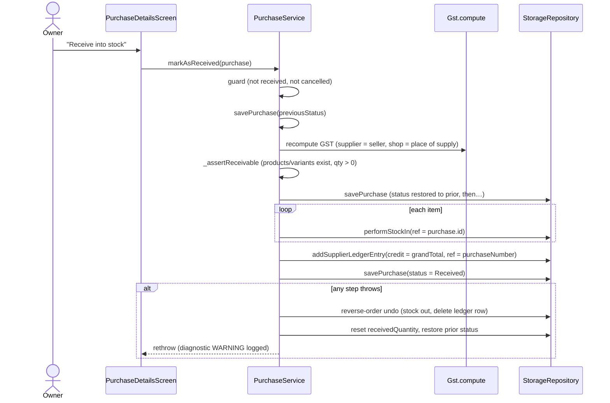
```mermaid
sequenceDiagram
    actor U as Owner
    participant F as PurchaseDetailsScreen
    participant PS as PurchaseService
    participant G as Gst.compute
    participant R as StorageRepository
    U->>F: "Receive into stock"
    F->>PS: markAsReceived(purchase)
    PS->>PS: guard (not received, not cancelled)
    PS->>PS: savePurchase(previousStatus)
    PS->>G: recompute GST (supplier = seller, shop = place of supply)
    PS->>PS: _assertReceivable (products/variants exist, qty > 0)
    PS->>R: savePurchase (status restored to prior, then…)
    loop each item
        PS->>R: performStockIn(ref = purchase.id)
    end
    PS->>R: addSupplierLedgerEntry(credit = grandTotal, ref = purchaseNumber)
    PS->>R: savePurchase(status = Received)
    alt any step throws
        PS->>R: reverse-order undo (stock out, delete ledger row)
        PS->>R: reset receivedQuantity, restore prior status
        PS-->>F: rethrow (diagnostic WARNING logged)
    end
```

### 23.2 Incremental pull

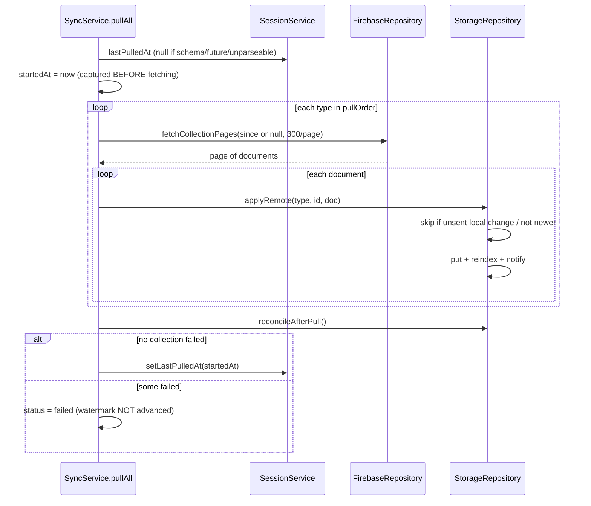
```mermaid
sequenceDiagram
    participant SY as SyncService.pullAll
    participant SS as SessionService
    participant FR as FirebaseRepository
    participant R as StorageRepository
    SY->>SS: lastPulledAt (null if schema/future/unparseable)
    SY->>SY: startedAt = now (captured BEFORE fetching)
    loop each type in pullOrder
        SY->>FR: fetchCollectionPages(since or null, 300/page)
        FR-->>SY: page of documents
        loop each document
            SY->>R: applyRemote(type, id, doc)
            R->>R: skip if unsent local change / not newer
            R->>R: put + reindex + notify
        end
    end
    SY->>R: reconcileAfterPull()
    alt no collection failed
        SY->>SS: setLastPulledAt(startedAt)
    else some failed
        SY->>SY: status = failed (watermark NOT advanced)
    end
```

### 23.3 Backup and restore

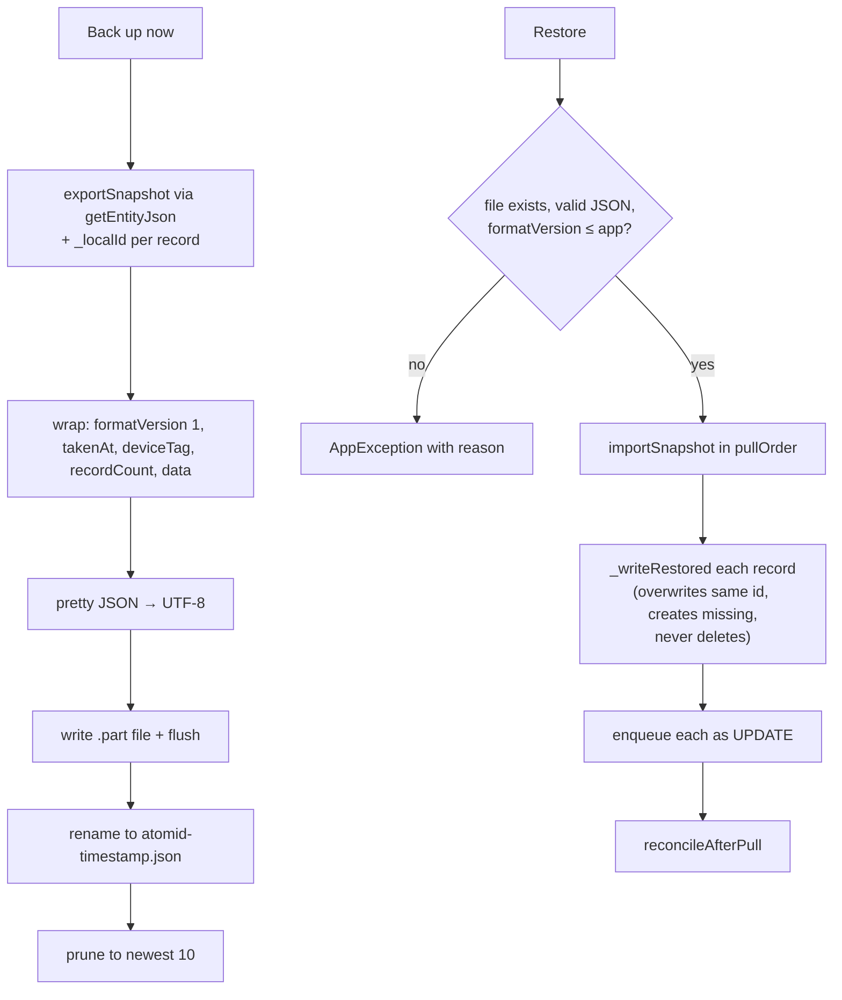
```mermaid
flowchart TD
    A[Back up now] --> B[exportSnapshot via getEntityJson<br/>+ _localId per record]
    B --> C[wrap: formatVersion 1, takenAt, deviceTag, recordCount, data]
    C --> D[pretty JSON → UTF-8]
    D --> E[write .part file + flush]
    E --> F[rename to atomid-timestamp.json]
    F --> G[prune to newest 10]
    H[Restore] --> I{file exists, valid JSON,<br/>formatVersion ≤ app?}
    I -- no --> X[AppException with reason]
    I -- yes --> J[importSnapshot in pullOrder]
    J --> K["_writeRestored each record<br/>(overwrites same id, creates missing,<br/>never deletes)"]
    K --> L[enqueue each as UPDATE]
    L --> M[reconcileAfterPull]
```

### 23.4 Customer merge

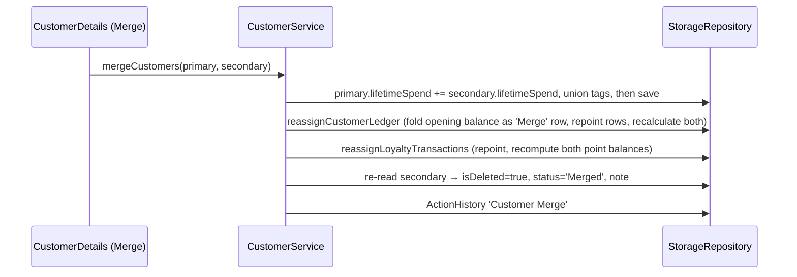
```mermaid
sequenceDiagram
    participant UI as CustomerDetails (Merge)
    participant CS as CustomerService
    participant R as StorageRepository
    UI->>CS: mergeCustomers(primary, secondary)
    CS->>R: primary.lifetimeSpend += secondary.lifetimeSpend, union tags, then save
    CS->>R: reassignCustomerLedger (fold opening balance as 'Merge' row, repoint rows, recalculate both)
    CS->>R: reassignLoyaltyTransactions (repoint, recompute both point balances)
    CS->>R: re-read secondary → isDeleted=true, status='Merged', note
    CS->>R: ActionHistory 'Customer Merge'
```

### 23.5 Label printing (LP46 direct)

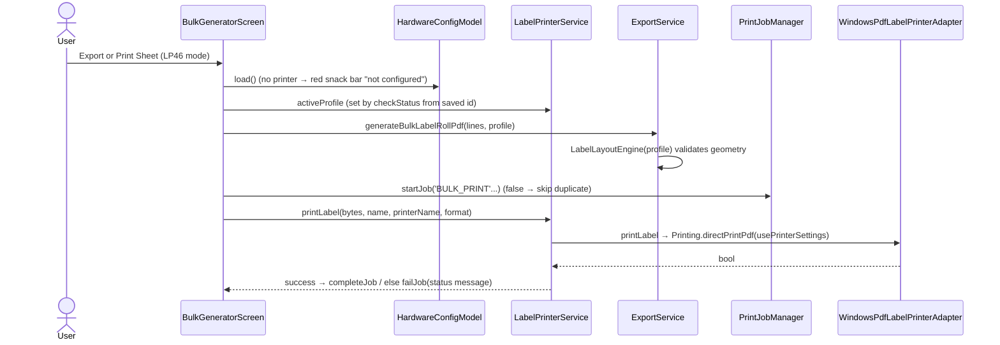
```mermaid
sequenceDiagram
    actor U as User
    participant B as BulkGeneratorScreen
    participant H as HardwareConfigModel
    participant L as LabelPrinterService
    participant E as ExportService
    participant J as PrintJobManager
    participant A as WindowsPdfLabelPrinterAdapter
    U->>B: Export or Print Sheet (LP46 mode)
    B->>H: load()  (no printer → red snack bar "not configured")
    B->>L: activeProfile (set by checkStatus from saved id)
    B->>E: generateBulkLabelRollPdf(lines, profile)
    E->>E: LabelLayoutEngine(profile) validates geometry
    B->>J: startJob('BULK_PRINT'...)  (false → skip duplicate)
    B->>L: printLabel(bytes, name, printerName, format)
    L->>A: printLabel → Printing.directPrintPdf(usePrinterSettings)
    A-->>L: bool
    L-->>B: success → completeJob / else failJob(status message)
```

---

## 24. Recipes — how to extend the system safely

### 24.1 Add a field to an existing synced model (e.g. `Customer.birthday`)
1. Add `@HiveField(30) DateTime? birthday;` (next unused number; never reuse) and the constructor parameter with a default.
2. `dart run build_runner build --delete-conflicting-outputs`.
3. Add it to `StorageRepository._encodeEntity` (Customer branch) as an ISO string.
4. Decode it in `EntityCodec.customer` with `_dateOrNull(json['birthday'])`.
5. Add UI. Add/extend tests: `sync_payload_test`, `backup_snapshot_test`, `serialization_fuzz_test`.
6. If recency semantics matter, make sure the model's `updatedAt` is stamped on save.

### 24.2 Add a new synced entity type (e.g. `Discount`)
1. Hive model + a `typeId` **not already used** (in use: 0–10, 15, 16, 20, 21, 22, 25, 26, 30, 40, 41, 50, 70) → regenerate.
2. Open a box in `StorageRepository` (constant name, `late Box`, `_safeOpenBox`, `init`).
3. Add to: `syncableEntities`, `_topicsFor`, `_encodeEntity`, `_syncTimestampFor`, `_localUpdatedAt`, `applyRemote`, `_idsFor` + `_writeRestored` (so backups include it), `EntityCodec.collectionFor`, `EntityCodec.<decoder>`, `EntityCodec.pullOrder` (respect dependency order), optionally `alwaysFullPull`.
4. Expose via a provider watching a `DataTopic` (add one if needed to `DataTopic.all`).
5. Never enqueue a type that is not in `syncableEntities` (queue guard + assert).

### 24.3 Add a payment method (e.g. "Wallet")
Add it to `_CheckoutScreenState._paymentMethods`. `SaleService` treats anything other than `Credit` as *paid at once* (debit + credit ledger rows). If it must behave like credit, extend `CheckoutRequest.isCredit`. UPI QR logic keys off the literal string `'UPI'` (`export_service.dart`).

### 24.4 Add or change a GST rate
Settings → Advanced → *Statutory GST Rate Presets* (adds a `GstRateConfig` with `effectiveFrom`/`effectiveTo`, cess, notes). For a **rate change on a date**, add a new preset that starts on that date and set the old one's `effectiveTo`. Products pinned by `gstRateConfigId` resolve against their entry's validity; products matching by percentage resolve to whichever entry for that percentage is effective on the transaction date.

### 24.5 Add an invoice template
Add an enum value in `InvoiceTemplate` (stable `id`), extend the `switch`es in `_itemHeaders`, `_itemCellAlignments`, `_itemRows`, and (if it needs a different page) `generateInvoiceForTemplate`. Templates must **only format stored fields**; `invoice_template_test.dart` and `export_service_test.dart` should be extended.

### 24.6 Add a label size / printer profile
Add a `const LabelPrinterProfile` in `label_printer_profile.dart`, append to `predefined`, and add the id to the dropdown in `HardwareSettingsScreen`. Validate that `left + columns×label + (columns−1)×gap + right ≤ media width` (the engine throws otherwise) and that the label is ≥ 20×15 mm. Add a case to `lp46_pagination_test`.

### 24.7 Add a hardware device
Subclass `HardwareDevice` (id/name/model/connection type, `connect/disconnect/checkStatus`), expose a Riverpod provider, register it in `hardwareManagerProvider`. For a non-spooler printer add a `LabelPrinterAdapter` (raw TSPL/EPL socket) and add it to `LabelPrinterService._adapters` ahead of the Windows one with a precise `canHandle`.

### 24.8 Add a report
Aggregate **stored snapshot** fields in `DocumentTotals` (never recompute tax), add a PDF generator to `ExportService` using `_buildReportHeader`, and add tests that compare the printed total with the tested total (the code states the printed and tested figures must come from the same function).

### 24.9 Change a Firestore rule
Edit `firestore.rules`, extend `test/firestore-rules/rules.test.js`, run `npm run test:rules` (or the Docker compose), then deploy. A rule change that widens access would otherwise "reach production with nothing to catch it".

---

## 25. Decision Log — the "why" in one place

| Decision | Alternatives rejected | Reason (from the source) |
|---|---|---|
| Hive CE as the system of record | SQLite/Drift, Isar, Firestore offline cache | Synchronous reads, web support, adapters with additive fields, no native build step; Firestore cache would make the till depend on the SDK's persistence |
| Outbox queue with `(type,id,action)` only | Persisting payload JSON in the queue | The latest row is always what is sent; rapid edits coalesce; deleted-before-upload vanishes |
| Batched atomic commits of 20 | One write per item; one giant batch | Throughput vs blast radius; Firestore batch limit safety |
| Exponential backoff (30 s × 2^retryCount), DEAD on the 5th failure | Infinite retry | A poison record must not retry forever or starve others; DEAD is visible and manually retryable |
| LWW + "unsent local wins" | CRDT / vector clocks | Single user/shop; records are mostly append-only; simplicity |
| Pull watermark taken *before* fetching, advanced only on full success | After fetching; per-collection watermarks | Missing a record is permanent, re-fetching is free |
| `updatedAt` forced on every payload | Rely on model fields | Firestore range queries omit documents lacking the field |
| Sale = frozen snapshot | Join to live company/product | Legal document immutability |
| GST: block when unsure | Default to shop state / 0 % | Silent under-/mis-taxation is worse than a refusal |
| UTGST modelled | Treat all UTs as SGST | Six UTs without legislature levy UTGST |
| Inclusive pricing default `SHELF_PRICE` | `TAX_RATE` | Customer pays the marked price exactly; shop can switch; "neither reading has been confirmed as the legally required one" |
| Derived points/payment status/visit stats | Stored counters | Stored duplicates drift (merge, edits); derivation cannot |
| Journal + undo list | Only one of them | Undo list dies with the process; journal alone cannot do exact compensations in-process |
| Document numbers with device tag | Server-issued sequence | Works offline; no coordination |
| UUID v4 ids | Timestamps | Same-millisecond collisions silently overwrote records |
| Backup as readable JSON built from the sync encoder | Binary/box copy, separate serializer | A separate serializer drifts silently; readability prevents "hostage" backups |
| Roboto bundled; other fonts online with non-cached fallback | Always online fonts | Offline-first printing must never wait on the network |
| Noto Tamil/Devanagari fallback fonts | Single Latin font | Indic shop names printed blank |
| One `StorageRepository` | Per-entity repositories | Cross-box invariants, single notify/reindex discipline |
| Single-account Firestore rule | Store/membership/role rules | No second party for distinctions to be about |
| Tests on real Hive, fake cloud | Mock repository | Behaviour that breaks lives in the repository |

---

## 26. Glossary

| Term | Meaning |
|---|---|
| **GST** | Goods and Services Tax (India). **CGST** central, **SGST** state, **UTGST** union-territory, **IGST** inter-state, **Cess** compensation levy |
| **GSTIN** | 15-char registration number: 2-digit state code + 10-char PAN + entity digit + `Z` + check char |
| **HSN / SAC** | Harmonised System code for goods / Service Accounting Code |
| **UQC** | Unit Quantity Code (`PCS`, `NOS`, `SET`, `MTR`, `KGS`) |
| **POS (Place of Supply)** | State where the supply is deemed made; decides intra vs inter-state |
| **ITC** | Input Tax Credit — GST paid on purchases claimable against output tax |
| **Tax Invoice / Bill of Supply** | Document for taxable supplies by a registered dealer / for non-taxable supplies |
| **Inclusive / exclusive pricing** | Listed price already includes GST / GST is added on top |
| **Round-off** | Adjustment to the nearest rupee, printed as a separate line |
| **Colourway** | One colour of a style; one `Product` record, sharing `productCode` |
| **Variant** | A size of a product with its own barcode, price, stock |
| **Outbox / queue** | `sync_queue` box of pending uploads |
| **Dead letter** | Queue item that exhausted retries (`DEAD`) |
| **Watermark** | `lastPulledAt`: time of the last fully successful pull start |
| **Journal** | `checkout_journal` write-ahead rows enabling crash recovery |
| **Topic** | `DataTopic` area the UI subscribes to |
| **Snapshot** | Copy of party/tax data frozen onto a document |
| **Wedge scanner / HID** | Barcode scanner that types like a keyboard |
| **Spooler** | OS print queue (Windows) addressed by printer name |

---

## 27. Troubleshooting

| Symptom | Likely cause | What to check / do |
|---|---|---|
| Cannot complete billing: "Configure your shop state…" | Company state not set | Settings → Business Details → State / UT |
| "…Product tax treatment is unconfigured" / "no GST rate configured" | Product has `UNCONFIGURED` or taxable with null rate | Edit the product, choose treatment/rate |
| "Customer GSTIN and customer state do not agree" | Stored state ≠ GSTIN prefix | Fix the customer record |
| Place of supply required (REQUIRE_STATE / ASK_AT_CHECKOUT policy) | Walk-in with strict policy | Choose a customer with a state, or change the policy in Advanced |
| Cloud icon shows red / "N items failed to sync" | Items went DEAD | System → Health: *Retry failed items*; check Sync log error text; "permission-denied" ⇒ sign in again / deploy rules |
| Second device is empty after sign-in | First pull failed or rules block read | System → *Re-fetch from cloud* (full pull); check the status message |
| "Some data could not be read and was reset: …" at startup | A Hive box was corrupt and rebuilt | Sign in and fetch from the cloud, or restore the latest backup |
| Phone-number lookup finds nobody after a pull | Index drift (historically) | Restart; if it persists run `auditDerivedState()` (via a test/debug) and report |
| Receipt does not print automatically | No receipt printer configured, printer missing, or duplicate-job guard | Settings → Terminal Hardware Setup; Hardware Diagnostics |
| Barcode scanner not reacting | Keystrokes > 50 ms apart, or device marked disconnected | Check scanner mode (keyboard wedge + Enter suffix) |
| Labels clipped / wrong layout | Wrong label profile | Pick `50x35` vs `50x35_2up` vs `50x50` in hardware settings |
| Tamil/Hindi text missing on invoices | Fallback fonts failed to load | Check `assets/fonts` are bundled (pubspec `assets`) |
| Invoice font looks different offline | Non-Roboto font fetch failed → Roboto fallback | Expected; reconnect once |
| Windows installer says VCRUNTIME missing | `CrtDir` wrong at compile time | Re-run ISCC with `/DCrtDir=…` |
| Play Console rejects the upload | Debug-signed build | Create keystore with `tools/new_keystore.ps1` and rebuild |
| Opening balance of a new customer looks doubled | Known defect D1 (§21) | Correct via a ledger entry until fixed |

---

## Appendix A — Example Firestore sale document (shape)

Collection `users/{uid}/sales/{saleId}` (values illustrative; field names exact):

```json
{
  "id": "5d2f…-uuid",
  "invoiceNumber": "INV-20260912-A3F1-0004",
  "date": "2026-09-12T11:42:08.120",
  "customerId": "c0a1…",
  "customerName": "Asha",
  "subtotal": 1180.0, "discountPercent": 0.0, "discountAmount": 0.0,
  "taxAmount": 180.0, "grandTotal": 1180.0,
  "paymentMethod": "UPI", "notes": "",
  "rewardDiscountAmount": 0.0, "rewardPointsEarned": 11.0,
  "isSynced": true, "isDeleted": false,
  "updatedAt": "2026-09-12T11:42:08.120",
  "sellerGstin": "33AAAAA0000A1Z5", "sellerState": "Tamil Nadu", "sellerStateCode": "33",
  "sellerLegalName": "Atomid Store", "sellerAddress": "…",
  "customerGstin": "", "customerState": "", "customerStateCode": "",
  "customerAddress": "", "customerPhone": "9000000001",
  "placeOfSupply": "Tamil Nadu",
  "placeOfSupplyBasis": "Over-the-counter counter sale (Shop State Policy)",
  "pricingMode": "inclusive",
  "taxableAmount": 1000.0, "cgstAmount": 90.0, "sgstAmount": 90.0,
  "utgstAmount": 0.0, "igstAmount": 0.0, "cessAmount": 0.0,
  "preRoundTotal": 1180.0, "roundOff": 0.0,
  "documentType": "Tax Invoice", "isInterState": false,
  "items": [ { "productId": "…", "productName": "Cotton Shirt - Blue", "productCode": "CS-1",
               "variantBarcode": "A1B2C3D4E5F6", "variantSize": "M", "price": 1180.0, "quantity": 1,
               "total": 1180.0, "hsn": "6205", "uqc": "PCS", "gstRate": 18.0,
               "gstTreatment": "TAXABLE", "cessRate": 0.0, "taxableValue": 1000.0,
               "discountAmount": 0.0, "cgstAmount": 90.0, "sgstAmount": 90.0,
               "utgstAmount": 0.0, "igstAmount": 0.0, "cessAmount": 0.0,
               "gstRateConfigId": "gst_18" } ],
  "syncedAt": "<server timestamp>",
  "sourceDevice": "dev_1789…_ab12cd34"
}
```

## Appendix B — Backup file (shape)

```json
{
  "formatVersion": 1,
  "takenAt": "2026-09-12T18:00:00.000",
  "deviceTag": "CD34",
  "recordCount": 1342,
  "data": {
    "SettingsModel": [ { "isDarkMode": true, "…": "…", "updatedAt": "…", "_localId": "app_settings" } ],
    "Product":       [ { "id": "…", "…": "…", "_localId": "…" } ],
    "Sale":          [ { "…": "…" } ]
  }
}
```

## Appendix C — User-facing error catalogue (selected, from `AppException`s)

| Message | Raised by |
|---|---|
| "Add at least one item before checking out." | `SaleService.checkout` |
| "Only N left of X (size) — the basket has M." | stock assertion |
| "Cannot complete billing:\n• …" | invalid `GstCalculationResult` |
| "This would take NAME to ₹X, over their ₹Y credit limit." | credit assertion |
| "Select a customer before taking a sale on credit." | credit assertion |
| "Not enough stock for X (size). Available: n, requested: m." | `performStockOut` |
| "Quantity must be greater than 0." | stock in/out |
| "That product no longer exists." / "That variant no longer exists on the product." | stock in/out |
| "That customer no longer exists." / "That supplier no longer exists." | ledger writes |
| "A purchase needs at least one item." | `PurchaseService.savePurchase` |
| "Only a draft order can be issued." / "This order has already been received." / "A cancelled order cannot be received." / "A received order cannot be cancelled. Record a return instead." | purchase lifecycle |
| "…is no longer in your catalogue — remove it from the order before receiving." | `_assertReceivable` |
| "Enter a 10-digit mobile number." | `registerByMobile` |
| "Backups need a file system, which the browser build does not have…" | `BackupService` (Web) |
| "That file is not a readable Atomid backup." / "That backup was written by a newer version of Atomid (format N)…" / "That backup has no records in it." / "That backup file is no longer there." | restore |
| "Cloud sync is not available on this platform. Your data is still saved on this device." | `AuthService._requireAvailable` |
| "There was nothing to export." | `exportPng` |
