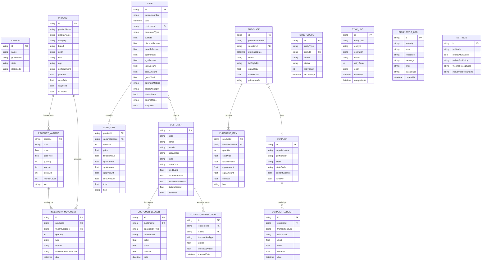

# Atomid — Complete System Architecture & Implementation Specification

> **Document Purpose:** This is the canonical engineering reference for the Atomid codebase. Every section is derived directly from actual source code. A new development team should be able to understand, extend, and maintain every layer of the system using this document alone. Nothing is summarised to the point of ambiguity.

---

## Table of Contents

1. [Project Identity & Mission](#1-project-identity--mission)
2. [Philosophy & Non-Negotiable Design Principles](#2-philosophy--non-negotiable-design-principles)
3. [Technology Stack — Every Choice Explained](#3-technology-stack--every-choice-explained)
4. [Repository & Project Layout](#4-repository--project-layout)
5. [Application Bootstrap & Startup Lifecycle](#5-application-bootstrap--startup-lifecycle)
6. [Data Layer — Hive CE Models in Full Detail](#6-data-layer--hive-ce-models-in-full-detail)
7. [Offline-First Architecture — The Complete Sync System](#7-offline-first-architecture--the-complete-sync-system)
8. [EntityCodec — The Serialisation Contract](#8-entitycodec--the-serialisation-contract)
9. [Security, Auth, and Sessions](#9-security-auth-and-sessions)
10. [The Statutory GST Engine — Every Calculation Explained](#10-the-statutory-gst-engine--every-calculation-explained)
11. [The Pricing Layer — Connecting GST to Business Logic](#11-the-pricing-layer--connecting-gst-to-business-logic)
12. [SaleService — The Checkout Transaction Orchestrator](#12-saleservice--the-checkout-transaction-orchestrator)
13. [PurchaseService — Procurement & Goods Receipt](#13-purchaseservice--procurement--goods-receipt)
14. [CustomerService — CRM, Ledger & Merge Logic](#14-customerservice--crm-ledger--merge-logic)
15. [SupplierService — Vendor Management](#15-supplierservice--vendor-management)
16. [Inventory Management — Stock-In, Stock-Out & Movements](#16-inventory-management--stock-in-stock-out--movements)
17. [Loyalty Program Engine](#17-loyalty-program-engine)
18. [Backup & Restore System](#18-backup--restore-system)
19. [Diagnostic & Health Monitoring System](#19-diagnostic--health-monitoring-system)
20. [State Management — Riverpod Architecture](#20-state-management--riverpod-architecture)
21. [PDF Generation & Printing Module](#21-pdf-generation--printing-module)
22. [Database Schema — Complete Entity Reference with Diagrams](#22-database-schema--complete-entity-reference-with-diagrams)
23. [Firestore Security Rules — Explained Line-by-Line](#23-firestore-security-rules--explained-line-by-line)
24. [Testing Architecture & CI/CD Pipeline](#24-testing-architecture--cicd-pipeline)
25. [Platform Targets & Build Configuration](#25-platform-targets--build-configuration)
26. [Development Conventions — The Rules You Cannot Break](#26-development-conventions--the-rules-you-cannot-break)
27. [Known Design Trade-offs & Future Considerations](#27-known-design-trade-offs--future-considerations)

---

## 1. Project Identity & Mission

**Atomid** (package: `atomid`) is a cross-platform retail management and point-of-sale (POS) application. It is built in Flutter/Dart and targets Android, iOS, Web, Windows, macOS, and Linux from a single codebase.

**Version:** `1.0.1+2` (build 2 of the 1.0.1 semantic release)  
**App ID:** `com.atomid.store`  
**Published to:** Not published to pub.dev (private, production app).

### Mission in One Sentence
Allow any small retail business in India to begin billing immediately on any device — with no internet, no subscription, and no learning curve — while supporting optional cloud backup and multi-device sync.

### Why India-Specific?
The GST (Goods and Services Tax) engine is purpose-built for Indian statutory requirements. It handles:
- Intra-State (CGST + SGST) vs Inter-State (IGST) determination
- Union Territory (CGST + UTGST) scenarios
- GSTIN validation with state-code prefix parsing
- All six official GST treatment categories (`TAXABLE`, `NIL_RATED`, `EXEMPT`, `NON_GST`, `ZERO_RATED`, `UNCONFIGURED`)
- Full Harmonised System of Nomenclature (HSN) code and Unit Quantity Code (UQC) capture

---

## 2. Philosophy & Non-Negotiable Design Principles

### 2.1 Offline-First is Absolute

Every single operation the user can perform — billing, adding products, adjusting stock, viewing reports, printing invoices — works without an internet connection. There is no deferred functionality, no "sync needed" spinner blocking a sale.

**Why this matters in practice:** A retail shop's busiest moments (end-of-day sale rush, a network outage) are exactly when a cloud-dependent POS would fail. Atomid's guarantee is that a dropped connection is invisible to the cashier.

**How it is achieved:** The local Hive database is the primary database. The cloud is a secondary mirror. All writes target Hive first. The sync queue transfers them to the cloud in the background, whenever the connection allows.

### 2.2 The Cloud is a Mirror, Not a Source of Truth

Firestore contains a copy of data, not the original. A user who has never signed in has a complete, fully functional app. A user who signs in gets cloud backup and multi-device sync on top of a fully functional app.

**The consequence for sync design:** The pull (download) flow must never overwrite unsent local changes. A local record that has pending sync items is always given priority over the cloud version.

### 2.3 Single-User Architecture

There is one account. There are no staff logins, no PIN shift sign-ins, no role-based permission checks. An earlier version of Atomid had a role/permission system with staff PINs. It was removed completely. The code contains no remnants of it.

**Why roles were removed:**
- Increased complexity with zero benefit for a one-person shop
- Created authentication dependencies that broke the offline-first guarantee
- Added security permission declarations (`biometric`, `local_auth`) to Android/iOS manifests for features that did not exist

**Security model consequence:** Anyone holding the unlocked device has full app access. The operating system's lock screen is the only gate. This is a deliberate and documented choice.

### 2.4 No App Encryption at Rest

The Hive database is unencrypted on disk. On Windows it lives at `%USERPROFILE%\AppData\Local\atomid\db`.

**Why no encryption:**
- Maximises read/write performance, critical for barcode scanning and cart operations
- Prevents data loss from lost encryption keys (a major risk for small business operators)
- The target user is an owner who physically controls the device

**What this means for a developer:** Do not add encryption without explicit product discussion. It changes the security model in ways that must be communicated to users.

### 2.5 Immutable Financial Trails

No sale, inventory movement, or ledger entry is silently erased. Soft deletes (the `isDeleted` flag) are used for records that need to be excluded from the active view, but the record itself remains in the database. Inventory changes are never represented as a mutable counter alone — every change generates an `InventoryMovement` log entry with a reason and reference.

### 2.6 Money Formatting is Always Through `Fmt`

Raw floating-point money values are never interpolated directly into strings. The `Fmt` utility class in `lib/core/utils/formatters.dart` handles all formatting. It ensures consistent currency symbols, decimal places, and locale-aware separators.

### 2.7 IDs Come from `Ids.generate()`, Never Timestamps

Using a timestamp as an ID is a classic concurrency bug: two offline devices billing at the same millisecond would produce a collision. `Ids.generate()` produces UUID v4 values. The only exception to unique IDs is singleton config documents (Settings, Company, etc.), which use fixed string keys (`'app_settings'`, `'profile'`, etc.).

---

## 3. Technology Stack — Every Choice Explained

### 3.1 Flutter 3.47.1 / Dart 3.12+

**What it is:** Flutter is Google's cross-platform UI toolkit. Dart is the language.

**Why Flutter over React Native or native:** A single Dart codebase targeting Android, iOS, Web, Windows, macOS, and Linux simultaneously. The Hive CE database, the PDF engine, and the barcode scanner all have mature Flutter packages. React Native does not have a first-class Hive equivalent.

**Why the version is pinned to exactly 3.47.1:** Flutter's `dart format` output changes between releases. CI enforces `dart format --set-exit-if-changed`. A developer on Flutter 3.48 would produce formatting that CI rejects, even with no logical code changes. Pinning makes every machine produce identical output.

### 3.2 Hive CE (Community Edition)

**Package:** `hive_ce: ^2.19.3`, `hive_ce_flutter: ^2.3.4`

**What it is:** A fast, lightweight, box-based NoSQL key-value database that runs entirely on device. CE is a community-maintained fork of the original Hive package.

**Why Hive over SQLite/Drift/Isar:**
- Synchronous reads. `storageRepo.getProductById(id)` returns instantly without `await`. This is critical in the GST engine, which calls repository methods inside tight loops.
- Native Dart object storage via generated type adapters — no manual SQL mapping.
- Embedded object support — `ProductVariant` is stored as an embedded list inside `Product`, not as a separate join table.
- Extremely fast box iteration for search and aggregation.

**Code generation:** Hive models use `@HiveType` and `@HiveField` annotations. Run `flutter pub run build_runner build --delete-conflicting-outputs` to regenerate the `.g.dart` adapter files whenever a model changes.

**Type IDs:** Every Hive model has a globally unique `typeId`. These must never be reused. Adding a new model requires assigning the next available integer. The current registry is in `lib/hive_registrar.g.dart`.

### 3.3 Riverpod 3.x

**Package:** `flutter_riverpod: ^3.3.2`

**What it is:** A reactive state management library. It replaces `Provider` with compile-time safety and supports fine-grained widget rebuild control.

**Why Riverpod over BLoC or Provider:**
- `ref.watch()` only rebuilds the widget when the specific value it watches changes. BLoC tends to rebuild entire subtrees.
- Providers can depend on each other with a type-safe graph — no `context.read()` ambiguity.
- The entire dependency graph is declared in `lib/presentation/providers/app_providers.dart` and overridden at startup by `bootstrap()`.

**Pattern used:** Topic-driven providers. There is no single "AppState" god object. Each domain topic (products, sales, cart, sync status) has its own provider. A change to the product list does not rebuild the cart, even though both are on screen.

### 3.4 Firebase Auth + Cloud Firestore

**Packages:** `firebase_auth: ^6.5.6`, `cloud_firestore: ^6.7.1`, `firebase_core: ^4.12.1`

**Firebase Auth — why:** Email/password authentication is the simplest mechanism for identifying a user across multiple devices. It serves a single function: generating a `uid` that namespaces the user's Firestore data.

**Firestore — why:**
- Document model maps directly to Atomid's flat entity structure (each sale is one document, each product is one document).
- Timestamp-based queries (`where('updatedAt', isGreaterThan: watermark)`) enable incremental sync without custom infrastructure.
- Firebase handles connection management, caching, and retry — the app does not need a separate REST client.
- The Firebase Admin SDK allows Firestore Rules to be tested automatically in CI without a real project.

**Why Firestore is optional:** `bootstrap()` wraps `Firebase.initializeApp()` in a try/catch. An `UnsupportedError` (platform not configured) or any network error silently sets `cloudReady = false` and the app runs fully offline. The reason `UnsupportedError` is caught rather than checked with a platform predicate is that `DefaultFirebaseOptions.currentPlatform` is a generated method, and catching the exception is the generated contract.

### 3.5 connectivity_plus

**Package:** `connectivity_plus: ^7.3.1`

**What it does:** Provides a stream of `ConnectivityResult` changes. When connectivity returns after a drop, `SyncService` uses this event to immediately trigger `processQueue()`.

**Important nuance:** `connectivity_plus` detects network interfaces being available, not actual internet reachability. It is possible to have WiFi connected but no real internet. The sync engine relies on Firestore errors to detect true unreachability and then applies backoff.

### 3.6 mobile_scanner

**Package:** `mobile_scanner: ^7.2.0`

**What it does:** Provides camera-based barcode and QR code scanning using ML Kit (Android/iOS) and native APIs.

**Why not `qr_code_scanner` or `flutter_barcode_scanner`:** `mobile_scanner` is the most actively maintained package with native ML Kit integration, giving sub-100ms scan times on mid-range hardware, which is essential for a fast checkout flow.

### 3.7 pdf + printing

**Packages:** `pdf: ^3.13.0`, `printing: ^5.15.0`

**What they do:** `pdf` generates Dart-native PDF documents programmatically. `printing` handles platform-specific print dialogs and direct thermal printer output.

**Why not a web-view PDF:** A web-view approach requires internet for most implementations and is slow. The Dart `pdf` package generates PDFs in-memory synchronously, supporting both A4 invoices and 58mm/80mm thermal receipt formats from the same code path.

### 3.8 google_mlkit_text_recognition

**Package:** `google_mlkit_text_recognition: ^0.15.1`

**What it does:** On-device OCR. Used for scanning supplier invoice text from a photo, reducing manual data entry when creating purchase orders.

### 3.9 uuid

**Package:** `uuid: ^4.5.3`

**Why:** Generates RFC 4122-compliant UUID v4 identifiers. Used everywhere an `Ids.generate()` call produces an entity ID.

---

## 4. Repository & Project Layout

```
atomid/
├── lib/
│   ├── bootstrap.dart              # Composition root — single construction path
│   ├── main.dart                   # App entry point, error wiring, FutureBuilder
│   ├── firebase_options.dart       # Generated per-platform Firebase config
│   ├── hive_registrar.g.dart       # Generated Hive adapter registration
│   │
│   ├── core/
│   │   ├── hardware/               # Hardware device manager (barcode scanners)
│   │   ├── services/               # PDF generation services
│   │   ├── theme/                  # Light/dark MaterialTheme definitions
│   │   └── utils/
│   │       ├── app_error.dart      # AppException — the typed error the UI catches
│   │       ├── formatters.dart     # Fmt — the only place money is formatted
│   │       ├── ids.dart            # Ids.generate() — UUID v4 factory
│   │       ├── platform_io.dart    # PlatformIo — cross-platform file I/O abstraction
│   │       └── responsive.dart     # Screen size breakpoints
│   │
│   ├── data/
│   │   ├── models/                 # Hive entity classes + generated adapters
│   │   ├── repositories/
│   │   │   ├── storage_repository.dart   # The single Hive I/O abstraction
│   │   │   └── firebase_repository.dart  # The single Firestore I/O abstraction
│   │   └── sync/
│   │       └── entity_codec.dart   # Firestore JSON → Dart model decoder + collection mapping
│   │
│   ├── domain/
│   │   ├── cart_item.dart          # Immutable CartItem value object
│   │   ├── date_window.dart        # Date range for analytics queries
│   │   ├── document_totals.dart    # Sale document totals summary
│   │   ├── gst_rate_summary.dart   # Rate-level GST summary for reports
│   │   ├── invoice_template.dart   # Invoice layout template selector
│   │   ├── price_tag_job.dart      # Price tag batch print job descriptor
│   │   ├── price_tag_print_mode.dart
│   │   ├── price_tag_size.dart
│   │   ├── pricing.dart            # SalePricing — coordinates GST engine for sales
│   │   ├── purchase_payment.dart   # Purchase payment method types
│   │   ├── gst/
│   │   │   ├── gst_engine.dart     # Gst.compute() — THE single tax authority
│   │   │   ├── gst_models.dart     # Input/output DTOs for the GST engine
│   │   │   ├── gst_rate_resolver.dart # Rate book + effective-date resolution
│   │   │   ├── gst_states.dart     # All Indian state codes, GSTIN validation
│   │   │   └── gst_treatment.dart  # GST treatment category constants
│   │   └── services/
│   │       ├── auth_service.dart   # Firebase Auth wrapper
│   │       ├── backup_service.dart # JSON snapshot backup/restore
│   │       ├── customer_service.dart
│   │       ├── expense_service.dart
│   │       ├── purchase_service.dart
│   │       ├── sale_service.dart
│   │       ├── session_service.dart # Per-install device ID + sync watermark
│   │       ├── supplier_service.dart
│   │       └── sync_service.dart   # Queue-driven cloud sync with backoff
│   │
│   └── presentation/
│       ├── features/               # Feature modules (billing, products, etc.)
│       ├── providers/              # Riverpod provider declarations
│       └── widgets/                # AppShell, guards, common UI components
│
├── test/
│   ├── unit/                       # Pricing, GST, service, repository, codec tests
│   ├── widget/                     # Widget and responsive layout tests
│   └── support/                    # TestStore (real Hive in temp dir), FakeFirebaseRepository
├── integration_test/               # Full app boot tests against real Hive
├── firestore.rules                 # Deployed Firestore security rules
├── Docs/                           # Architecture documentation
├── docker/                         # Rules test container configuration
└── pubspec.yaml                    # Dependency manifest
```

---

## 5. Application Bootstrap & Startup Lifecycle

### 5.1 The Problem with Traditional `main()` Bootstrap

In many Flutter apps, services are initialised inside widget `initState` methods or scattered across providers. This creates two problems:
1. If a service fails to initialise, the user sees an unhandled exception screen.
2. Different entry points (e.g., tests, integration tests, deep links) can silently construct a different object graph.

Atomid solves this with a centralised `bootstrap()` function.

### 5.2 `bootstrap()` — Step by Step

**File:** `lib/bootstrap.dart`

```dart
Future<BootstrapResult> bootstrap() async {
  // Step 1: Construct core service instances
  final storageRepo = StorageRepository();
  final firebaseRepo = FirebaseRepository();
  final authService = AuthService(firebaseRepo);
  final sessionService = SessionService(authService);

  // Step 2: Firebase init — cloud failure is never fatal
  try {
    await Firebase.initializeApp(
      options: DefaultFirebaseOptions.currentPlatform,
    );
    cloudReady = true;
  } on UnsupportedError {
    // Platform not configured — expected on Linux, unsupported iOS builds
    cloudMessage = 'Cloud sync is not configured for this platform...';
  } catch (error) {
    // Network unreachable — transient, app still runs
    cloudMessage = 'Could not reach the cloud. Working on this device only.';
  }

  // Step 3: Local storage init — this IS fatal
  try {
    await storageRepo.init();
    await sessionService.init();
  } catch (error) {
    return BootstrapResult(storageReady: false, fatalError: error, ...);
  }

  // Step 4: Device ID injection into storage repo
  // Needed so two offline tills cannot both issue invoice INV-0001
  storageRepo.deviceId = sessionService.deviceId;

  // Step 5: Construct SyncService with all four dependencies
  final syncService = SyncService(
    storageRepo, firebaseRepo, authService, sessionService,
  );

  // Step 6: Wire everything into the Riverpod ProviderContainer
  final container = ProviderContainer(
    overrides: [...all services overridden as singletons...]
  );

  // Step 7: Seed expense categories for new installs
  await ExpenseService(storageRepo).seedDefaultCategories();

  // Step 8: Start sync engine (only if Firebase was configured)
  if (cloudReady) syncService.start();

  // Step 9: Connect hardware devices
  await container.read(hardwareManagerProvider).connectAll();

  return BootstrapResult(storageReady: true, cloudReady: cloudReady, ...);
}
```

**What `BootstrapResult` communicates:**
- `storageReady`: Must be `true` for the app to run. If `false`, `main.dart` shows a `StartupFailureScreen` with a retry button.
- `cloudReady`: If `false`, the app runs entirely offline. The UI shows a banner but every feature works.
- `recoveredBoxes`: A list of Hive box names that had to be rebuilt from corruption. Used in the diagnostics screen.
- `fatalError`: The actual exception if `storageReady` is `false`.
- `cloudMessage`: Human-readable description of the cloud state to show in settings.

### 5.3 `main.dart` — The Entry Wrapper

```dart
void main() {
  WidgetsFlutterBinding.ensureInitialized();

  // Global uncaught error handlers — prevents red screen of death
  FlutterError.onError = (details) {
    FlutterError.presentError(details);
    debugPrint('FlutterError: ...');
  };
  PlatformDispatcher.instance.onError = (error, stack) {
    debugPrint('Uncaught error: $error\n$stack');
    return true; // handled — prevents app crash
  };

  runApp(const AtomidBootstrap());
}
```

`AtomidBootstrap` is a `StatefulWidget` that calls `bootstrap()` in `initState`. The `FutureBuilder` shows a `SplashScreen` until the future completes, then either mounts the full `AtomidApp` or the `StartupFailureScreen`.

**Why `StatefulWidget` for bootstrap:** The `_retry()` method on the state calls `setState(() => _startup = bootstrap())`. This lets a user retry storage initialisation without killing the process and restarting the app.

The `UncontrolledProviderScope` hands the pre-built `ProviderContainer` from `bootstrap()` to the widget tree. This is why every service is a singleton — the container is built once at startup and all subsequent `ref.read()` calls return the same instances.

---

## 6. Data Layer — Hive CE Models in Full Detail

All Hive models live in `lib/data/models/`. Every model follows the same pattern:
1. Annotated with `@HiveType(typeId: N)` where N is globally unique.
2. All persisted fields annotated with `@HiveField(N)`.
3. A generated `.g.dart` file contains the binary adapter.
4. The model is registered in `hive_registrar.g.dart`.

### 6.1 `Product` (typeId: 0) + `ProductVariant` (typeId: 1)

**Design decision:** One `Product` record represents one colourway of an item. Sizes of that colourway are embedded as `List<ProductVariant>`. So a shirt available in Red and Blue, each in S/M/L, is two `Product` records each with three `ProductVariant` children.

**Why embedded variants, not a separate table:** Variants are always read together with their parent product. There is never a query for "all Size M variants regardless of product". Embedding eliminates a join and keeps reads synchronous.

**Key fields on `Product`:**
| Field | Type | Purpose |
|---|---|---|
| `id` | `String` | UUID v4 |
| `productName` | `String` | Base product name |
| `displayName` | computed | `productName` + `color` — shown everywhere a human reads |
| `productCode` | `String` | Internal SKU prefix |
| `category` / `brand` / `color` | `String` | Catalogue metadata |
| `hsn` | `String` | Harmonised System Nomenclature code for GST |
| `uqc` | `String` | Unit Quantity Code (PCS, KGS, MTR, etc.) |
| `gstTreatment` | `String` | One of the six `GstTreatment` constants |
| `gstRate` | `double?` | `null` = unconfigured (must never default to 0%) |
| `cessRate` | `double` | Additional cess percentage |
| `gstRateConfigId` | `String?` | Reference to a `GstRateConfig` entry |
| `isSynced` / `lastSyncedAt` | | Cloud sync tracking |
| `isDeleted` | `bool` | Soft delete flag |
| `version` / `deviceId` / `createdBy` | | Audit trail |

**Key fields on `ProductVariant`:**
| Field | Type | Purpose |
|---|---|---|
| `barcode` | `String` | Unique per-variant identifier, used as the in-memory index key |
| `size` | `String` | Size label (S, M, L, XL, 500ml, etc.) |
| `price` | `double` | Selling price (may be inclusive or exclusive of tax depending on settings) |
| `costPrice` | `double` | Purchase cost for margin calculation |
| `quantity` | `int` | Current stock on hand |
| `stockIn` / `stockOut` | `int` | Cumulative lifetime movement counters |
| `reorderLevel` | `int` | Threshold that triggers a low-stock alert (default: 5) |

**The `displayName` getter — why it matters:**
```dart
String get displayName =>
    color.trim().isEmpty ? productName : '$productName - ${color.trim()}';
```
A product stocked in three colours (Red, Blue, Green) would all show as "Cotton Shirt" without the colour appended. The cashier scanning a barcode must see which colourway they just scanned. This getter is used everywhere in the app — on receipts, in cart items, in sale snapshots. Historical sales capture `displayName` at the time of the sale; if the colour is later changed, old invoices still show the original colour.

### 6.2 `Sale` (typeId: 6) + `SaleItem` (typeId: 7)

The `Sale` record is the master invoice. It contains a complete statutory snapshot of both the seller and buyer at the moment of the transaction. This is immutable by design — if the shop's address changes next month, last month's invoices still show the old address, which is legally correct.

**GST snapshot fields frozen into every `Sale`:**
- `sellerGstin`, `sellerState`, `sellerStateCode`, `sellerLegalName`, `sellerAddress`
- `customerGstin`, `customerState`, `customerStateCode`, `customerAddress`, `customerPhone`
- `placeOfSupply`, `placeOfSupplyBasis`
- `pricingMode` (`inclusive`/`exclusive`)
- `taxableAmount`, `cgstAmount`, `sgstAmount`, `utgstAmount`, `igstAmount`, `cessAmount`
- `preRoundTotal`, `roundOff`
- `documentType` (`Tax Invoice` or `Bill of Supply`)
- `isInterState`

**Why `documentType` is computed, not user-set:**
```dart
final docType = (company.isGstRegistered || totals.taxAmount > 0)
    ? 'Tax Invoice'
    : 'Bill of Supply';
```
Indian GST law requires a GST-registered business to issue a "Tax Invoice" when tax applies. Unregistered supplies use a "Bill of Supply". This determination happens automatically in `SaleService`.

**`SaleItem` — why every line item also stores GST amounts:**
Each `SaleItem` stores its own `cgstAmount`, `sgstAmount`, `igstAmount`, `cessAmount`, `taxableValue`, and `discountAmount`. This is because the printed invoice must show a line-item GST breakdown. Recalculating this after the fact is unsafe — the rate could have changed. Snapshotting the computed values at checkout time is the correct approach.

### 6.3 `Customer` (typeId: 3)

Key fields beyond basic contact info:
- `gstNumber` — used to derive Place of Supply and validate GSTIN format in billing
- `state` / `stateCode` — explicit state for GST computation
- `creditLimit` / `creditDays` — enforced in `SaleService._assertCreditAllowed()`
- `currentBalance` — derived from the ledger, updated on each transaction
- `totalRewardPoints` — derived from loyalty transactions
- `lifetimeSpend` — running total, used for loyalty tier calculations
- `customerGroup` — for bulk pricing and segmented reporting
- `tags` — flexible array for custom categorization

### 6.4 `SyncQueueItem` (typeId: 14) + `SyncLogModel` (typeId: 15)

`SyncQueueItem` drives the entire cloud sync system. Its fields:
| Field | Type | Description |
|---|---|---|
| `id` | `String` | UUID of the queue record itself |
| `entityType` | `String` | Dart class name (e.g. `'Sale'`, `'Product'`) |
| `entityId` | `String` | ID of the entity to sync |
| `action` | `String` | `'PUT'` or `'DELETE'` |
| `status` | `String` | `SyncState` constant: `pending`, `syncing`, `failed`, `dead` |
| `retryCount` | `int` | Incremented on each failure |
| `lastAttempt` | `DateTime?` | Timestamp of most recent attempt |
| `createdAt` | `DateTime` | When the queue item was created |

`SyncLogModel` is an audit log of sync outcomes. Every batch attempt writes a log entry per item, whether success or failure.

### 6.5 `DiagnosticLogModel` (typeId: N)

This is a device-only table. It is **never synced to Firestore**. It records failures in critical financial or stock paths — checkout crashes, receiving failures, undo failures. Fields include `severity` (warning/error), `area` (checkout/receiving/sync), `reference` (invoice or PO number), `message`, `error`, and `stackTrace`.

### 6.6 Other Models (Summary Table)

| Model | typeId | Box Name | Purpose |
|---|---|---|---|
| `Purchase` | 8 | `purchases` | Supplier purchase orders |
| `PurchaseItem` | embedded | — | Line items within a purchase |
| `InventoryMovement` | 9 | `inventory_movements` | Append-only stock audit log |
| `Supplier` | 10 | `suppliers` | Vendor master |
| `CustomerLedger` | 11 | `customer_ledger` | Customer account transactions |
| `SupplierLedger` | 12 | `supplier_ledger` | Supplier account transactions |
| `LoyaltyTransaction` | 13 | `loyalty_transactions` | Points earn/redeem history |
| `Expense` | 16 | `expenses` | Shop expense records |
| `ExpenseCategory` | 17 | `expense_categories` | Seeded on first install |
| `ActionHistory` | 18 | `history` | Business activity feed |
| `SettingsModel` | 19 | `settings` | App configuration (singleton) |
| `CompanyModel` | 20 | `company` | Business profile (singleton) |
| `InvoiceSettingsModel` | 21 | `invoice_settings` | Invoice layout config |
| `LoyaltySettingsModel` | 22 | `loyalty_settings` | Loyalty program parameters |
| `GstRateConfig` | 23 | `gst_rate_configs` | Custom rate book entries |

---

## 7. Offline-First Architecture — The Complete Sync System

### 7.1 Overview

The sync system is split across three layers:
1. **`StorageRepository`** — writes data to Hive and creates `SyncQueueItem` entries
2. **`EntityCodec`** — translates between Hive models and Firestore JSON
3. **`SyncService`** — polls the queue, batches uploads, handles failures, triggers downloads

```mermaid
flowchart TD
    A[User Action] --> B[StorageRepository.saveX()]
    B --> C[Write entity to Hive box]
    B --> D[Create SyncQueueItem in sync_queue box]
    D --> E{Device online?}
    E -->|No| F[Queue waits — data safe on device]
    E -->|Yes| G[SyncService.processQueue()]
    G --> H[Group up to 20 items into batch]
    H --> I[Call FirebaseRepository.commitBatch()]
    I -->|Success| J[Delete SyncQueueItem]
    I -->|Failure| K[Increment retryCount]
    K --> L{retryCount >= 5?}
    L -->|No| M[Apply exponential backoff and retry later]
    L -->|Yes| N[Mark as DEAD in queue]
    N --> O[Show sync failed warning in UI]
    O --> P[User can manually trigger retryFailed]
```

### 7.2 What Triggers a Sync

`SyncService.start()` registers three triggers:

**Trigger 1 — Connectivity change:**
```dart
_connectivitySubscription = Connectivity().onConnectivityChanged.listen((results) {
  final online = results.any((r) => r != ConnectivityResult.none);
  if (online) {
    processQueue(); // immediately drain queue on reconnection
  } else {
    _emit(status.copyWith(phase: SyncPhase.offline, ...));
  }
});
```

**Trigger 2 — Auth state change (sign-in):**
```dart
_authSubscription = _authService.authStateChanges.listen((user) async {
  if (user == null) {
    _emit(const SyncStatus(phase: SyncPhase.offline));
    return;
  }
  await pullAll();     // download cloud data on fresh sign-in
  await processQueue(); // then upload local queue
});
```

**Trigger 3 — Fallback timer:**
```dart
_syncTimer = Timer.periodic(_fallbackInterval, (_) => processQueue());
// _fallbackInterval = Duration(minutes: 2)
```
The 2-minute fallback ensures sync is eventually triggered even if connectivity events are missed (e.g., on some Android OEMs that throttle broadcast intents).

### 7.3 The Upload Flow — `processQueue()` in Detail

```dart
Future<void> processQueue() async {
  final uid = _sessionService.cloudUid;
  if (_isSyncing) return;          // Prevent overlapping runs
  if (uid == null) return;          // Not signed in — nowhere to upload

  _isSyncing = true;
  try {
    final pendingItems = _storageRepo.getPendingSyncItems();
    if (pendingItems.isEmpty) {
      _refreshCounts(phase: SyncPhase.idle);
      return;
    }

    _refreshCounts(phase: SyncPhase.syncing);

    // Process in batches of 20 (Firestore batch write limit is 500,
    // but 20 keeps the batch fast and observable)
    for (var i = 0; i < pendingItems.length; i += _batchSize) {
      final slice = pendingItems.skip(i).take(_batchSize).toList();

      final writes = <SyncWrite>[];
      final queued = <String>[];

      for (final item in slice) {
        if (item.retryCount >= SyncState.maxRetries) continue; // Skip dead items
        if (_isBackingOff(item.lastAttempt, item.retryCount)) continue; // Skip backoff items

        // Determine Firestore path
        final collection = EntityCodec.collectionFor(item.entityType);
        final docId = _documentIdFor(item);

        if (item.action == 'DELETE') {
          writes.add(SyncWrite.delete(collection: collection, documentId: docId));
          queued.add(item.id);
          continue;
        }

        // Fetch entity JSON from Hive
        final data = _storageRepo.getEntityJson(item.entityType, item.entityId);
        if (data == null) {
          // Entity was deleted locally before it uploaded — clean up queue
          await _storageRepo.deleteSyncItem(item.id);
          continue;
        }

        writes.add(SyncWrite.put(collection: collection, documentId: docId, data: data));
        queued.add(item.id);
      }

      // Mark as 'syncing' before the network call
      for (final id in queued) {
        await _storageRepo.updateSyncItemStatus(id, SyncState.syncing);
      }

      try {
        await _firebaseRepo.commitBatch(uid: uid, writes: writes, ...);
        await _recordOutcome(slice, queued, startedAt, success: true);
      } catch (error) {
        if (_isPermissionDenied(error)) {
          // Token expired or rules changed — stop syncing, tell user to re-auth
          _emit(status.copyWith(phase: SyncPhase.failed, message: '...'));
        }
        await _recordOutcome(slice, queued, startedAt, success: false, error: error.toString());
      }
    }
  } finally {
    _isSyncing = false; // Always release the lock
  }
}
```

### 7.4 Exponential Backoff Calculation

```dart
bool _isBackingOff(DateTime? lastAttempt, int retryCount) {
  if (lastAttempt == null) return false;
  final waited = DateTime.now().difference(lastAttempt).inSeconds;
  final threshold = math.pow(2, retryCount).toInt() * 30;
  return waited < threshold;
}
```

**Backoff schedule:**
| Retry | Wait before next attempt |
|---|---|
| 1 (first failure) | 2¹ × 30 = 60 seconds |
| 2 | 2² × 30 = 120 seconds |
| 3 | 2³ × 30 = 240 seconds (4 min) |
| 4 | 2⁴ × 30 = 480 seconds (8 min) |
| 5 (dead) | Item parked — no more automatic retries |

### 7.5 Dead-Letter Queue and Manual Recovery

When `retryCount >= SyncState.maxRetries` (5), the item remains in the queue with status `DEAD`. It is excluded from automatic processing. The sync status is set to `SyncPhase.failed`.

The UI shows a warning indicator. Under **Settings → System → Sync**, the user can trigger:
```dart
Future<void> retryFailed() async {
  await _storageRepo.retryDeadSyncItems(); // Resets retryCount = 0, status = pending
  _refreshCounts(phase: SyncPhase.retrying);
  await processQueue(); // Immediately attempt to drain
}
```

**When does a dead item occur in practice?**
- Firestore security rules were not deployed before first use
- The user's Firebase project was deleted or changed
- A document structure change was made server-side that the client doesn't handle
- A network error during a write that Firestore could not acknowledge

### 7.6 Singleton Document IDs

Config entities (Settings, Company, InvoiceSettings, LoyaltySettings) use fixed document IDs rather than UUID-based IDs, because there is exactly one of each per store:

```dart
String _documentIdFor(SyncQueueItem item) {
  switch (item.entityType) {
    case 'SettingsModel': return 'settings';
    case 'CompanyModel': return 'company';
    case 'InvoiceSettingsModel': return 'invoice';
    case 'LoyaltySettingsModel': return 'loyalty';
    default: return item.entityId; // All transactional records use their UUID
  }
}
```

### 7.7 The Download Flow — `pullAll()` in Detail

A pull fetches cloud records and merges them into local storage. It runs on sign-in and on-demand.

**Watermark-based incremental fetching:**
The `SessionService` stores `lastPulledAt` — the timestamp when the last *complete* pull started. On each pull:
```dart
final startedAt = DateTime.now(); // Captured before first fetch
final watermark = full ? null : (since ?? _sessionService.lastPulledAt);
```
Taking the timestamp before fetching is critical: if a record is written to Firestore while the pull is in progress, it would otherwise fall into the gap between the start and end timestamps and never be seen again.

**Entity pull order (from `EntityCodec.pullOrder`):**
```dart
static const pullOrder = [
  'SettingsModel',          // 1st — app config must exist before entities read it
  'CompanyModel',           // 2nd — seller details needed before invoices render
  'InvoiceSettingsModel',   // 3rd
  'LoyaltySettingsModel',   // 4th
  'ExpenseCategory',        // Always full-pull (no timestamp)
  'GstRateConfig',          // Always full-pull (no timestamp)
  'Product',                // Must exist before Sales/Purchases reference them
  'Customer',               // Must exist before Sales reference them
  'Supplier',               // Must exist before Purchases reference them
  'Purchase',
  'Sale',
  'Expense',
  'InventoryMovement',
  'LoyaltyTransaction',
  'CustomerLedger',
  'SupplierLedger',         // Last — derived from Sales/Purchases above
];
```

**Why this order matters:** If a `Sale` is downloaded before its referenced `Customer`, the local reconciliation (`reconcileAfterPull()`) would show a sale with an unknown customer. By fetching customers first, the foreign reference is always resolvable.

**Local-wins merge policy:**
```dart
final changed = await _storageRepo.applyRemote(entityType, id, document);
```
`applyRemote()` checks if the entity has pending sync items. If it does, the local version is authoritative and the remote document is discarded. This prevents overwriting local edits that haven't uploaded yet.

**Watermark advancement:**
```dart
// Only advance if EVERY collection succeeded
if (failures.isEmpty) {
  await _sessionService.setLastPulledAt(startedAt);
}
```
If even one collection fails (e.g., `Sale` times out but `Product` succeeded), the watermark is NOT advanced. The next pull will re-fetch everything from the previous watermark. A partial advance would permanently skip the failed collection's records.

### 7.8 SyncPhase State Machine

```
              ┌──────────────────────────────┐
              │           offline             │
              │  (no uid OR firebase down)    │
              └────────────┬─────────────────┘
                           │ user signs in
                           ▼
              ┌──────────────────────────────┐
              │             idle             │
              │     (signed in, queue empty) │
              └────────────┬─────────────────┘
                           │ new items in queue
                           ▼
              ┌──────────────────────────────┐
              │           syncing            │
              │   (batch upload in flight)   │
              └──────┬────────────┬──────────┘
                     │ success    │ failure
                     ▼           ▼
              idle          retrying
                           │ max retries hit
                           ▼
                         failed
                           │ user triggers retryFailed()
                           ▼
                        retrying → syncing
```

---

## 8. EntityCodec — The Serialisation Contract

**File:** `lib/data/sync/entity_codec.dart`

`EntityCodec` is a pure static utility class with no state. It handles two responsibilities:

### 8.1 Collection Routing

```dart
static String collectionFor(String entityType) {
  switch (entityType) {
    case 'Customer': return 'customers';
    case 'Sale': return 'sales';
    case 'Product': return 'products';
    // ... all 16 entity types
    case 'SettingsModel':
    case 'CompanyModel':
    case 'InvoiceSettingsModel':
    case 'LoyaltySettingsModel':
      return 'config'; // All four configs share one Firestore sub-collection
    default:
      return '${entityType.toLowerCase()}s'; // Convention fallback
  }
}
```

All of these live under `/users/{uid}/` in Firestore.

### 8.2 Decoders (Firestore JSON → Hive Model)

`EntityCodec` contains one static decoder method per entity type. Every field access uses one of the type-safe helper methods to prevent crash on malformed cloud data:

```dart
static String _str(dynamic value, [String fallback = '']) =>
    value is String ? value : fallback;

static double _dbl(dynamic value, [double fallback = 0]) =>
    value is num && value.isFinite ? value.toDouble() : fallback;

static int _int(dynamic value, [int fallback = 0]) {
  if (value is! num || !value.isFinite) return fallback;
  if (value > _maxInt || value < _minInt) return fallback;
  return value.toInt();
}

static bool _bool(dynamic value, [bool fallback = false]) =>
    value is bool ? value : fallback;

static DateTime _date(dynamic value, [DateTime? fallback]) {
  if (value is String) {
    final parsed = DateTime.tryParse(value);
    if (parsed != null) return parsed;
  }
  return fallback ?? DateTime.fromMillisecondsSinceEpoch(0);
}
```

**Why these helpers exist:** Firestore documents may contain fields written by older app versions that had different types (e.g., a field that was once an `int` is now a `double`). Robust decoding ensures forward and backward compatibility.

**The `gstRate` field is `double?` on purpose:**
```dart
gstRate: _dblOrNull(json['gstRate']),
```
`null` means "not configured" and is fundamentally different from `0.0` which means "configured at 0%". Using `_dblOrNull` instead of `_dbl` preserves this distinction across the sync boundary. If this ever used `_dbl` with a `0.0` fallback, every synced product with an unconfigured rate would silently appear as 0% — a critical billing error.

### 8.3 Encoding (Hive Model → Firestore JSON)

Encoding (the reverse direction) happens in `StorageRepository.getEntityJson()`. This method is called by `SyncService` to retrieve the JSON payload to upload. The contract requires that every field declared in `EntityCodec`'s decoder is also present in `getEntityJson()`. The test `sync_payload_test` enforces this:

> A field added to a model must also be added to both `StorageRepository.getEntityJson` AND `EntityCodec`, or it is silently dropped on sync.

---

## 9. Security, Auth, and Sessions

### 9.1 AuthService

**File:** `lib/domain/services/auth_service.dart`

A thin wrapper around `FirebaseAuth`. Exposes:
- `authStateChanges` — stream of `User?` that drives both `SyncService` and `SessionService`
- `signInWithEmailAndPassword()` — the only login method
- `createUserWithEmailAndPassword()` — account creation
- `signOut()` — clears the cloud identity only; local data is untouched
- `currentUser` / `uid` — the current Firebase user

**What signing out does NOT do:** Signing out does not wipe local data. The app continues working offline. All existing data remains on the device. The sync queue accumulates new changes and will upload them when the user signs back in.

### 9.2 SessionService

**File:** `lib/domain/services/session_service.dart`

Manages per-installation persistent state. Uses a dedicated Hive box named `'session'`.

**Device ID generation:**
```dart
String _generateDeviceId() {
  final random = Random.secure();
  final entropy = List<int>.generate(4, (_) => random.nextInt(256))
    .map((b) => b.toRadixString(16).padLeft(2, '0')).join();
  return 'dev_${DateTime.now().millisecondsSinceEpoch}_$entropy';
}
```

The device ID combines a millisecond timestamp with 32 bits of cryptographic entropy. It is persistent — generated once and stored in the `'session'` box. It is used to:
1. Tag every created entity (`deviceId` field) for provenance tracking
2. Differentiate invoices generated on different tills when offline (two tills billing simultaneously use their device ID as a suffix to ensure unique invoice numbers)
3. Identify the device in sync logs

**Sync Watermark Management:**
```dart
DateTime? get lastPulledAt {
  if (_sessionBox.get(_keyPullSchema) != pullSchemaVersion) return null;
  final raw = _sessionBox.get(_keyLastPulledAt);
  if (raw is! String) return null;
  final parsed = DateTime.tryParse(raw);
  if (parsed == null) return null;
  if (parsed.isAfter(DateTime.now())) return null; // Future timestamp = corrupted
  return parsed;
}
```

The `pullSchemaVersion` check is critical. When the schema of uploaded documents changes (e.g., a new required field is added to `Sale`), the `pullSchemaVersion` constant is bumped. This invalidates the stored watermark, forcing the next pull to be a full fetch — ensuring no record with the old format is missed.

**Session box crash recovery:**
```dart
Future<Box> _safeOpenBox(String boxName) async {
  try {
    return await Hive.openBox(boxName);
  } catch (e) {
    try {
      return await Hive.openBox(boxName, crashRecovery: true); // Attempt Hive recovery
    } catch (_) {
      try { await Hive.deleteBoxFromDisk(boxName); } catch (_) {}
      return await Hive.openBox(boxName); // Last resort: fresh box (device gets new ID)
    }
  }
}
```

If the session box is unrecoverable, a new device ID is generated. This is an acceptable recovery: the device re-registers itself, and previously uploaded data can be pulled back down.

### 9.3 Firestore Security Rules

**File:** `firestore.rules`

```javascript
rules_version = '2';
service cloud.firestore {
  match /databases/{database}/documents {

    // Every sync document lives under /users/{uid}/...
    // One condition: the authenticated user must own the path
    match /users/{userId}/{document=**} {
      allow read, write: if request.auth != null
                            && request.auth.uid == userId;
    }

    // Deny everything else — including the old /stores/{storeId}/... tree
    match /{document=**} {
      allow read, write: if false;
    }
  }
}
```

**Why `{document=**}` instead of per-collection rules:**

The original design had per-collection rules that distinguished what staff could do vs. what owners could do. With single-user architecture, those distinctions are meaningless. A wildcard rule at the user level is both simpler and more secure — adding a new collection to the app never requires a rules update.

**The `match /{document=**} { allow read, write: if false; }` catch-all:** This is not implicit. Without this explicit deny, Firestore allows nothing by default, but an explicit catch-all is considered best practice because it makes the intent clear and prevents any accidental matches from higher-level rules.

**Rules deployment is a prerequisite:**
```bash
firebase deploy --only firestore:rules
```
If rules are not deployed before the first sync attempt, every write will receive `permission-denied`, and all items will eventually become dead-letter. The bootstrap process does not auto-deploy rules.

---

## 10. The Statutory GST Engine — Every Calculation Explained

**File:** `lib/domain/gst/gst_engine.dart`

The `Gst` class is a sealed static utility (`const Gst._();` — cannot be instantiated). Its single public method `Gst.compute(GstCalculationInput input)` is the ONLY place in the application where tax mathematics happens. Checkout, purchase receipt, invoice printing, and GST reports all derive from this one method.

### 10.1 Input Model (`GstCalculationInput`)

```dart
class GstCalculationInput {
  final DateTime transactionDate;
  final String sellerState;     // Shop's state name
  final String sellerStateCode; // Shop's 2-digit state code
  final String sellerGstin;

  final String? customerState;
  final String? customerStateCode;
  final String? customerGstin;
  final String? destinationStateCode; // Delivery address (overrides customer state)

  final String pricingMode;        // 'inclusive' or 'exclusive'
  final String walkInPosPolicy;    // What to do for unidentified customers
  final bool isWalkIn;

  final double requestedDiscountPercent;
  final double manualDiscountAmount;
  final double rewardDiscountAmount;

  final bool roundOffEnabled;
  final String inclusiveTaxRounding; // 'SHELF_PRICE' or 'TAX_RATE'

  final List<GstLineInput> lines;
}
```

### 10.2 Step 1 — Seller State Resolution

```dart
final sellerGstState =
    GstStates.findByCode(input.sellerStateCode) ??
    GstStates.findByName(input.sellerState);
```

`GstStates` contains the complete master list of all 28 states + 8 Union Territories with their 2-digit numeric state codes. If neither the code nor the name resolves to a known state, an error is added: *"Configure your shop state before billing. Settings > Business Details."*

**Why a missing seller state blocks billing:** Without knowing the seller's state, it is impossible to determine if the transaction is intra-state or inter-state, making CGST/SGST vs IGST determination impossible.

### 10.3 Step 2 — Customer GSTIN Validation

```dart
final gstinCheck = GstStates.validateGstin(
  customerGstin,
  expectedStateCode: statedCustomerCode,
);
```

A valid Indian GSTIN is 15 characters: `SS PPPPPPPPPPP P Z C` where:
- `SS` = 2-digit state code
- `PPPPPPPPPPP` = 10-character PAN
- `P` = entity number
- `Z` = default `Z`
- `C` = check digit

The engine reads the first two digits of the GSTIN to derive the state. If the GSTIN-derived state conflicts with the explicitly set `customerStateCode`, the engine throws a `stateMismatch` error rather than silently picking one side. The cashier must resolve the conflict.

**Why this matters:** A GSTIN-state mismatch usually indicates either a data entry error or a fraudulent GSTIN. Silently using the wrong state would generate incorrect IGST/CGST invoices.

### 10.4 Step 3 — Place of Supply Resolution (Priority Order)

The Place of Supply (POS) determines IGST vs CGST/SGST:

```
Priority:
1. Explicit destination state code (delivery address) — if provided, wins unconditionally
2. Customer state code (explicit field on customer record)
3. Customer state name (resolves to code via master list)
4. Customer GSTIN state prefix (derived, when no state was recorded)
5. Walk-in policy (for counter sales with no customer identified)
6. Error (POS required but cannot be determined)
```

**Walk-in policy options** (configured in Settings):
- `USE_SHOP_STATE` — default; over-the-counter sales use the shop's own state (intra-state)
- `REQUIRE_STATE` — blocks sale until cashier selects customer state
- `ASK_AT_CHECKOUT` — prompts for state selection at checkout
- `ASK_ONLY_WHEN_REQUIRED` — same as USE_SHOP_STATE for practical purposes

### 10.5 Step 4 — Intra-State vs Inter-State Determination

```dart
final bool isInterState =
    sellerGstState != null &&
    resolvedPosCode != null &&
    sellerGstState.code != resolvedPosCode;

final bool isUtgst =
    !isInterState &&
    sellerGstState != null &&
    sellerGstState.isUnionTerritoryWithoutLegislature;
```

**Three possible outcomes:**
1. **Same state code → Intra-State:** CGST (50% of rate) + SGST (50% of rate)
2. **Different state codes → Inter-State:** IGST (full rate)
3. **Same UT code, UT without legislature → UTGST:** CGST (50%) + UTGST (50%)

Union Territories **with** legislature (Delhi, Puducherry, J&K) use SGST like states. Union Territories **without** legislature (Chandigarh, Dadra, Lakshadweep, etc.) use UTGST. The `GstStates` master list flags `isUnionTerritoryWithoutLegislature` on each entry.

### 10.6 Step 5 — Rate Resolution via `GstRateResolver`

For each line item, the rate resolver determines the applicable GST rate:

```dart
static GstRateResolution resolve({
  required String gstTreatment,
  required double? configuredRate,
  required double cessRate,
  String? rateConfigId,
  required DateTime transactionDate,
}) {
  // UNCONFIGURED = must block, never bill at 0%
  if (gstTreatment == GstTreatment.unconfigured) {
    return GstRateResolution.unresolved('Product tax treatment is unconfigured.');
  }

  // NIL_RATED, EXEMPT, NON_GST, ZERO_RATED = 0% with no tax, resolved immediately
  if (gstTreatment != GstTreatment.taxable) {
    return GstRateResolution.resolved(rate: 0.0, cessRate: 0.0, ...);
  }

  // TAXABLE: rate must exist
  if (configuredRate == null) {
    return GstRateResolution.unresolved('Taxable product has no GST rate configured.');
  }

  // Check effective date — validate rate applies to transaction date
  // ...rate book lookup logic...
}
```

**Built-in rate book:** The resolver contains all statutory Indian GST rates: 0%, 0.25%, 3%, 5%, 12%, 18%, 28%. Each has an `effectiveFrom` date of 1 July 2017 (GST inception). Custom rates can be added via `GstRateConfig` entries.

**Effective date validation:** If a transaction is backdated before GST inception (1 July 2017), the resolver rejects it. This prevents billing errors on historical imports.

### 10.7 Step 6 — Subtotal & Discount Allocation

```dart
// Compute line grosses
final lineGrossValues = [for (final line in input.lines) Fmt.round2(line.lineGross)];
final subtotal = lineGrossValues.fold(0.0, (sum, g) => sum + g);

// Line-level discounts (e.g., supplier invoice line discount)
// These are taken first, before document-level discount is spread
final lineDiscounts = [
  for (var i = 0; i < input.lines.length; i++)
    Fmt.round2(input.lines[i].lineDiscount.clamp(0.0, lineGrossValues[i]))
];

// Document-level discount (e.g., cashier's 10% off entire bill)
// Must be proportionally spread across lines for tax compliance
```

**Why proportional allocation is required by law:** If you apply a ₹100 discount to a ₹1000 bill containing items at different tax rates, you cannot simply subtract ₹100 from the total and then compute tax on the remaining taxable amount. Each line must have its own taxable value reduced by its proportional share of the discount, so that each line's tax is correctly computed.

**Proportional allocation algorithm:**
```dart
for (int i = 0; i < input.lines.length; i++) {
  final gross = lineGrossValues[i];
  final lineShare = Fmt.round2(totalDiscountToAllocate * (gross / subtotal));
  allocatedDiscounts.add(lineShare);
  runningAllocated = Fmt.round2(runningAllocated + lineShare);
}

// Reconcile floating-point residual onto the largest line
final diff = Fmt.round2(totalDiscountToAllocate - runningAllocated);
if (diff.abs() > 0.0001) {
  allocatedDiscounts[largestLineIndex] += diff;
}
```

The residual (a paisa or two lost to rounding across lines) is corrected onto the largest line item. This guarantees `sum(allocatedDiscounts) == totalDiscountToAllocate` exactly.

### 10.8 Step 7 — Line-Level Tax Computation

For each line, after applying both line-level and allocated document discounts:

```dart
final netGross = Fmt.round2((lineGross - discount).clamp(0.0, double.infinity));
```

**Exclusive Pricing:**
```dart
taxableValue = netGross;
final totalGst = Fmt.round2(taxableValue * (rate / 100.0));
cessAmount = Fmt.round2(taxableValue * (cessRate / 100.0));
// Split GST into CGST+SGST or IGST
lineTotal = taxableValue + cgstAmount + sgstAmount + cessAmount; // Tax added on top
```

**Inclusive Pricing — SHELF_PRICE mode (default):**
```dart
// The shelf price is exact; tax is whatever is left over
taxableValue = Fmt.round2(netGross / (1.0 + (totalRate / 100.0)));
final totalTax = Fmt.round2(netGross - taxableValue); // Remainder is total tax
// Split totalTax into CGST+SGST or IGST proportionally
lineTotal = netGross; // Customer pays exactly the shelf price
```

**Inclusive Pricing — TAX_RATE mode (alternative):**
```dart
// Tax figures are strictly rate × taxable — may produce a paisa above shelf price
taxableValue = Fmt.round2(netGross / (1.0 + (totalRate / 100.0)));
final totalGst = Fmt.round2(taxableValue * (rate / 100.0));
// Line total = taxableValue + computed tax (may be shelf_price + 0.01)
```

The shop owner configures which mode to use in Settings → Tax → Inclusive Tax Rounding. The two modes differ by how rounding interacts with the tax-extraction formula.

### 10.9 Step 8 — Document Totals Aggregation

```dart
double runningTaxable = 0.0;
double runningCgst = 0.0;
double runningSgst = 0.0;
double runningIgst = 0.0;
// ... etc.

for (final line in calculatedLines) {
  runningTaxable = Fmt.round2(runningTaxable + line.taxableValue);
  runningCgst = Fmt.round2(runningCgst + line.cgstAmount);
  // ... etc.
}
```

Each accumulator uses `Fmt.round2()` at every step. This is intentional — accumulating unrounded intermediate values and rounding only at the end would produce different totals than rounding each line independently, which is what invoice printing shows.

### 10.10 Step 9 — Round-Off

```dart
if (input.roundOffEnabled) {
  payableAmount = Fmt.round2(runningPreRoundTotal.roundToDouble());
  roundOff = Fmt.round2(payableAmount - runningPreRoundTotal);
} else {
  payableAmount = runningPreRoundTotal;
  roundOff = 0.0;
}
```

Round-off is applied to the pre-tax-added total (for exclusive) or the shelf-price sum (for inclusive). The `roundOff` value is stored on the `Sale` and displayed on the invoice, showing the customer the rounding adjustment.

### 10.11 Output Model (`GstCalculationResult`)

The engine returns a `GstCalculationResult` containing:
- `isValid` — false if any validation error occurred
- `errors` — human-readable list of problems (shown to cashier before blocking checkout)
- `lines` — list of `GstLineResult` (one per input line, with full CGST/SGST/IGST breakdown)
- Document-level totals: `subtotal`, `discountAmount`, `taxableAmount`, `cgstAmount`, `sgstAmount`, `utgstAmount`, `igstAmount`, `cessAmount`, `totalGst`, `totalTax`, `preRoundTotal`, `roundOff`, `payableAmount`
- `placeOfSupplyCode`, `placeOfSupplyState`, `placeOfSupplyBasis` (why POS was chosen)
- `isInterState`, `isUtgst`

---

## 11. The Pricing Layer — Connecting GST to Business Logic

**File:** `lib/domain/pricing.dart`

`SalePricing` is the bridge between the GST engine and the checkout flow. It accepts the business context (Settings, Customer, Cart) and constructs the `GstCalculationInput`.

### 11.1 `SalePricing.computeCart()`

This is called both for live cart previews (every keystroke on the discount field) and at checkout commit time:

```dart
static SaleTotals computeCart({
  required List<CartItem> items,
  required SettingsModel settings,
  required LoyaltySettingsModel loyalty,
  required CompanyModel company,
  Customer? customer,
  ...
}) {
  // Compute subtotal from item prices × quantities
  final subtotal = items.fold(0.0, (sum, i) => sum + (i.variant.price * i.quantity));

  // Compute reward discount cap
  final rewardDiscount = redeemPoints
      ? maxRedeemableValue(loyalty: loyalty, availablePoints: availablePoints, subtotal: subtotal)
      : 0.0;

  // Build GstLineInput for each cart item
  // IMPORTANT: Each product's own gstRate is used — settings.taxRate is IGNORED
  // This was a major historical bug: settings.taxRate used to override per-product rates

  final lines = items.map((i) {
    final rate = i.product.gstRate; // null if unconfigured — passed through to engine
    return GstLineInput(
      productId: i.product.id,
      productName: i.product.displayName,
      gstTreatment: i.product.gstTreatment,
      gstRate: rate,       // null propagated — engine will block checkout
      cessRate: i.product.cessRate,
      gstRateConfigId: i.product.gstRateConfigId,
      ...
    );
  }).toList();

  // Build engine input from shop + customer context
  final input = GstCalculationInput(
    sellerState: company.state,     // No fallback — missing state is an error
    sellerStateCode: company.stateCode,
    customerState: customer?.state,
    customerStateCode: customer?.stateCode,
    customerGstin: customer?.gstNumber,
    isWalkIn: customer == null || (customer.gstNumber.isEmpty && customer.state.isEmpty),
    ...
  );

  final gstResult = Gst.compute(input);

  return SaleTotals(
    subtotal: gstResult.subtotal,
    taxAmount: gstResult.totalTax,
    grandTotal: gstResult.payableAmount,
    pointsEarned: pointsEarned(loyalty: loyalty, payableAmount: gstResult.payableAmount),
    ...full GST breakdown...
    gstResult: gstResult, // Raw engine result preserved for checkout commit
  );
}
```

### 11.2 Loyalty Point Calculations

**Earning points:**
```dart
static double pointsEarned({
  required LoyaltySettingsModel loyalty,
  required double payableAmount,
}) {
  if (!loyalty.isLoyaltyEnabled) return 0;
  if (loyalty.spendAmountForPoint <= 0) return 0;
  // Points = floor(amount / spendAmountForPoint) * pointsEarnedPerSpend
  final multiples = (payableAmount / loyalty.spendAmountForPoint).floorToDouble();
  return multiples * loyalty.pointsEarnedPerSpend;
}
```

Example: If `spendAmountForPoint = 100` and `pointsEarnedPerSpend = 1`, spending ₹356 earns 3 points (floor(356/100) × 1).

**Maximum redeemable value:**
```dart
static double maxRedeemableValue({
  required LoyaltySettingsModel loyalty,
  required double availablePoints,
  required double subtotal,
}) {
  if (subtotal < loyalty.minBillAmountForRedemption) return 0; // Minimum bill check
  final pointsValue = availablePoints * loyalty.pointRedemptionValue;
  final cap = subtotal * (loyalty.maxRedemptionPercentage / 100.0); // Max % of bill
  return Fmt.floor2(min(pointsValue, cap));
}
```

Example: 200 points at ₹1/point = ₹200 value. But capped at 50% of a ₹300 bill = ₹150 cap. Customer can redeem ₹150 worth.

---

## 12. SaleService — The Checkout Transaction Orchestrator

**File:** `lib/domain/services/sale_service.dart`

`SaleService` is responsible for the atomic commit of a checkout. It must either succeed completely or leave the database exactly as it was before the attempt.

### 12.1 The `checkout()` Method — Full Step-by-Step

```dart
Future<Sale> checkout(CheckoutRequest request) async {
  // --- Pre-flight validation ---
  if (request.items.isEmpty) throw AppException('Add at least one item.');
  _assertStockAvailable(request);   // Verify stock at the moment of checkout

  // --- Compute final totals ---
  final totals = preview(request, date: now);
  if (totals.gstResult != null && !totals.gstResult!.isValid) {
    throw AppException('Cannot complete billing:\n• ${errors.join('\n• ')}');
  }
  _assertCreditAllowed(request, totals); // Credit limit check

  // --- Build Sale object with full GST snapshot ---
  final saleItems = <SaleItem>[];
  for (int i = 0; i < request.items.length; i++) {
    final lineRes = gstRes?.lines[i];
    saleItems.add(SaleItem(
      productName: item.product.displayName, // Colour included
      total: lineRes?.lineTotal ?? Fmt.round2(item.total),
      cgstAmount: lineRes?.cgstAmount ?? 0.0,
      // ... all GST snapshot fields
    ));
  }

  final sale = Sale(
    id: Ids.generate(),
    invoiceNumber: _repo.getNextInvoiceNumber(),
    documentType: (company.isGstRegistered || totals.taxAmount > 0)
        ? 'Tax Invoice' : 'Bill of Supply',
    sellerGstin: company.gstNumber,
    // ... all seller + buyer GST snapshots
  );

  // --- Open the checkout journal (crash guard) ---
  await _repo.openCheckoutJournal(
    saleId: sale.id,
    invoiceNumber: sale.invoiceNumber,
    customerId: customer?.id ?? '',
    previousLifetimeSpend: storedCustomer?.lifetimeSpend,
  );

  final undo = <Future<void> Function()>[]; // Reversible action stack

  try {
    // Commit 1: Save sale record
    await _repo.saveSale(sale);
    undo.add(() => _repo.deleteSale(sale.id));

    // Commit 2: Deduct stock for each item
    for (final item in request.items) {
      await _repo.performStockOut(
        productId: item.product.id,
        variantBarcode: item.variant.barcode,
        quantity: item.quantity,
        reason: 'Sale (${sale.invoiceNumber})',
        movementReferenceId: sale.id,
      );
      undo.add(() => _repo.performStockIn(...reverse...));
    }

    // Commit 3: Customer ledger entries
    if (customer != null) {
      await _recordLedger(sale, request, undo);
      // Debit entry for sale amount
      // Credit entry for payment (unless credit sale)

      // Commit 4: Loyalty transaction entries
      await _recordLoyalty(sale, request, totals, undo);
      // Redeem entry if points redeemed
      // Earn entry for points earned this transaction

      // Commit 5: Update customer lifetime spend
      await _updateLifetimeSpend(customer, totals.grandTotal, undo);
    }

    // All successful — close journal
    await _repo.closeCheckoutJournal(sale.id);
    return sale;

  } catch (error, stack) {
    // Log failure to diagnostics
    await _repo.recordDiagnostic(severity: warning, area: checkout, ...);

    // Reverse everything in LIFO order
    await _unwind(undo, sale);

    // Close journal regardless
    await _repo.closeCheckoutJournal(sale.id);
    rethrow; // UI receives the exception and shows it
  }
}
```

### 12.2 The `undo` Stack — How Reversal Works

The undo stack is a `List<Future<void> Function()>`. Each successful write operation immediately adds its inverse to the stack. If any subsequent write fails, `_unwind()` runs all closures in reverse order:

```dart
Future<void> _unwind(List<Future<void> Function()> undo, Sale sale) async {
  for (final step in undo.reversed) {
    try {
      await step();
    } catch (e, stack) {
      // The undo itself failed — this is a severity.error diagnostic
      await _repo.recordDiagnostic(
        severity: DiagnosticSeverity.error,
        area: DiagnosticArea.checkout,
        reference: sale.invoiceNumber,
        message: 'A step of the checkout reversal failed. Stock or the customer '
                 'ledger may not match this invoice.',
        error: e,
        stack: stack,
      );
      // Continue reversing other steps even if one undo fails
    }
  }
}
```

**LIFO ordering:** If the commit order was `[saveSale, stockOut_item1, stockOut_item2, addLedger]`, the undo order is `[deleteLedger, stockIn_item2, stockIn_item1, deleteSale]`. This matches the dependency order of the writes.

**Undo of undo failure:** If an undo step itself fails (e.g., the stock-in during reversal fails because the product was deleted concurrently), this is logged as a `DiagnosticSeverity.error` — the most severe level. The health tab shows a banner, and the cashier is told to verify stock counts manually.

### 12.3 Stock Availability Assertion

```dart
void _assertStockAvailable(CheckoutRequest request) {
  // Aggregate quantities in case same variant appears twice in cart
  final wanted = <String, int>{};
  for (final item in request.items) {
    wanted.update(item.variant.barcode, (v) => v + item.quantity, ifAbsent: () => item.quantity);
  }

  for (final item in request.items) {
    final product = _repo.getProductById(item.product.id);
    final variant = product?.variants.firstWhere(
      (v) => v.barcode == item.variant.barcode, orElse: () => null
    );

    if (product == null) throw AppException('${item.product.productName} is no longer in your catalogue.');
    if (variant == null) throw AppException('${item.product.productName} (${item.variant.size}) is no longer available.');

    final required = wanted[item.variant.barcode] ?? item.quantity;
    if (variant.quantity < required) {
      throw AppException('Only ${variant.quantity} left of ${item.product.productName} '
          '(${item.variant.size}) — the basket has $required.');
    }
  }
}
```

Stock is re-validated at the moment of commit, not just when items are added to the cart. A customer could have been browsing while another device sold the last unit offline. The fresh check prevents overselling.

### 12.4 Credit Limit Assertion

```dart
void _assertCreditAllowed(CheckoutRequest request, SaleTotals totals) {
  if (!request.isCredit) return; // Cash/UPI/card payments bypass this
  if (customer == null) throw AppException('Select a customer before taking a sale on credit.');
  if (customer.creditLimit <= 0) return; // Zero limit = no restriction
  
  final projected = customer.currentBalance + totals.grandTotal;
  if (projected > customer.creditLimit) {
    throw AppException(
      'This would take ${customer.name} to ${Fmt.money(projected, symbol)}, '
      'over their ${Fmt.money(customer.creditLimit, symbol)} credit limit.'
    );
  }
}
```

---

## 13. PurchaseService — Procurement & Goods Receipt

**File:** `lib/domain/services/purchase_service.dart`

`PurchaseService` manages the procurement lifecycle and uses the same `Gst.compute()` engine for purchase-side tax.

### 13.1 Purchase GST — The Inverted Perspective

In a sale, the **shop is the seller** and the customer's state is the Place of Supply. In a purchase, the **supplier is the seller** and the shop's state is the Place of Supply (recipient). The engine's inputs are inverted:

```dart
Gst.compute(GstCalculationInput(
  sellerState: supplierState.state!.name,  // Supplier = seller
  sellerStateCode: supplierState.state!.code,
  customerState: shop.state!.name,         // Shop = buyer/recipient
  customerStateCode: shop.state!.code,
  customerGstin: company.gstNumber,        // Shop's GSTIN
  destinationStateCode: shop.state!.code,  // Delivery to shop
  isWalkIn: false,                         // Not a walk-in scenario
  ...
));
```

The same engine correctly determines IGST (if supplier is in different state) or CGST+SGST (if same state).

### 13.2 ITC (Input Tax Credit) Eligibility

Purchases carry an `itcEligibility` field:
- `ELIGIBLE` — GST paid on this purchase can be claimed as ITC
- `INELIGIBLE` — Cannot claim (e.g., personal use, blocked credits under Section 17(5))
- `REQUIRES_DETERMINATION` — Default; cashier must classify before filing

This field is informational in the current version — ITC filing support is planned for future releases.

### 13.3 Purchase Lifecycle States

```
Draft → Issued → Received
              ↘ Cancelled
```

- **Draft:** PO created but not finalised
- **Issued:** Sent to supplier
- **Received:** Goods arrived. This triggers stock-in for all items and supplier ledger credit entry
- **Cancelled:** Cannot proceed if already Received

**The receive transition:**
```dart
Future<void> _receive(Purchase purchase, String? priorStatus) async {
  final undo = <Future<void> Function()>[];
  try {
    for (final item in purchase.items) {
      await _repository.performStockIn(
        productId: item.productId,
        variantBarcode: item.variantBarcode,
        quantity: item.quantity,
        reason: 'PO Received (${purchase.purchaseNumber})',
        movementReferenceId: purchase.id,
      );
      item.receivedQuantity = item.quantity;
      undo.add(() => _repository.performStockOut(...reverse...));
    }

    // Credit supplier ledger — shop now owes the supplier
    final ledgerId = await _repository.addSupplierLedgerEntry(
      supplierId: purchase.supplierId,
      transactionType: 'Purchase',
      credit: purchase.grandTotal, // Supplier is owed this amount
      ...
    );
    undo.add(() => _repository.deleteSupplierLedgerEntry(ledgerId));

    purchase.status = PurchaseStatus.received;
    await _repository.savePurchase(purchase);
  } catch (error) {
    // Full reversal with diagnostics
    for (final step in undo.reversed) { try { await step(); } catch ... }
    purchase.status = priorStatus ?? PurchaseStatus.issued;
    await _repository.savePurchase(purchase);
    rethrow;
  }
}
```

---

## 14. CustomerService — CRM, Ledger & Merge Logic

**File:** `lib/domain/services/customer_service.dart`

### 14.1 Quick Registration by Mobile Number

```dart
Future<Customer> registerByMobile(String mobile, {String name = ''}) async {
  final digits = StorageRepository.normaliseMobile(mobile);
  if (digits.length < 10) throw AppException('Enter a 10-digit mobile number.');

  // Check if customer already exists — idempotent
  final existing = _storageRepo.getCustomerByMobile(digits);
  if (existing != null) return existing;

  final customer = Customer(
    id: _uuid.v4(),
    code: 'C-${digits.substring(digits.length - 6)}', // Last 6 digits as code
    name: name.trim().isEmpty ? 'Customer $digits' : name.trim(),
    mobile: digits,
    ...
  );
  await _storageRepo.saveCustomer(customer);
  return customer;
}
```

This enables a cashier to capture a new customer's number during checkout in seconds — no full form required. The customer profile can be completed later.

### 14.2 Customer Merge Logic

When duplicate customer records are discovered (same person registered twice), `mergeCustomers()` consolidates them:

```dart
Future<void> mergeCustomers(String primaryId, String secondaryId) async {
  // 1. Add secondary's lifetime spend to primary
  primary.lifetimeSpend += secondary.lifetimeSpend;
  // Note: currentBalance is NOT added here — it is derived from ledger
  // Note: totalRewardPoints is NOT added here — it is derived from loyalty transactions

  // 2. Move all ledger entries from secondary to primary
  // This also recomputes both customers' currentBalance
  await _storageRepo.reassignCustomerLedger(from: secondaryId, to: primaryId);

  // 3. Move all loyalty transactions from secondary to primary
  // This recomputes both customers' totalRewardPoints
  await _storageRepo.reassignLoyaltyTransactions(from: secondaryId, to: primaryId);

  // 4. Soft-delete the secondary with a merge note
  merged.isDeleted = true;
  merged.status = 'Merged';
  merged.notes += '\n[System] Merged into ${primary.code} on ${DateTime.now()}';
  await saveCustomer(merged);

  // 5. Log to action history
  await _storageRepo.saveHistory(ActionHistory(...));
}
```

**Why `currentBalance` and `totalRewardPoints` are NOT directly added:** These are derived figures computed from their respective ledgers. If you add them directly and then move the ledger rows, you'd double-count. The correct approach is to move the source rows (ledger entries, loyalty transactions) and let the derivation compute the new totals from the complete transaction history.

**Why a fresh re-read before soft-delete:** Steps 2 and 3 both call `saveCustomer` internally (to update derived figures). Reading the secondary after those steps gives the post-update state. Writing back the pre-update copy fetched at the start of the method would undo the derivation.

---

## 15. SupplierService — Vendor Management

`SupplierService` follows the same pattern as `CustomerService`. Suppliers have:
- `gstNumber` — used for purchase GST computation (supplier-side GSTIN)
- `state` / `stateCode` — determines intra-state vs inter-state purchase
- `currentBalance` — how much the shop owes the supplier
- `SupplierLedger` entries tracking each purchase, payment, and return

---

## 16. Inventory Management — Stock-In, Stock-Out & Movements

Every stock change goes through `StorageRepository.performStockIn()` or `performStockOut()`. These methods:

1. Locate the product and variant in Hive
2. Validate quantity (cannot go below 0 on stockOut)
3. Update `variant.quantity`, `variant.stockIn`/`stockOut`, `variant.lastStockUpdated`
4. Write an `InventoryMovement` record with:
   - `type`: `'IN'` or `'OUT'`
   - `reason`: human-readable (e.g., `'Sale (INV-0042)'`, `'PO Received (PO-0007)'`, `'Manual Correction'`)
   - `movementReferenceId`: ID of the Sale or Purchase that triggered the movement
   - `performedAt`: who/what initiated it
5. Enqueue a sync item for the updated `Product` and the new `InventoryMovement`

**The in-memory barcode index:** `StorageRepository` maintains `_barcodeIndex = Map<String, Product>`. On startup, all products are loaded into this map keyed by each variant's barcode. Barcode lookups during scanning are `O(1)` dictionary lookups. The index is updated on every product write.

**Why the barcodeIndex must be kept in sync:** The mobile scanner fires events 20-30 times per second. Each event must resolve to a product in under 1ms. A Hive box scan (linear) would lag. The in-memory map makes the scanner feel instant.

---

## 17. Loyalty Program Engine

Configured via `LoyaltySettingsModel`:

| Setting | Default | Meaning |
|---|---|---|
| `isLoyaltyEnabled` | false | Master switch |
| `spendAmountForPoint` | 100 | ₹100 spent = threshold for earning |
| `pointsEarnedPerSpend` | 1 | Points per threshold cleared |
| `pointRedemptionValue` | 1 | 1 point = ₹1 discount |
| `maxRedemptionPercentage` | 50 | Max 50% of bill can be paid with points |
| `minBillAmountForRedemption` | 0 | Minimum bill to allow redemption |

**Transaction types recorded in `LoyaltyTransaction`:**
- `'Earn'` — points added after a sale
- `'Redeem'` — points subtracted when used as discount
- `'Manual'` — cashier adjusts points outside a transaction (correction)

**Points balance derivation:** `totalRewardPoints` on the `Customer` record is maintained as a running total. The `LoyaltyTransaction` log allows full audit and re-derivation.

---

## 18. Backup & Restore System

**File:** `lib/domain/services/backup_service.dart`

### 18.1 Why Backup Exists Separately from Cloud Sync

Cloud sync is a live mirror. If you delete 500 sales records accidentally, the deletion is synced to the cloud within seconds. There is no recovery from cloud sync alone. Backups are point-in-time snapshots that can be restored regardless of what the cloud contains.

### 18.2 Backup File Format

```json
{
  "formatVersion": 1,
  "takenAt": "2026-10-01T21:13:12.000",
  "deviceTag": "dev_1727793192000_ab3f",
  "recordCount": 1847,
  "data": {
    "products": [{ "id": "...", "productName": "...", ... }, ...],
    "sales": [...],
    "customers": [...],
    ...all entity types...
  }
}
```

The file is **pretty-printed JSON** intentionally. A business owner must be able to open the file in a text editor and read their own data. A backup that requires the app to open it is a liability, not an asset.

### 18.3 Atomic Write (`.part` file pattern)

```dart
// Write to staging file first
final staging = PlatformFile('${file.path}.${Ids.generate()}.part');
await staging.writeAsBytes(bytes, flush: true); // flush = OS-level sync
await staging.rename(file.path); // Atomic move on supported filesystems
```

If the device loses power halfway through writing a backup, the `.part` file is left behind — it will never be mistaken for a valid backup because it doesn't have the `.json` extension. The previous backup file is untouched. On next launch, orphaned `.part` files can be cleaned up.

### 18.4 Additive Restore

```dart
return _storage.importSnapshot(snapshot);
```

`importSnapshot` is additive: records with the same `id` are overwritten, records not present locally are created, and no existing records are deleted. Restoring a week-old backup will not erase sales made after that backup was taken.

### 18.5 Platform-Specific Backup Location

```dart
if (PlatformIo.isAndroid) {
  base = await PlatformIo.getExternalStorageDirectoryPath();
}
base ??= await PlatformIo.getApplicationDocumentsDirectoryPath();
```

On Android, external storage is used specifically because the internal app documents directory is **deleted on app uninstall**. A backup in the documents directory that survives a data wipe but not an app reinstall is not useful. External storage survives uninstall.

### 18.6 Backup Retention

The 10 most recent backups are kept. Older ones are deleted automatically after each new backup is written. The deletion silently catches errors — if pruning fails, the new backup is still valid and the method does not throw.

---

## 19. Diagnostic & Health Monitoring System

### 19.1 DiagnosticLog Entries

`DiagnosticLog` entries are written exclusively by `StorageRepository.recordDiagnostic()`, which is called from:
- `SaleService.checkout()` — when any commit step fails
- `SaleService._unwind()` — when an undo step itself fails
- `PurchaseService._receive()` — when goods receipt fails or its undo fails
- Any future critical money/stock path

Severity levels:
- `warning` — the operation failed but was fully reversed by the undo stack. Data is consistent. The entry is informational.
- `error` — the undo stack itself failed partially. Data may be inconsistent. Manual verification required.

### 19.2 Health Tab Banner

The UI reads all diagnostic logs on startup. If any `error` severity entries exist, a persistent banner is shown on the Health/Dashboard tab. The banner does not dismiss until the user acknowledges each entry.

`warning` entries appear in the diagnostics log list but do not trigger the banner.

### 19.3 Checkout Journal (Crash Recovery)

The `checkout_journal` Hive box (untyped) stores the in-progress state of any checkout that has started but not completed. The key is the Sale ID; the value is a JSON map with:
- `invoiceNumber`
- `customerId`
- `previousLifetimeSpend`
- `previousUpdatedAt`

On app startup, `StorageRepository` scans for open journal entries. Any found indicates a crash occurred mid-checkout. The app:
1. Identifies what stock may have been incorrectly deducted (by scanning `InventoryMovement` records referencing the crashed sale ID)
2. Reverses those movements
3. Logs a `warning` diagnostic entry
4. Closes the journal entry

---

## 20. State Management — Riverpod Architecture

### 20.1 Provider Dependency Graph

```
storageRepositoryProvider    → (StorageRepository singleton)
firebaseRepositoryProvider   → (FirebaseRepository singleton)
authServiceProvider          → (AuthService singleton)
sessionServiceProvider       → (SessionService singleton)
syncServiceProvider          → (SyncService singleton, depends on all 4 above)

settingsProvider             → reads storageRepositoryProvider
companyProvider              → reads storageRepositoryProvider
productsProvider             → reads storageRepositoryProvider
customersProvider            → reads storageRepositoryProvider
salesProvider                → reads storageRepositoryProvider
cartProvider                 → (ephemeral, UI-local state)
syncStatusProvider           → reads syncServiceProvider.statusStream
```

### 20.2 Topic-Driven Refresh

Providers are not derived from a single AppState. Each topic is independent. When `SaleService` saves a sale, it calls `notifyProductsChanged()` and `notifySalesChanged()` on the repository, which triggers specific Riverpod state notifications. Only the sales list widget and inventory widget rebuild — not the settings page, the sync indicator, or the customer list.

### 20.3 Provider Overrides at Startup

All singleton services are constructed in `bootstrap()` and injected via `ProviderContainer.overrides`:
```dart
final container = ProviderContainer(
  overrides: [
    storageRepositoryProvider.overrideWithValue(storageRepo),
    firebaseRepositoryProvider.overrideWithValue(firebaseRepo),
    authServiceProvider.overrideWithValue(authService),
    sessionServiceProvider.overrideWithValue(sessionService),
    syncServiceProvider.overrideWithValue(syncService),
  ],
);
```
Tests override the same providers with `FakeFirebaseRepository` and `TestStore` (a real Hive instance in a temp directory), enabling the full service layer to be tested without mocking internal details.

---

## 21. PDF Generation & Printing Module

**Files:** `lib/core/services/` — multiple PDF service files

Supported document types generated entirely in Dart using the `pdf` package:
- **A4 Tax Invoice** — Full GST invoice with seller/buyer details, HSN summary table, per-line CGST/SGST/IGST breakdown, digital signature placeholder, QR code for UPI payment
- **Thermal Receipt (80mm)** — Compact format for thermal POS printers; configurable to show or hide GST breakdown
- **Thermal Receipt (58mm)** — Narrower format for smaller printers
- **Purchase Order PDF** — Supplier-facing PO document with ITC eligibility status
- **Barcode Sheet** — Grid of barcodes for printing price tags; configurable tag sizes (40×25mm, 50×30mm, etc.)
- **Inventory Report** — Stock snapshot with low-stock flagging
- **GST Summary Report** — Monthly/quarterly CGST/SGST/IGST/CESS totals by HSN code

All PDF generation is synchronous, in-memory, and uses the Roboto font bundled in `assets/fonts/`. Google Fonts are not fetched at runtime — the app works offline, so bundled fonts are mandatory.

---

## 22. Database Schema — Complete Entity Reference with Diagrams

### 22.1 Full ER Diagram



---

## 23. Firestore Security Rules — Explained Line-by-Line

```javascript
rules_version = '2';
```
Uses Firestore security rules v2, which supports recursive wildcards (`{document=**}`).

```javascript
match /users/{userId}/{document=**} {
  allow read, write: if request.auth != null
                        && request.auth.uid == userId;
}
```
- `{userId}` — captures the UID from the path
- `{document=**}` — matches any depth of sub-collections (products, sales, customers, config, etc.)
- `request.auth != null` — the user must be authenticated
- `request.auth.uid == userId` — the authenticated user's UID must match the path UID

**The combined effect:** A user can only access `/users/their-uid/...`. They cannot read `/users/someone-elses-uid/...` regardless of how the request is formed.

```javascript
match /{document=**} {
  allow read, write: if false;
}
```
Explicitly denies everything not matched by the user rule. This covers:
- The old `/stores/{storeId}/...` tree from the previous multi-user design
- Any future Firestore collection added without a corresponding rule
- Direct document access attempts outside the `/users/` namespace

---

## 24. Testing Architecture & CI/CD Pipeline

### 24.1 Unit Test Suite (`test/unit/`)

**GST Engine Tests:**
- Inclusive/exclusive pricing at each standard rate (0%, 5%, 12%, 18%, 28%)
- CGST+SGST vs IGST split for intra/inter-state transactions
- UTGST scenarios for Union Territories without legislature
- Proportional discount allocation across mixed-rate carts
- Round-off calculation accuracy
- GSTIN validation and state-mismatch detection
- Place of Supply resolution priority order

**SaleService Tests:**
- Happy-path checkout producing correct sale record
- Checkout reversal on commit failure (the undo stack)
- Stock insufficient error
- Credit limit enforcement
- Loyalty earn/redeem calculations

**EntityCodec Tests (sync_payload_test):**
- Round-trip: encode a model to JSON, decode it back, verify field equality
- Ensures no field is silently dropped between Hive and Firestore
- **This test is the enforcement mechanism for the convention:** "A field added to a model must be in both `getEntityJson` and `EntityCodec`."

**Repository Tests:**
- Barcode index accuracy after product CRUD
- `applyRemote` local-wins behaviour
- `reconcileAfterPull` consistency checks

### 24.2 Widget Tests (`test/widget/`)

- Cart state changes and UI rebuild isolation
- Responsive layout breakpoints (tablet vs phone layouts)
- AppShell navigation guard behaviour

### 24.3 Integration Tests (`integration_test/`)

Boots the full app (using the real `main()` entry point) against a real Hive instance in a temporary directory. Verifies:
- App starts without errors
- Navigation between screens works
- A sale can be completed end-to-end

### 24.4 Test Support Infrastructure (`test/support/`)

**`TestStore`:** Creates a real `StorageRepository` backed by a real Hive instance in a platform temp directory. Each test gets a fresh instance. Tests do not mock the repository — they use real Hive I/O.

**`FakeFirebaseRepository`:** Subclasses the real `FirebaseRepository` class. It is NOT a mock. Using `mockito` or `mocktail` would only verify method calls, not the actual Firestore data structure. Subclassing the real class means a type error in the Firestore-specific types (e.g., `DocumentReference`) will break the build, not just a test.

### 24.5 Firestore Rules Tests

**Location:** `test/` (npm-based, separate from Flutter tests)

**Stack:** Node.js 22, Firebase Emulator Suite, Temurin JVM 21

```bash
npm ci
npm run test:rules
```

Tests verify:
- An authenticated user can read/write their own `/users/{uid}/...` tree
- An authenticated user cannot read another user's `/users/{other-uid}/...` tree
- Unauthenticated requests are denied everywhere
- The `/stores/...` tree (old design) is blocked even for authenticated users

**Docker alternative:**
```bash
docker compose -f docker/rules-tests.compose.yml run --rm --build rules-tests
```
The container has the JVM and emulator baked in. `firestore.rules` and the `test/` directory are bind-mounted, so editing rules and re-running does not rebuild the image — only the test run is repeated.

### 24.6 CI/CD Pipeline (GitHub Actions)

**On every push:**

**Stage 1 — Code Quality:**
```bash
dart format --set-exit-if-changed .
flutter analyze --fatal-infos
```
Any formatting deviation or analysis info (not just warning/error) fails CI.

**Stage 2 — Tests:**
```bash
flutter test
```

**Stage 3 — Build Matrix (only if tests pass):**
```bash
flutter build appbundle --release   # Android AAB for Play Store
flutter build apk --release         # Android APK (all ABIs)
flutter build windows --release     # Windows .msix
```
All three artifacts are uploaded to the GitHub Actions run and available as downloadable files.

**Stage 4 — Firestore Rules:**
Runs in a separate job (Node.js environment, not Flutter). Validates security rules against the emulator.

**Stage 5 — Web Deploy (only after all stages pass):**
```bash
flutter build web --release
firebase deploy --only hosting
```

---

## 25. Platform Targets & Build Configuration

### 25.1 App IDs
| Platform | App ID |
|---|---|
| Android | `com.atomid.store` |
| iOS | `com.atomid.store` |
| Windows | `atomid.store.app` (MSIX Identity Name) |
| Web | Firebase Hosting |

### 25.2 Flutter Launcher Icons

Configured via `flutter_launcher_icons` in `pubspec.yaml`. The mark is black line-art on transparency. Every platform explicitly sets a white background (`#FFFFFF`) rather than relying on the launcher's default, because black-on-transparent renders as black-on-black on some Android dark-theme launchers.

### 25.3 Windows MSIX Packaging

```yaml
msix_config:
  display_name: "Atomid Store"
  publisher_display_name: "Atomid"
  identity_name: "atomid.store.app"
  publisher: "CN=Atomid"
  msix_version: "1.0.0.0"
```

Built with `flutter pub run msix:create`. The MSIX package enables distribution through the Microsoft Store and supports auto-updates via Windows App Installer.

### 25.4 Android Release Signing

**Not included in the repository.** The developer must generate a keystore:
```bash
keytool -genkey -v -keystore ~/atomid-upload.jks \
  -keyalg RSA -keysize 2048 -validity 10000 -alias upload
```

And create `android/key.properties` (git-ignored):
```properties
storePassword=<password>
keyPassword=<password>
keyAlias=upload
storeFile=C:/Users/you/atomid-upload.jks
```

> **Critical:** The keystore is the only proof that a Play Store update comes from the original developer. If it is lost, the app can never be updated on Play Store — the only recovery is to publish a new app under a different package ID. Back it up to multiple secure locations.

---

## 26. Development Conventions — The Rules You Cannot Break

### 26.1 Run `build_runner` After Every Model Change
```bash
flutter pub run build_runner build --delete-conflicting-outputs
```
Hive adapters are generated. A model change without regenerating adapters will cause Hive to silently write partial data or crash on read.

### 26.2 The Sync Contract: Three Files Must Stay in Sync
Every Hive model field that should be synced to the cloud must appear in **all three** of:
1. **The model class** — the `@HiveField` annotated field
2. **`StorageRepository.getEntityJson()`** — encoding to JSON for upload
3. **`EntityCodec.decode*()`** — decoding from JSON on download

Missing from `getEntityJson`: field never uploads, effectively invisible to the cloud.  
Missing from `EntityCodec`: field silently defaults on download, cloud data lost on pull.  
The `sync_payload_test` test enforces this contract with a round-trip check.

### 26.3 Money is Only Formatted Through `Fmt`
```dart
// WRONG:
Text('₹${sale.grandTotal}')  // No decimal control, no locale awareness

// RIGHT:
Text(Fmt.money(sale.grandTotal, settings.currencySymbol))
```

### 26.4 IDs Come from `Ids.generate()`
```dart
// WRONG:
id: DateTime.now().millisecondsSinceEpoch.toString()

// RIGHT:
id: Ids.generate()  // UUID v4
```

Timestamps as IDs create collisions when two offline devices bill simultaneously.

### 26.5 No Raw `settings.taxRate` in the GST Engine
`SettingsModel.taxRate` is a legacy field from a period when the app had a single shop-wide tax rate. It must never be passed to `GstLineInput.gstRate`. Each product's own `gstRate` is the authority. Using `settings.taxRate` as a fallback would:
- Override a product explicitly configured at 0% with the shop's 18% rate
- Bill an unconfigured product silently instead of blocking checkout

### 26.6 Firebase Credentials Must Never Be Committed
`google-services.json` and `GoogleService-Info.plist` are both `.gitignore`d. If these files are pushed to a public repository, anyone can access the Firebase project and potentially write data to other users' stores. Regenerate them via `flutterfire configure` on a clean machine.

---

## 27. Known Design Trade-offs & Future Considerations

### 27.1 Unencrypted Local Database
**Trade-off made:** Speed and simplicity over data confidentiality.  
**Future mitigation:** If multi-staff support is ever added, Hive CE supports encryption via `HiveAesCipher`. A migration path would need to exist for existing unencrypted boxes.

### 27.2 No Conflict Resolution for Multi-Device Edits
**Current behaviour:** When two devices edit the same product offline and both sync, the last-upload-wins. There is no CRDT or server-side merge.  
**Impact:** In practice, product edits on two different devices simultaneously are rare for the target user (one owner, one till). For a future multi-device scenario, a version-vector approach would be needed.

### 27.3 In-Memory Barcode Index Rebuild on Every Startup
All products are loaded into `_barcodeIndex` at startup. For a store with 10,000+ products, this adds ~2-3 seconds to startup time.  
**Mitigation:** The splash screen covers this. For future large catalogs, a lazy-loading strategy using Hive's lazy boxes could be adopted.

### 27.4 Cloud Sync is Always Full for Config Types
`SettingsModel`, `CompanyModel`, `InvoiceSettingsModel`, `LoyaltySettingsModel`, and `GstRateConfig` are always fetched in their entirety, regardless of the watermark. This is because config documents do not carry an `updatedAt` field that Firestore can filter on.  
**Future improvement:** Add `updatedAt` to all config documents and include them in incremental pulls.

### 27.5 Backup Does Not Include Attached Files
Product images and receipt images are stored as local file paths, not in the backup JSON. A restore does not recover these files — only structured data is restored.

### 27.6 No GST Return Filing Integration
The engine captures all fields required for GSTR-1 (B2B, B2C, HSN Summary, etc.) and GSTR-3B preparation. Actual filing API integration with the GST Network (GSTN) is a planned future feature.

---

*End of Atomid Implementation Specification — All content derived from live source code at version 1.0.1+2.*

---

> **For new developers:** Start by reading `bootstrap.dart` and `lib/domain/gst/gst_engine.dart`. The bootstrap gives you the wiring of the system. The GST engine gives you the mathematical core. Everything else flows from these two files.
