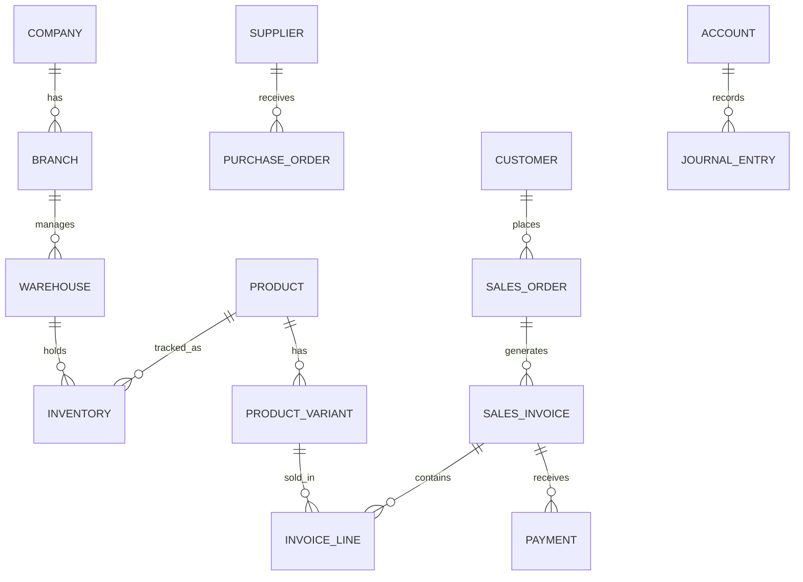
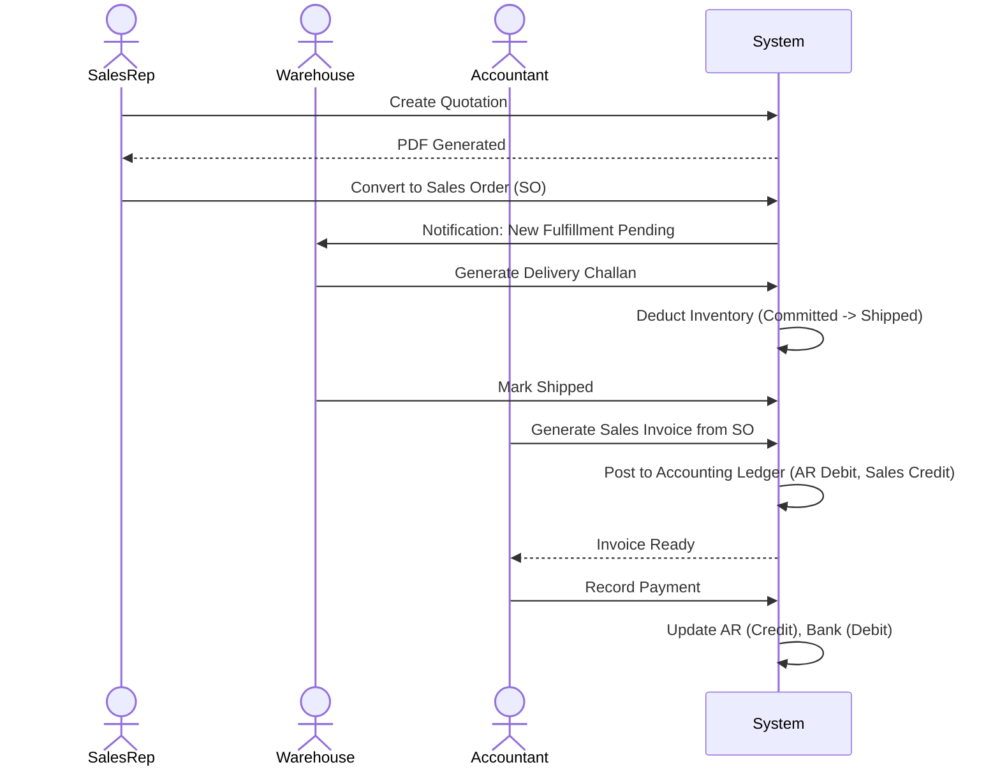
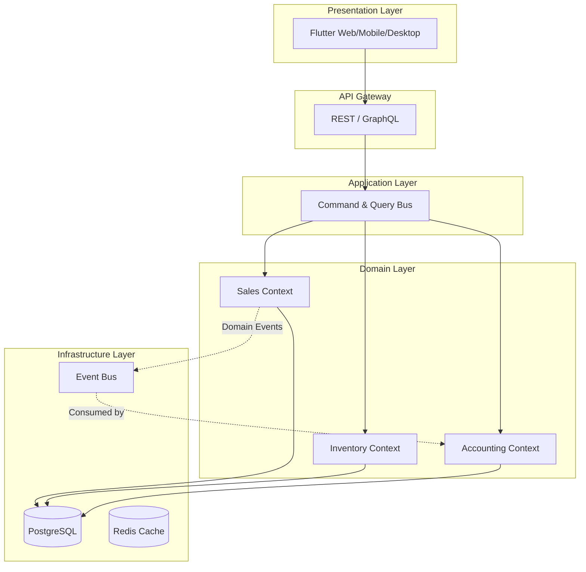

# OMNEXA ERP - Master Product Blueprint

## SECTION 1 — Product Vision

- **Product Name:** Omnexa ERP
- **Vision:** To become the global operating system for modern businesses, unifying retail, distribution, and manufacturing under a single, intelligent, and offline-capable platform.
- **Mission:** Empower SMEs and enterprise businesses with enterprise-grade, AI-driven tools that are intuitive to use, lightning-fast, and accessible from anywhere without exorbitant costs.
- **Goals:** 
  - Achieve 100% data reliability through offline-first architecture.
  - Reduce manual data entry by 80% using AI (OCR, NLP).
  - Provide real-time actionable insights through predictive analytics.
- **Target Customers:** SMEs (Small and Medium Enterprises), Retailers, Wholesalers, Distributors, and light Manufacturers.
- **Business Domains:** Retail, Wholesale, Supply Chain Logistics, Accounting, CRM, HR/Payroll.
- **Unique Selling Points (USPs):** 
  - **True Offline-First:** Continues to work flawlessly without internet; syncs instantly when reconnected via CRDTs.
  - **AI-Native:** Not just an add-on; AI is baked into workflows (receipt scanning, demand forecasting, NLP querying).
  - **Modular Architecture:** Start simple (POS + Inventory) and scale to full Enterprise ERP without migrating platforms.
- **Competitive Advantages:** Faster UI than Odoo, deeper offline capabilities than Zoho, more modern UX than Tally, more affordable than SAP B1.
- **Future Roadmap:** E-commerce integration (Shopify/WooCommerce), Advanced Manufacturing (BOM routing), Fleet Management, Open API Marketplace.

---

## SECTION 2 — Complete ERP Modules

1. **Core:** Dashboard, Settings, Audit Logs, Notifications, Cloud Sync, Backup, Branches, Warehouses, Users & Roles.
2. **Master Data:** Company, Customers, Customer Groups, Suppliers, Products, Categories, Brands, Units, Taxes.
3. **Inventory:** Stock Tracking, Stock Movement, Stock Transfer, Adjustments, Barcode Generation.
4. **Purchases:** Purchase Order (PO), Purchase Invoice, Debit Note (Purchase Return), Expenses.
5. **Sales:** Quotation/Estimate, Sales Order (SO), Delivery Challan, Sales Invoice (POS/B2B), Credit Note (Sales Return).
6. **Accounting:** Chart of Accounts, Cash Book, Bank Book, Ledger, Journal Entries, Profit & Loss, Balance Sheet, Trial Balance, GST/Tax Filing.
7. **CRM:** Leads, Opportunities, Activities, Support Tickets.
8. **HRMS:** Employee Directory, Attendance, Leaves, Payroll, Advances.
9. **AI & Analytics:** AI Assistant (NLP Queries), Demand Forecasting, Reports Hub, OCR Engine.
10. **Extensibility:** API Manager, Integrations (Stripe, Twilio, WhatsApp).

---

## SECTION 3 — Feature Breakdown

### Module: Inventory
- **Purpose:** Track physical goods across multiple locations.
- **Business Need:** Prevent stockouts, reduce holding costs, track shrinkage.
- **Features:** 
  - *Multi-Warehouse:* Track stock per branch/warehouse.
  - *Stock Transfer:* Move items between warehouses with transit states.
  - *Variants & Batches:* Track items by Size/Color, Batch/Expiry, or Serial Number.
- **Business Rules:** Cannot sell serial numbers not in stock; cannot perform stock transfer if requested quantity > available.
- **Dependencies:** Products Module, Branches Module.
- **Required Permissions:** `Inventory.Read`, `Inventory.Write`, `Inventory.Transfer`.

### Module: Sales & POS
- **Purpose:** Process customer orders and payments.
- **Business Need:** Fast checkout, accurate invoicing, tax compliance.
- **Features:**
  - *POS Interface:* Barcode scanning, quick keys, hold/resume cart.
  - *B2B Sales:* Convert Quotation -> SO -> Delivery Challan -> Invoice.
  - *Payments:* Split payments (Cash + Card).
- **Business Rules:** Credit limit blocking for B2B customers.
- **Dependencies:** Inventory, Customers, Accounting.
- **Required Permissions:** `Sales.Create`, `Sales.ApproveDiscount`.

### Module: Accounting
- **Purpose:** Financial health tracking and compliance.
- **Business Need:** Tax filing, profitability tracking, auditor compliance.
- **Features:** Double-entry ledger, auto-posting from sales/purchases, bank reconciliation.
- **Business Rules:** Journal entries must balance (Debits = Credits). Cannot alter locked financial periods.
- **Dependencies:** All financial modules.
- **Required Permissions:** `Accounting.View`, `Accounting.Post`, `Accounting.ClosePeriod`.

---

## SECTION 4 — Database Design

### ER Diagram

### Core Entities

**1. `products`**
- **Description:** Master item catalog.
- **Columns:** `id` (PK, UUID), `sku` (String, Unique), `name` (String), `category_id` (FK), `brand_id` (FK), `tax_id` (FK), `is_active` (Bool).
- **Indexes:** `idx_products_sku`, `idx_products_name`.

**2. `sales_invoices`**
- **Description:** Finalized billing document.
- **Columns:** `id` (PK, UUID), `invoice_number` (String, Unique), `branch_id` (FK), `customer_id` (FK), `date` (Timestamp), `subtotal` (Decimal), `tax_total` (Decimal), `grand_total` (Decimal), `status` (Enum: DRAFT, UNPAID, PAID).
- **Relationships:** Belongs to `customers`, `branches`. Has many `invoice_lines`.

**3. `journal_entries`**
- **Description:** Double-entry accounting records.
- **Columns:** `id` (PK), `transaction_id` (FK - Polymorphic), `account_id` (FK), `debit` (Decimal), `credit` (Decimal), `date` (Timestamp).
- **Constraints:** Sum(debit) must equal Sum(credit) per transaction.

**Normalization:** 3NF applied. Redundant data (like current stock) is materialized via CQRS read models for performance, while source of truth relies on event sourcing (Stock Ledger).

---

## SECTION 5 — Business Workflow

### B2B Sales & Fulfillment Workflow

---

## SECTION 6 — User Roles

| Role | Description | Permissions | Restrictions |
| :--- | :--- | :--- | :--- |
| **Owner / Admin** | Superuser. | `*` (All permissions) | None. |
| **Manager** | Branch operations head. | `Sales.*`, `Purchases.*`, `Inventory.*`, `Reports.View` | Cannot delete company data or alter accounting ledgers. |
| **Cashier** | POS operator. | `Sales.Create`, `Inventory.Read` | Cannot view profit margins, edit past invoices, or apply >10% discount. |
| **Accountant** | Financial controller. | `Accounting.*`, `Sales.Read`, `Purchases.Read` | Cannot modify physical inventory counts. |
| **Warehouse** | Inventory handler. | `Inventory.Transfer`, `Purchases.Receive` | Cannot view pricing, sales totals, or customer financials. |

---

## SECTION 7 — UI/UX Design

- **Navigation:** Left-side collapsible sidebar for core modules (Dashboard, Sales, Purchases, Inventory, Accounting, HR, Settings). Top app bar for global search (AI Assistant), notifications, and user profile.
- **Dashboard:** Customizable widgets (Daily Revenue, Low Stock Alerts, Pending Orders).
- **POS Screen:** Tablet/Touch-optimized. Left 70% for product grid/barcode scanning. Right 30% for active cart, customer selection, and quick-pay buttons.
- **Dark Mode:** System-level deep integration using premium dark greys (e.g., `#121212` background) with high-contrast accent colors (e.g., Electric Blue or Emerald Green).
- **Responsiveness:** 
  - *Desktop:* Data-dense tables with advanced filtering.
  - *Tablet:* Optimized for POS checkout and warehouse picking.
  - *Mobile:* Simplified views for executives (approvals, dashboard) and field sales.

---

## SECTION 8 — Reports

- **Sales:** Sales by Item, Sales by Customer, Sales by Region, Top Performing Reps.
- **Inventory:** Stock Valuation (FIFO/Weighted Average), Low Stock Report, Slow Moving Items, Stock Ledger.
- **Financial:** Profit & Loss Statement, Balance Sheet, Trial Balance, Cash Flow Statement, Aging Summary (AR/AP).
- **GST/Tax:** GSTR-1, GSTR-2, GSTR-3B formats (or local equivalents), Tax Summary.
- **KPIs (Dashboard Widgets):** Gross Margin %, Inventory Turnover Ratio, Average Order Value (AOV), Customer Acquisition Cost (CAC).

---

## SECTION 9 — AI Features

Omnexa ERP is built "AI-Native":
1. **Natural Language Queries (OmniBot):** Type *"What were the top 5 selling products last month?"* and receive a generated chart and data table instantly (Text-to-SQL / RAG).
2. **Invoice & Receipt OCR:** Upload a picture of a supplier bill. AI extracts Supplier Name, Date, Line Items, Taxes, and auto-fills the Purchase Invoice form.
3. **Smart Reorder Suggestions:** Predictive models analyze historical sales velocity, seasonality, and supplier lead times to suggest exactly what to reorder and when.
4. **Expense Categorization:** AI automatically assigns ledger accounts to raw bank statement imports (e.g., "Starbucks" -> "Meals & Entertainment").
5. **Anomaly Detection:** Flags suspicious transactions (e.g., an invoice created at 3 AM, or a discount 50% above average).

---

## SECTION 10 — Architecture

**Architecture Style:** Modular Monolith evolving into Microservices (via Domain-Driven Design).
**Why?** A modular monolith provides the simplest deployment for on-premise/SMEs while keeping domains strictly bounded, allowing easy separation into microservices for Enterprise Cloud scale.

### Architecture Diagram (Layered & DDD)

- **Offline-First Sync:** CRDTs (Conflict-free Replicated Data Types) handled via a local database (e.g., SQLite/PowerSync) on the device, syncing asynchronously with the central PostgreSQL database.

---

## SECTION 11 — Technology Stack

- **Frontend:** Flutter (Web, iOS, Android, Windows, macOS) - Single codebase, offline capability.
- **Backend:** Go (Golang) or .NET Core 8 (High concurrency, strong typing).
- **Database:** PostgreSQL (Primary), SQLite (Local Offline Client).
- **Cache:** Redis (Session management, pre-aggregated reports).
- **Message Broker:** RabbitMQ or Apache Kafka (Async event driven architecture).
- **Authentication:** Supabase Auth or Keycloak (OIDC/OAuth2).
- **Cloud Infrastructure:** AWS (EKS, RDS, S3) or Google Cloud Platform.
- **AI/ML:** OpenAI API (for NLP/Agents), Google Cloud Vision (OCR).
- **Deployment:** Docker, Kubernetes, Terraform.

---

## SECTION 12 — Development Roadmap

- **Phase 1 (MVP - Month 1-3):** 
  - Core framework, RBAC, Master Data.
  - Basic Inventory (Stock In/Out).
  - Basic Sales (POS & Invoicing).
  - Offline sync foundation.
- **Phase 2 (Growth - Month 4-6):** 
  - Purchases & Expenses.
  - Double-entry Accounting core.
  - Multi-warehouse support.
- **Phase 3 (Scale - Month 7-9):**
  - B2B Workflows (Quotations, Orders, Challans).
  - Advanced Reporting & Tax Engine.
  - CRM & HR Modules.
- **Phase 4 (AI & Enterprise - Month 10-12):**
  - OCR integration, NLP Querying, Predictive Forecasting.
  - Open API for third-party integrations.
- **Complexity Estimate:** High. Requires ~5-8 senior engineers (2 Frontend, 3 Backend, 1 QA, 1 DevOps, 1 AI Specialist).

---

## SECTION 13 — Monetization

SaaS Subscription Model with tiered pricing based on features and users.

| Plan | Pricing | Target | Key Features |
| :--- | :--- | :--- | :--- |
| **Free Tier** | $0/mo | Solo Retailers | 1 User, POS, Basic Inventory, Max 100 invoices/mo. |
| **Starter** | $29/mo | Small Shops | 3 Users, Unlimited Invoices, Accounting, Email Support. |
| **Professional** | $79/mo | Growing SMEs | 10 Users, Multi-Warehouse, B2B workflows, OCR capabilities. |
| **Enterprise** | Custom | Large Chains | Unlimited Users, Advanced AI Forecasting, Dedicated Account Manager, Custom API integrations. |

---

## SECTION 14 — Final Blueprint

Omnexa ERP represents a paradigm shift from legacy monolithic ERPs to a modern, agile, AI-driven operating system.

- **Module Hierarchy:** Highly cohesive domains connected via an event bus.
- **Feature Hierarchy:** Gradual disclosure. Start simple, toggle advanced features (like batches, multi-currency) in settings.
- **Database Hierarchy:** PostgreSQL schemas isolating multi-tenant data or bounded contexts.
- **User Hierarchy:** Strict RBAC with granular permission flags (Create, Read, Update, Delete, Approve).
- **Architecture Hierarchy:** Client (Flutter) -> Gateway -> Application Services (CQRS) -> Domain Logic -> Infrastructure.

This document serves as the master blueprint. Development teams should begin by establishing the Go/.NET microservice skeletons and the Flutter Monorepo, prioritizing Phase 1 (MVP) implementation of Master Data and the POS module to ensure the offline-first sync engine is robust before scaling domain complexity.
