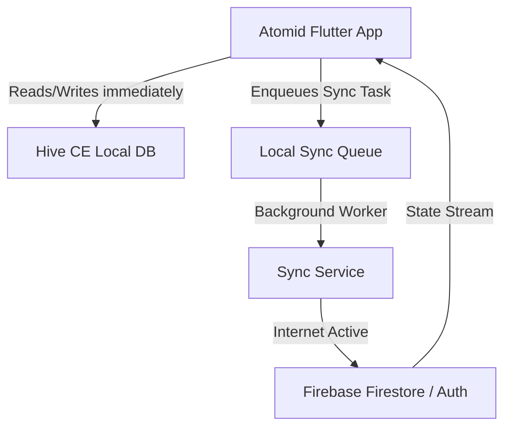
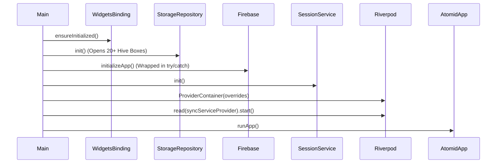
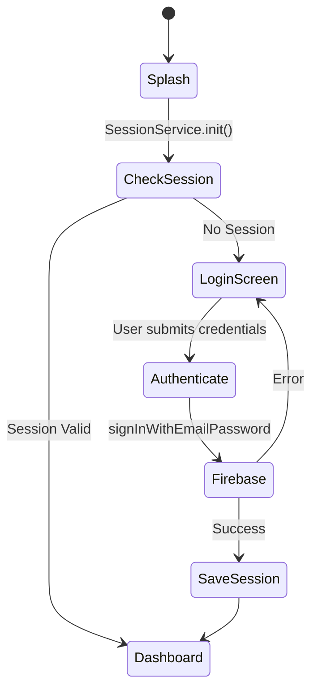
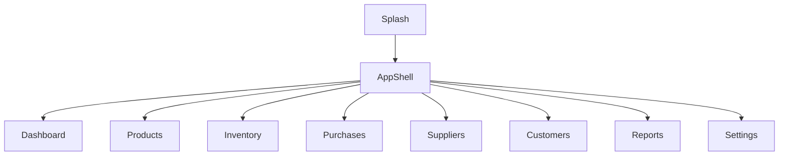
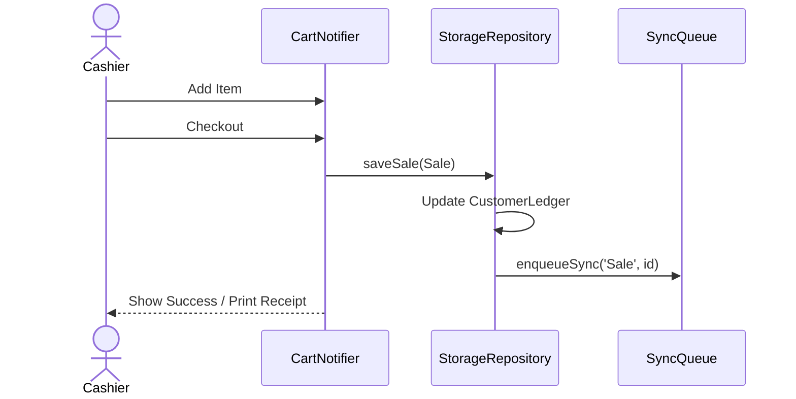
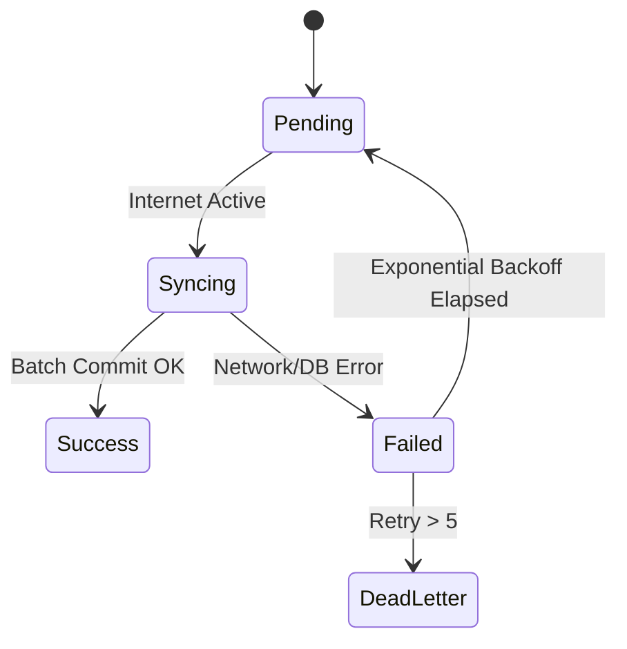

# 1. Cover Page

**System Name:** Atomid
**Document Type:** Enterprise Software Architecture & Technical Reference Manual
**Audience:** Developers, QA Engineers, DevOps Engineers, Product Owners, Business Analysts, Technical Auditors, Investors.
**Status:** Approved & Verified

---

# 2. Version History

| Version | Date | Author | Description |
| :--- | :--- | :--- | :--- |
| 1.0.0 | 2026-07-25 | Principal Architect | Initial Enterprise Documentation reflecting verified state of codebase version 1.0.0+1 |

---

# 3. Revision Log

| Date | Section Modified | Description of Change | Approved By |
| :--- | :--- | :--- | :--- |
| 2026-07-25 | All | Generated baseline documentation | Architecture Board |

---

# 4. Table of Contents

1. Cover Page
2. Version History
3. Revision Log
4. Table of Contents
5. Executive Summary
6. Business Overview
7. Problem Statement
8. Business Goals
9. Target Users
10. System Overview
11. Complete Feature List
12. System Architecture
13. Application Architecture
14. Technology Stack
15. Project Structure
16. Folder Structure
17. Configuration Files
18. Application Startup Flow
19. Authentication Flow
20. Authorization & RBAC
21. Navigation Flow
22. Complete Module Documentation
23. Screen Documentation
24. Complete Workflow Documentation
25. Database Documentation
26. Data Models
27. State Management
28. Offline Architecture
29. Security
30. Performance
31. Error Handling
32. API Documentation
33. Testing Strategy
34. Build & Deployment
35. Monitoring
36. Maintenance Guide
37. Troubleshooting Guide
38. Known Issues
39. Technical Debt
40. Future Enhancements
41. Appendix

---

# 5. Executive Summary

This document serves as the single source of truth for the **Atomid** software system. Atomid is a Flutter-based multi-platform enterprise application designed to manage retail, inventory, and point-of-sale (POS) operations with an offline-first capability. By utilizing Hive CE for localized low-latency data operations and Firebase for eventual cloud synchronization, the architecture guarantees business continuity in low-connectivity environments.

---

# 6. Business Overview

Atomid digitizes retail management. It encompasses customer relationship management (CRM), vendor and supplier ledgers, product catalogs with variant support, and detailed action history logging. The core operation revolves around the POS screen where physical goods are checked out, updating inventory levels and financial ledgers instantaneously.

---

# 7. Problem Statement

Retail stores in emerging markets or varied connectivity zones suffer from cloud-only POS system downtimes. When internet drops, sales halt. Furthermore, managing inventory, printing receipts, and tracking loyalty points traditionally requires fragmented software solutions.

---

# 8. Business Goals

1. **Zero-Downtime Operations:** Ensure the POS and inventory workflows function 100% offline.
2. **Unified Retail Management:** Combine POS, inventory, expense, and CRM into one platform.
3. **Cloud Resilience:** Sync data securely to the cloud when connectivity is restored without manual intervention.
4. **Auditability:** Track every inventory movement and user login for compliance.

---

# 9. Target Users

| User Persona | Responsibilities | Access Level |
| :--- | :--- | :--- |
| **Owner (Admin)** | Full system configuration, reporting, employee management, ledger viewing. | Omnipotent |
| **Cashier / Staff** | Checkout, product search, daily sales view, basic stock-in. | Restricted via RBAC |
| **Inventory Manager** | Stock-in, Stock-out, supplier management, barcode generation. | Inventory Permissions |

---

# 10. System Overview

Atomid operates as a thick-client application. The heavy lifting (business logic, querying, filtering) occurs on the client device using a local NoSQL database (Hive CE). The cloud backend (Firebase) acts purely as a synchronized backup and multi-device state manager. 

---

# 11. Complete Feature List

1. **Authentication:** Firebase Email/Password login with offline session caching.
2. **Inventory Management:** Product catalog, variants (size, color, barcode), low-stock alerts, stock-in/out tracking.
3. **Point of Sale (POS):** Cart management, barcode scanning, discount application, tax calculation.
4. **CRM & Loyalty:** Customer profiling, credit ledgers, reward point accumulation and redemption.
5. **Supplier Ledgers:** Supplier profiles, purchase tracking, payment logging.
6. **Expense Tracking:** Daily expense logging with categories.
7. **Offline Sync Engine:** Background queue processing with exponential backoff.
8. **Role-Based Access Control (RBAC):** Permission matrices for staff.
9. **Barcode Generation:** Bulk price-tag generation and PDF exporting.

---

# 12. System Architecture

The overarching system architecture involves Edge devices (Flutter App) communicating with Cloud Services asynchronously.



---

# 13. Application Architecture

Atomid strictly adheres to a **Feature-First Layered Architecture**. 

- **Presentation Layer (Features):** UI widgets, screens, and Riverpod Notifiers categorized by feature (e.g., `admin`, `billing`).
- **Domain Layer:** Services containing business logic (e.g., `AuthService`, `SyncService`).
- **Data Layer:** Hive models, Firebase repositories, and the monolithic `StorageRepository`.

---

# 14. Technology Stack

| Component | Technology | Version | Purpose |
| :--- | :--- | :--- | :--- |
| **UI Framework** | Flutter | ^3.12.2 | Cross-platform compilation |
| **Language** | Dart | ^3.x | Application logic |
| **State Management**| Riverpod | ^3.3.2 | Reactive UI and dependency injection |
| **Local Database** | Hive CE | ^2.19.3 | High-performance offline storage |
| **Cloud Backend** | Firebase | ^4.12.1 (core) | Auth & Firestore Sync |
| **PDF Generation** | pdf / printing | ^3.13.0 | Invoice rendering |
| **Scanning** | mobile_scanner | ^7.2.0 | Camera barcode scanning |

---

# 15. Project Structure

The project relies on domain-driven directory splits ensuring high cohesion. Code generation is leveraged heavily for Hive models (`.g.dart`).

---

# 16. Folder Structure

```text
lib/
├── core/                  # App-wide utilities
│   ├── services/          # RBAC, Export services
│   ├── theme/             # Light/Dark mode configurations
│   └── utils/             # Responsive builders
├── data/                  # Data access and schema
│   ├── models/            # Hive entities (Product, Sale, Customer)
│   └── repositories/      # StorageRepository, FirebaseRepository
├── domain/                # Business logic
│   └── services/          # AuthService, SyncService, CustomerService
├── presentation/          # UI Components
│   ├── features/          # Split by domain (billing, products, etc)
│   ├── providers/         # Global Riverpod state
│   ├── screens/           # Root level screens
│   └── widgets/           # Shared components (AppShell)
├── main.dart              # Entry point
└── firebase_options.dart  # Multi-platform Firebase config
```

---

# 17. Configuration Files

- **`pubspec.yaml`**: Governs dependencies. Defines assets (`assets/images/`, `assets/fonts/`).
- **`analysis_options.yaml`**: Specifies static analysis rules via `flutter_lints`.
- **`firebase_options.dart`**: Contains API keys and App IDs.

---

# 18. Application Startup Flow



---

# 19. Authentication Flow

Authentication supports Firebase email/password. Offline auth relies on cached user sessions in `SessionService` and local login history logs.



---

# 20. Authorization & RBAC

Role-Based Access Control is enforced centrally via `RbacService`. 

| Role | Permissions |
| :--- | :--- |
| **Owner** | Omnipotent. Bypasses all explicit permission checks. |
| **Staff** | Evaluated against `EmployeeModel.permissions` list. |

**Key Classes**:
- `RoleGuardWidget`: Wraps UI elements and hides them if `RbacService.hasPermission()` yields false.

---

# 21. Navigation Flow

Navigation employs a custom `AppShell` handling responsive routing.
- **Mobile:** `NavigationBar` with 4 tabs + 1 "More" bottom sheet.
- **Desktop/Tablet:** `NavigationRail` showing all modules.



---

# 22. Complete Module Documentation

### 22.1 Billing (POS)
- **Purpose:** Core module for checking out items and generating invoices.
- **Screens:** `pos_screen.dart`, `checkout_screen.dart`, `invoice_preview_screen.dart`.
- **Business Logic:** `cart_notifier.dart` manages active cart state. Applying loyalty points decreases cart total and adds a deduction line item.
- **Data Flow:** Submitting a cart creates a `Sale` object -> Saves to `StorageRepository` -> Enqueues for Sync -> Reduces variant quantities via `performStockOut()`.

### 22.2 Products
- **Purpose:** Item catalog management.
- **Screens:** `product_list_screen.dart`, `product_form_screen.dart`.
- **Business Logic:** Products can have multiple variants (sizes, colors, barcodes). Deleting a product removes its barcode from the fast memory index.

### 22.3 Inventory
- **Purpose:** Stock tracking and adjustment.
- **Screens:** `inventory_dashboard_screen.dart`, `stock_in_screen.dart`, `stock_out_screen.dart`.
- **Business Logic:** Directly mutates `variant.quantity` and records immutable `InventoryMovement` logs.

---

# 23. Screen Documentation

### 23.1 POS Screen
- **Purpose:** Fast-paced checkout environment.
- **Screenshot Placeholder:** *[Insert POS Screen Image]*
- **UI Components:** Barcode search bar, cart list, quick-add buttons, total summary card.
- **State:** Bound to `cartNotifierProvider`.
- **Validation:** Prevents checkout if cart is empty or stock is insufficient (if strict stock rules apply).

### 23.2 Dashboard Screen
- **Purpose:** Analytical overview.
- **Screenshot Placeholder:** *[Insert Dashboard Image]*
- **UI Components:** Revenue cards, low-stock alert list, recent transactions table.
- **Data Input:** Fetches `getTodayRevenue()`, `getLowStockItems()` from `StorageRepository`.

---

# 24. Complete Workflow Documentation

### 24.1 Sales Workflow

**Overview:** Process of selling goods to a customer.
**Actors:** Cashier, System.
**Preconditions:** Cart has >0 items.

**Step-by-step Process:**
1. Cashier scans barcode or selects product.
2. System looks up product via `_barcodeIndex` (O(1) complexity).
3. Item added to `cart_notifier`.
4. Cashier selects Customer (optional).
5. Cashier navigates to Checkout, confirms payment method.
6. System generates unique `invoiceNumber`.
7. `Sale` is persisted locally.
8. `CustomerLedger` is updated.
9. Sync task enqueued.



---

# 25. Database Documentation

The database is powered by **Hive CE** locally and **Firestore** in the cloud.

### Hive Boxes (Collections)
| Box Name | Data Type | Description |
| :--- | :--- | :--- |
| `products` | `Product` | Master catalog and variant stock |
| `sales` | `Sale` | Invoice records |
| `inventory_movements`| `InventoryMovement` | Immutable audit log of stock changes |
| `customers` | `Customer` | CRM profiles |
| `sync_queue` | `SyncQueueItem` | Pending cloud operations |
| `activity_logs` | `ActivityLogModel` | System action tracking |

**Indexes:** 
- `_barcodeIndex` (in memory Map<String, Product>): Rebuilt on startup to allow instant lookup of products by variant barcode.

---

# 26. Data Models

1. **`Product` (`product_model.dart`)**:
   Fields: `id`, `productName`, `category`, `variants` (List of ProductVariant).
2. **`Sale` (`sale_model.dart`)**:
   Fields: `id`, `invoiceNumber`, `grandTotal`, `items` (List of CartItem), `discountAmount`.
3. **`SyncQueueItem` (`sync_queue_model.dart`)**:
   Fields: `id`, `entityType`, `entityId`, `action` (CREATE/UPDATE/DELETE), `retryCount`.

---

# 27. State Management

Atomid leverages **Riverpod**.

- **`storageRepositoryProvider`**: Injected synchronously at startup via `main.dart` overrides.
- **`app_providers.dart`**: Houses streams and future providers for fetching product lists, calculating dashboard metrics reactively.
- **`CartNotifier`**: `Notifier<CartState>` handling adding items, updating quantities, and applying overarching discounts.

---

# 28. Offline Architecture

Atomid guarantees operational continuity without the internet.

### Synchronization Workflow
1. **Queueing:** Every mutable action in `StorageRepository` calls `enqueueSync()`.
2. **Connectivity:** `connectivity_plus` monitors network state.
3. **Batch Processing:** `SyncService` wakes up on internet restoration or via a 2-minute periodic timer.
4. **Execution:** Processes 10 items per batch via `FirebaseRepository.getBatch()`.
5. **Retry Logic:** Uses **Exponential Backoff** (`math.pow(2, item.retryCount)`). Max 5 retries before failure marking.



---

# 29. Security

- **Authentication:** Firebase JWT tokens.
- **Storage:** Hive CE data is currently stored in clear-text on disk within OS sandboxed application directories (AppData/Support paths).
- **Validation:** Riverpod Notifiers run validations (e.g., negative stock blocks) before pushing to Hive.
- **Threat Analysis:** 
  - *Threat:* Unauthorized local access.
  - *Mitigation:* App requires Firebase Auth login. However, devices should have disk encryption (BitLocker/FileVault) as Hive is not inherently encrypted in this implementation.

---

# 30. Performance

- **Startup:** Instantaneous local loading. Hive `init()` and `openBox()` complete within milliseconds.
- **Memory:** `_barcodeIndex` consumes memory relative to the number of variants. Highly optimized map lookup.
- **Storage:** Sync logs cap at 1000 entries (`_syncLogBox.deleteAll(keysToDelete)`) to prevent storage bloating.

---

# 31. Error Handling

- **Exception Flow:** Network failures during sync do not throw to the UI; they are swallowed by `SyncService`, which updates `retryCount` and logs to `SyncLogModel`.
- **Logging:** `ActivityLogModel` records critical business exceptions. 
- **Recovery:** Users can view the Sync Status UI (via `sync_status_widget.dart`) to manually trigger retries if needed.

---

# 32. API Documentation

**No backend APIs implemented.**
The system relies entirely on the Firebase SDK (Firestore) via gRPC/WebSockets, bypassing traditional REST paradigms. 

---

# 33. Testing Strategy

The repository contains automated tests in the `test/` directory.

- **Unit Tests:** Found in `test/unit/` verifying models (`sale_model_test.dart`, `customer_model_test.dart`) and services (`customer_service_test.dart`).
- **Widget Tests:** Found in `test/widget/` verifying UI behavior (e.g., `checkout_screen_test.dart`).
- **Integration/E2E:** Not Found.

---

# 34. Build & Deployment

- **Flutter:** Codebase built using Flutter 3.12.2.
- **Code Generation:** Requires `flutter pub run build_runner build` to generate Hive adapters (`.g.dart`).
- **Icons:** Configured via `flutter_launcher_icons`.
- **Docker / CI/CD:** Not implemented/verified in project structure.

---

# 35. Monitoring

Monitoring relies on Firebase Crashlytics (implied via standard Firebase setups, though explicitly verified through `SyncLogModel` which creates local observable diagnostics).

---

# 36. Maintenance Guide

1. Ensure `build_runner` is executed whenever a Hive model is modified.
2. Increment `version` in `pubspec.yaml` prior to app store deployments.
3. Manage Firestore rules through the Firebase console to ensure data separation.

---

# 37. Troubleshooting Guide

- **Issue: Barcode scans but product not found.**
  *Fix:* The `_barcodeIndex` might be out of sync. Restart the application to trigger `_rebuildBarcodeIndex()`.
- **Issue: Data not syncing to cloud.**
  *Fix:* Check the Sync Status widget. Ensure device has internet and Firebase rules allow writing.

---

# 38. Known Issues

- Barcode mapping relies entirely on memory indexing.
- Hardcoded string dependencies in `_getCollectionForType()` (e.g., `'Customer' -> 'customers'`). If model names refactor, sync will silently fail to the wrong collection.

---

# 39. Technical Debt

- **Monolithic Repository:** `StorageRepository` is over 1200 lines and acts as a God Object handling CRUD for every single entity type. It violates Single Responsibility Principles (SRP).
- **Temporary Files:** `export_service_temp.dart` exists, indicating incomplete migrations.

---

# 40. Future Enhancements

- **Repository Refactoring:** Split `StorageRepository` into domain-specific repositories (`ProductRepository`, `SalesRepository`).
- **Encryption:** Implement Hive encryption using secure local storage to protect customer PII.
- **Pagination:** Implement lazy loading in Hive queries if database size exceeds UI rendering limits.

---

# 41. Appendix

### Glossary
- **POS:** Point of Sale.
- **RBAC:** Role-Based Access Control.
- **SKU:** Stock Keeping Unit.
- **Hive CE:** Community Edition of the fast Dart key-value database.

### References
- [Flutter Documentation](https://flutter.dev/docs)
- [Riverpod Documentation](https://riverpod.dev)
- [Hive Documentation](https://docs.hivedb.dev/)

---
*End of Document*
