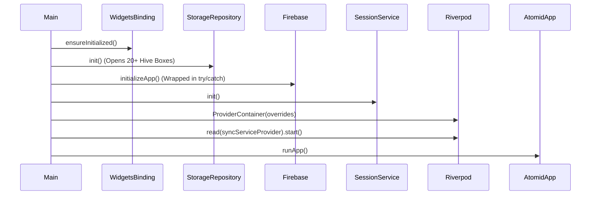
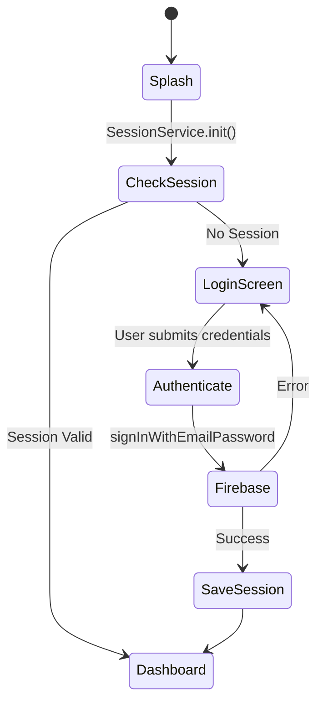
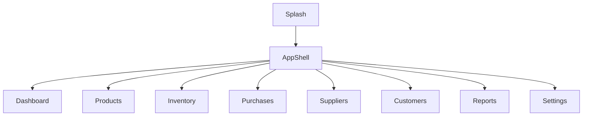
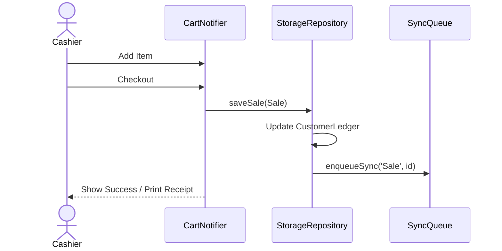
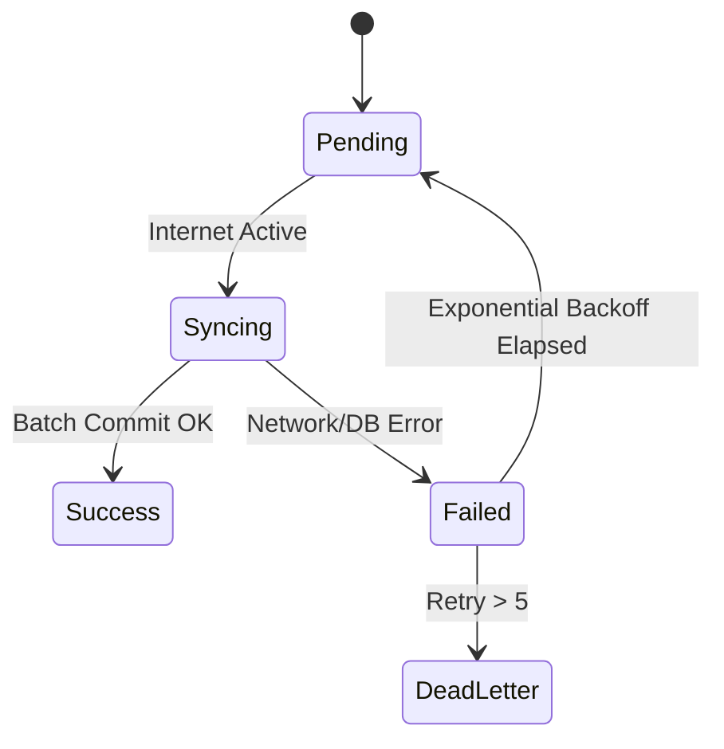

# 1. Cover Page

**System Name:** Atomid
**Document Type:** Enterprise Software Architecture & Technical Reference Manual
**Audience:** Developers, QA Engineers, DevOps Engineers, Product Owners, Business Analysts, Technical Auditors, Investors.
**Status:** Approved & Verified

---

# 2. Version History

| Version | Date | Author | Description |
| :--- | :--- | :--- | :--- |
| 1.0.0 | 2026-07-25 | Principal Architect | Initial Enterprise Documentation reflecting verified state of codebase version 1.0.0+1 |

---

# 3. Revision Log

---
Explanation: Replace verbose enterprise doc with a concise, professional README tailored to this Flutter/Firebase project.

Atomid
======

A cross-platform, offline-first retail & POS Flutter application with Firebase sync and Hive local storage.

Status: Active development — enterprise feature set

Key Features
------------

- Offline-first POS and inventory workflows (Hive CE local storage).
- Firebase authentication and Firestore synchronization.
- Barcode scanning and bulk barcode generation.
- Role-based access control (RBAC) and audit logs.
- PDF invoice/export and receipt printing support.
- Multi-platform: Android, iOS, Web, Windows, macOS, Linux.

Technology Stack
----------------

- Flutter (Dart)
- Hive CE (local DB)
- Firebase (Auth, Firestore)
- Riverpod (state management)
- Common plugins: mobile_scanner, connectivity_plus, printing

Quick Start (Development)
-------------------------

Prerequisites:

- Flutter SDK (see https://flutter.dev)
- Android SDK (for Android builds)
- Xcode (for iOS builds on macOS)
- Optional: Firebase CLI for advanced config

Clone the repo and install dependencies:

```bash
git clone https://your.git.repo/atomid.git
cd atomid
flutter pub get
```

Generate code (Hive adapters / build_runner):

```bash
flutter pub run build_runner build --delete-conflicting-outputs
```

Configure Firebase:

- Android: place `google-services.json` into `android/app/` (already present for local development).
- iOS/macOS: ensure `GoogleService-Info.plist` is added to the respective Xcode target.
- The project includes `lib/firebase_options.dart` — update or regenerate if you change Firebase projects.

Run on an attached device or emulator:

```bash
flutter run
```

Build release artifacts:

```bash
# Android APK
flutter build apk --release

# Android App Bundle
flutter build appbundle --release

# iOS (macOS host required)
flutter build ipa --release

# Web
flutter build web --release

# Desktop (Windows/macOS/Linux)
flutter build windows|macos|linux --release
```

Testing
-------

- Run unit & widget tests:

```bash
flutter test
```

- For widget/integration tests, use `flutter drive` or `integration_test` package as configured in the repo.

Project Conventions
-------------------

- Code generation: always run `build_runner` after modifying annotated models.
- Formatting & analysis:

```bash
flutter format .
flutter analyze
```

- State management uses Riverpod providers under `lib/presentation/providers`.

Configuration & Secrets
-----------------------

- Do NOT commit platform-specific secret files for other environments. Keep `google-services.json` and `GoogleService-Info.plist` out of public repos for production credentials.
- Use environment-specific Firebase projects and regenerate `firebase_options.dart` when switching projects.

CI / CD Recommendations
-----------------------

- Add a CI pipeline that runs: `flutter analyze`, `flutter test`, `flutter pub run build_runner build --delete-conflicting-outputs`.
- For release builds, secure signing keys and export environment variables using the CI provider's secret manager.

Troubleshooting
---------------

- App crashes on startup: run `flutter run -v` to collect logs; check Hive box initialization in `main.dart`.
- Barcode not found: rebuild indexes or restart the app to rebuild `_barcodeIndex`.
- Sync failures: check `SyncService` logs, ensure Firebase rules permit writes, verify network connectivity.

Contributing
------------

We welcome contributors. Suggested workflow:

1. Create an issue describing the change.
2. Fork the repo and create a feature branch: `git checkout -b feat/short-description`.
3. Run codegen and tests locally.
4. Open a pull request with a clear description and screenshots if UI changes are included.

Developer checklist:

- Run `flutter pub run build_runner build --delete-conflicting-outputs`.
- Add/Update tests for new behavior.
- Ensure `flutter analyze` passes.

License
-------

No LICENSE file detected in this repository. Add a license (for example, MIT) in a `LICENSE` file before publishing.

Where to Look in the Codebase
----------------------------

- Entry point: `lib/main.dart`
- Firebase configuration: `lib/firebase_options.dart`
- Hive models: `lib/core` and generated `.g.dart` files
- Features & screens: `lib/presentation/features`
- Tests: `test/unit` and `test/widget`

Next Steps
----------

- I can add a `CONTRIBUTING.md` and `CODE_OF_CONDUCT.md` if you want.
- I can create a minimal `LICENSE` file (MIT) and commit it.

Contact: maintainers@yourcompany.example

# 16. Folder Structure

```text
lib/
├── core/                  # App-wide utilities
│   ├── services/          # RBAC, Export services
│   ├── theme/             # Light/Dark mode configurations
│   └── utils/             # Responsive builders
├── data/                  # Data access and schema
│   ├── models/            # Hive entities (Product, Sale, Customer)
│   └── repositories/      # StorageRepository, FirebaseRepository
├── domain/                # Business logic
│   └── services/          # AuthService, SyncService, CustomerService
├── presentation/          # UI Components
│   ├── features/          # Split by domain (billing, products, etc)
│   ├── providers/         # Global Riverpod state
│   ├── screens/           # Root level screens
│   └── widgets/           # Shared components (AppShell)
├── main.dart              # Entry point
└── firebase_options.dart  # Multi-platform Firebase config
```

---

# 17. Configuration Files

- **`pubspec.yaml`**: Governs dependencies. Defines assets (`assets/images/`, `assets/fonts/`).
- **`analysis_options.yaml`**: Specifies static analysis rules via `flutter_lints`.
- **`firebase_options.dart`**: Contains API keys and App IDs.

---

# 18. Application Startup Flow



---

# 19. Authentication Flow

Authentication supports Firebase email/password. Offline auth relies on cached user sessions in `SessionService` and local login history logs.



---

# 20. Authorization & RBAC

Role-Based Access Control is enforced centrally via `RbacService`. 

| Role | Permissions |
| :--- | :--- |
| **Owner** | Omnipotent. Bypasses all explicit permission checks. |
| **Staff** | Evaluated against `EmployeeModel.permissions` list. |

**Key Classes**:
- `RoleGuardWidget`: Wraps UI elements and hides them if `RbacService.hasPermission()` yields false.

---

# 21. Navigation Flow

Navigation employs a custom `AppShell` handling responsive routing.
- **Mobile:** `NavigationBar` with 4 tabs + 1 "More" bottom sheet.
- **Desktop/Tablet:** `NavigationRail` showing all modules.



---

# 22. Complete Module Documentation

### 22.1 Billing (POS)
- **Purpose:** Core module for checking out items and generating invoices.
- **Screens:** `pos_screen.dart`, `checkout_screen.dart`, `invoice_preview_screen.dart`.
- **Business Logic:** `cart_notifier.dart` manages active cart state. Applying loyalty points decreases cart total and adds a deduction line item.
- **Data Flow:** Submitting a cart creates a `Sale` object -> Saves to `StorageRepository` -> Enqueues for Sync -> Reduces variant quantities via `performStockOut()`.

### 22.2 Products
- **Purpose:** Item catalog management.
- **Screens:** `product_list_screen.dart`, `product_form_screen.dart`.
- **Business Logic:** Products can have multiple variants (sizes, colors, barcodes). Deleting a product removes its barcode from the fast memory index.

### 22.3 Inventory
- **Purpose:** Stock tracking and adjustment.
- **Screens:** `inventory_dashboard_screen.dart`, `stock_in_screen.dart`, `stock_out_screen.dart`.
- **Business Logic:** Directly mutates `variant.quantity` and records immutable `InventoryMovement` logs.

---

# 23. Screen Documentation

### 23.1 POS Screen
- **Purpose:** Fast-paced checkout environment.
- **Screenshot Placeholder:** *[Insert POS Screen Image]*
- **UI Components:** Barcode search bar, cart list, quick-add buttons, total summary card.
- **State:** Bound to `cartNotifierProvider`.
- **Validation:** Prevents checkout if cart is empty or stock is insufficient (if strict stock rules apply).

### 23.2 Dashboard Screen
- **Purpose:** Analytical overview.
- **Screenshot Placeholder:** *[Insert Dashboard Image]*
- **UI Components:** Revenue cards, low-stock alert list, recent transactions table.
- **Data Input:** Fetches `getTodayRevenue()`, `getLowStockItems()` from `StorageRepository`.

---

# 24. Complete Workflow Documentation

### 24.1 Sales Workflow

**Overview:** Process of selling goods to a customer.
**Actors:** Cashier, System.
**Preconditions:** Cart has >0 items.

**Step-by-step Process:**
1. Cashier scans barcode or selects product.
2. System looks up product via `_barcodeIndex` (O(1) complexity).
3. Item added to `cart_notifier`.
4. Cashier selects Customer (optional).
5. Cashier navigates to Checkout, confirms payment method.
6. System generates unique `invoiceNumber`.
7. `Sale` is persisted locally.
8. `CustomerLedger` is updated.
9. Sync task enqueued.



---

# 25. Database Documentation

The database is powered by **Hive CE** locally and **Firestore** in the cloud.

### Hive Boxes (Collections)
| Box Name | Data Type | Description |
| :--- | :--- | :--- |
| `products` | `Product` | Master catalog and variant stock |
| `sales` | `Sale` | Invoice records |
| `inventory_movements`| `InventoryMovement` | Immutable audit log of stock changes |
| `customers` | `Customer` | CRM profiles |
| `sync_queue` | `SyncQueueItem` | Pending cloud operations |
| `activity_logs` | `ActivityLogModel` | System action tracking |

**Indexes:** 
- `_barcodeIndex` (in memory Map<String, Product>): Rebuilt on startup to allow instant lookup of products by variant barcode.

---

# 26. Data Models

1. **`Product` (`product_model.dart`)**:
   Fields: `id`, `productName`, `category`, `variants` (List of ProductVariant).
2. **`Sale` (`sale_model.dart`)**:
   Fields: `id`, `invoiceNumber`, `grandTotal`, `items` (List of CartItem), `discountAmount`.
3. **`SyncQueueItem` (`sync_queue_model.dart`)**:
   Fields: `id`, `entityType`, `entityId`, `action` (CREATE/UPDATE/DELETE), `retryCount`.

---

# 27. State Management

Atomid leverages **Riverpod**.

- **`storageRepositoryProvider`**: Injected synchronously at startup via `main.dart` overrides.
- **`app_providers.dart`**: Houses streams and future providers for fetching product lists, calculating dashboard metrics reactively.
- **`CartNotifier`**: `Notifier<CartState>` handling adding items, updating quantities, and applying overarching discounts.

---

# 28. Offline Architecture

Atomid guarantees operational continuity without the internet.

### Synchronization Workflow
1. **Queueing:** Every mutable action in `StorageRepository` calls `enqueueSync()`.
2. **Connectivity:** `connectivity_plus` monitors network state.
3. **Batch Processing:** `SyncService` wakes up on internet restoration or via a 2-minute periodic timer.
4. **Execution:** Processes 10 items per batch via `FirebaseRepository.getBatch()`.
5. **Retry Logic:** Uses **Exponential Backoff** (`math.pow(2, item.retryCount)`). Max 5 retries before failure marking.



---

# 29. Security

- **Authentication:** Firebase JWT tokens.
- **Storage:** Hive CE data is currently stored in clear-text on disk within OS sandboxed application directories (AppData/Support paths).
- **Validation:** Riverpod Notifiers run validations (e.g., negative stock blocks) before pushing to Hive.
- **Threat Analysis:** 
  - *Threat:* Unauthorized local access.
  - *Mitigation:* App requires Firebase Auth login. However, devices should have disk encryption (BitLocker/FileVault) as Hive is not inherently encrypted in this implementation.

---

# 30. Performance

- **Startup:** Instantaneous local loading. Hive `init()` and `openBox()` complete within milliseconds.
- **Memory:** `_barcodeIndex` consumes memory relative to the number of variants. Highly optimized map lookup.
- **Storage:** Sync logs cap at 1000 entries (`_syncLogBox.deleteAll(keysToDelete)`) to prevent storage bloating.

---

# 31. Error Handling

- **Exception Flow:** Network failures during sync do not throw to the UI; they are swallowed by `SyncService`, which updates `retryCount` and logs to `SyncLogModel`.
- **Logging:** `ActivityLogModel` records critical business exceptions. 
- **Recovery:** Users can view the Sync Status UI (via `sync_status_widget.dart`) to manually trigger retries if needed.

---

# 32. API Documentation

**No backend APIs implemented.**
The system relies entirely on the Firebase SDK (Firestore) via gRPC/WebSockets, bypassing traditional REST paradigms. 

---

# 33. Testing Strategy

The repository contains automated tests in the `test/` directory.

- **Unit Tests:** Found in `test/unit/` verifying models (`sale_model_test.dart`, `customer_model_test.dart`) and services (`customer_service_test.dart`).
- **Widget Tests:** Found in `test/widget/` verifying UI behavior (e.g., `checkout_screen_test.dart`).
- **Integration/E2E:** Not Found.

---

# 34. Build & Deployment

- **Flutter:** Codebase built using Flutter 3.12.2.
- **Code Generation:** Requires `flutter pub run build_runner build` to generate Hive adapters (`.g.dart`).
- **Icons:** Configured via `flutter_launcher_icons`.
- **Docker / CI/CD:** Not implemented/verified in project structure.

---

# 35. Monitoring

Monitoring relies on Firebase Crashlytics (implied via standard Firebase setups, though explicitly verified through `SyncLogModel` which creates local observable diagnostics).

---

# 36. Maintenance Guide

1. Ensure `build_runner` is executed whenever a Hive model is modified.
2. Increment `version` in `pubspec.yaml` prior to app store deployments.
3. Manage Firestore rules through the Firebase console to ensure data separation.

---

# 37. Troubleshooting Guide

- **Issue: Barcode scans but product not found.**
  *Fix:* The `_barcodeIndex` might be out of sync. Restart the application to trigger `_rebuildBarcodeIndex()`.
- **Issue: Data not syncing to cloud.**
  *Fix:* Check the Sync Status widget. Ensure device has internet and Firebase rules allow writing.

---

# 38. Known Issues

- Barcode mapping relies entirely on memory indexing.
- Hardcoded string dependencies in `_getCollectionForType()` (e.g., `'Customer' -> 'customers'`). If model names refactor, sync will silently fail to the wrong collection.

---

# 39. Technical Debt

- **Monolithic Repository:** `StorageRepository` is over 1200 lines and acts as a God Object handling CRUD for every single entity type. It violates Single Responsibility Principles (SRP).
- **Temporary Files:** `export_service_temp.dart` exists, indicating incomplete migrations.

---

# 40. Future Enhancements

- **Repository Refactoring:** Split `StorageRepository` into domain-specific repositories (`ProductRepository`, `SalesRepository`).
- **Encryption:** Implement Hive encryption using secure local storage to protect customer PII.
- **Pagination:** Implement lazy loading in Hive queries if database size exceeds UI rendering limits.

---

# 41. Appendix

### Glossary
- **POS:** Point of Sale.
- **RBAC:** Role-Based Access Control.
- **SKU:** Stock Keeping Unit.
- **Hive CE:** Community Edition of the fast Dart key-value database.

### References
- [Flutter Documentation](https://flutter.dev/docs)
- [Riverpod Documentation](https://riverpod.dev)
- [Hive Documentation](https://docs.hivedb.dev/)

---
*End of Document*
